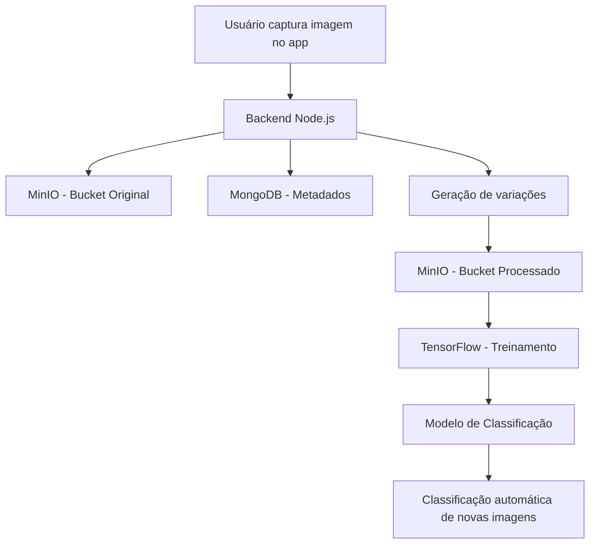

# Arquitetura

```mermaid
flowchart TD
    A[Usuário captura imagem no app] --> B[Backend Node.js]
    B --> C[MinIO - Bucket Original]
    B --> D[MongoDB - Metadados]
    B --> E[Geração de variações]
    E --> F[MinIO - Bucket Processado]
    F --> G[TensorFlow - Treinamento]
    G --> H[Modelo de Classificação]
    H --> I[Classificação automática de novas imagens]
```