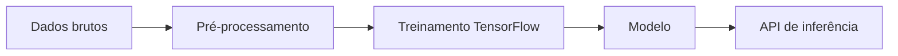

# Inteligência Artificial

## Dataset
- Imagens capturadas pelo app
- Variações automáticas (rotação, coloração)

## Pipeline

```mermaid
flowchart LR
    A[Dados brutos] --> B[Pré-processamento]
    B --> C[Treinamento TensorFlow]
    C --> D[Modelo]
    D --> E[API de inferência]
```