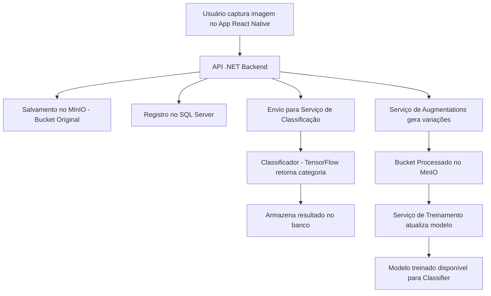

# OColecionador  

Sistema completo para **coleta, classificação e gerenciamento de imagens de colecionáveis**, integrando **mobile app, backend em .NET, e serviços de IA em Python com TensorFlow**.  
O objetivo é automatizar o fluxo desde a captura da imagem até a classificação e treinamento do modelo, com pipeline totalmente modular e orquestrado via Docker.

---

## 🚀 Visão Geral

O **OColecionador** é composto por múltiplos serviços que trabalham em conjunto:

| Módulo | Descrição |
|--------|------------|
| **OColecionadorMobile** | App em React Native (Expo) para captura e envio de imagens. |
| **OColecionadorBackEnd** | API REST em C# (.NET 8) responsável por autenticação, armazenamento no MinIO e integração com os serviços de IA. |
| **OColecionadorAugmentations** | Serviço Python que gera variações das imagens (rotação, cor, brilho, etc.) para aumentar o dataset. |
| **OColecionadorTraining** | Serviço Python responsável por treinar o modelo de classificação usando TensorFlow. |
| **OColecionadorClassifier** | Serviço Python que expõe a inferência do modelo via API (classificação automática). |
| **LocalServer** | Ambiente local e orquestração via Docker Compose, com perfis `manual` e `automatic`. |

---

## 🧩 Tecnologias Utilizadas

| Camada | Tecnologias |
|--------|--------------|
| **Frontend** | React Native, Expo |
| **Backend** | C#, .NET 8, ASP.NET Core, Entity Framework Core |
| **IA / ML** | Python, TensorFlow, NumPy, OpenCV |
| **Armazenamento** | MinIO (S3-compatible) |
| **Banco de Dados** | SQL Server |
| **Infraestrutura** | Docker, Docker Compose |
| **CI/CD** | GitHub Actions |
| **Autenticação** | JWT Tokens |

---

## ⚙️ Estrutura do Repositório

```
OColecionador/
│
├── .github/workflows/              # CI/CD pipelines
├── LocalServer/                    # Configurações locais e Docker Compose
│
├── OColecionadorAugmentations/     # Serviço de augmentations (Python)
├── OColecionadorClassifier/        # Serviço de classificação (TensorFlow)
├── OColecionadorTraining/          # Serviço de treinamento (TensorFlow)
│
├── OColecionadorBackEnd/           # API principal (.NET 8)
│   ├── Controllers/                # Endpoints REST
│   ├── Data/                       # Contexto de banco de dados (EF Core)
│   ├── Model/                      # Modelos de domínio
│   ├── Service/                    # Regras de negócio
│   ├── Migrations/                 # Migrações EF Core
│   └── Properties/                 # Configurações do projeto
│
└── OColecionadorMobile/            # Aplicativo React Native (Expo)
    ├── app/                        # Telas e navegação
    ├── assets/                     # Ícones e imagens
    ├── services/                   # Serviços de integração 
    └── models/                     # Modelos de dados locais
```

---

## 🔄 Fluxo do Sistema

1. O usuário captura a imagem no **app mobile**.  
2. O **backend .NET** recebe e armazena a imagem original no **MinIO**.  
3. O backend registra metadados no banco **SQL Server**.  
4. O serviço **Augmentations** gera variações e salva no bucket de treinamento.  
5. O serviço **Training** consome as imagens e atualiza o modelo TensorFlow.  
6. O serviço **Classifier** usa o modelo treinado para classificar novas imagens.  
7. O resultado da classificação é retornado ao backend e exibido no app.

---

## 🧭 Diagrama do Fluxo



---

## 🐳 Execução via Docker

### 🔹 Subir todo o ambiente
```bash
docker compose up --build
```

### 🔹 Executar apenas o perfil manual (ex: treinamento)
```bash
docker compose --profile manual up
```

### 🔹 Executar apenas os serviços automáticos
```bash
docker compose --profile automatic up
```

---

## 🧠 Pipeline de IA

| Etapa | Serviço | Descrição |
|-------|----------|-----------|
| **Coleta** | Mobile | Captura imagens e envia ao backend |
| **Armazenamento** | Backend | Envia ao MinIO e registra metadados |
| **Augmentations** | Python | Cria variações de treino |
| **Treinamento** | Python (TensorFlow) | Treina e atualiza o modelo |
| **Classificação** | Python API | Classifica novas imagens em tempo real |

---

## 🧰 Desenvolvimento

### Backend (.NET)
```bash
cd OColecionadorBackEnd
dotnet restore
dotnet run
```

### Mobile (React Native)
```bash
cd OColecionadorMobile
npm install
npm start
```

### Serviços Python
```bash
cd OColecionadorAugmentations
pip install -r requirements.txt
python main.py
```

---

## 📦 Status do Projeto

🚧 **Em desenvolvimento ativo**  
✅ Arquitetura modular consolidada  
✅ Integração total via Docker  
🧠 Modelos TensorFlow em evolução  
📱 App mobile conectado ao backend  

---

## 👨‍💻 Autor

**Patrick Calorio Carvalho**  
📍 Desenvolvedor Full Stack e entusiasta de IA aplicada  
🔗 [github.com/PatrickCalorioCarvalho](https://github.com/PatrickCalorioCarvalho)
