# OColecionadorAugmentations - Fluxos Avançados

Documentação detalhada dos fluxos complexos e otimizações do serviço de augmentação.

---

## 🔄 Fluxo 1: Pipeline Completo com Processamento Paralelo

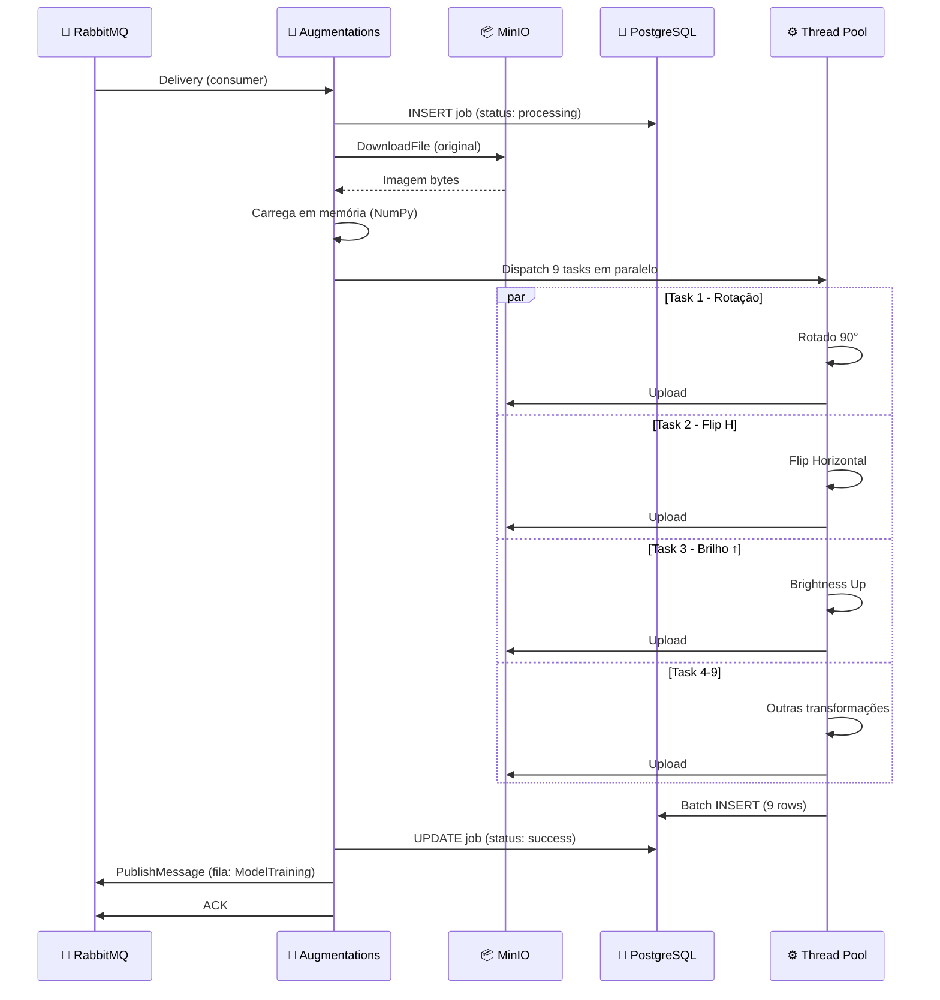

---

## 🎨 Fluxo 2: Augmentations com Detecção de Qualidade

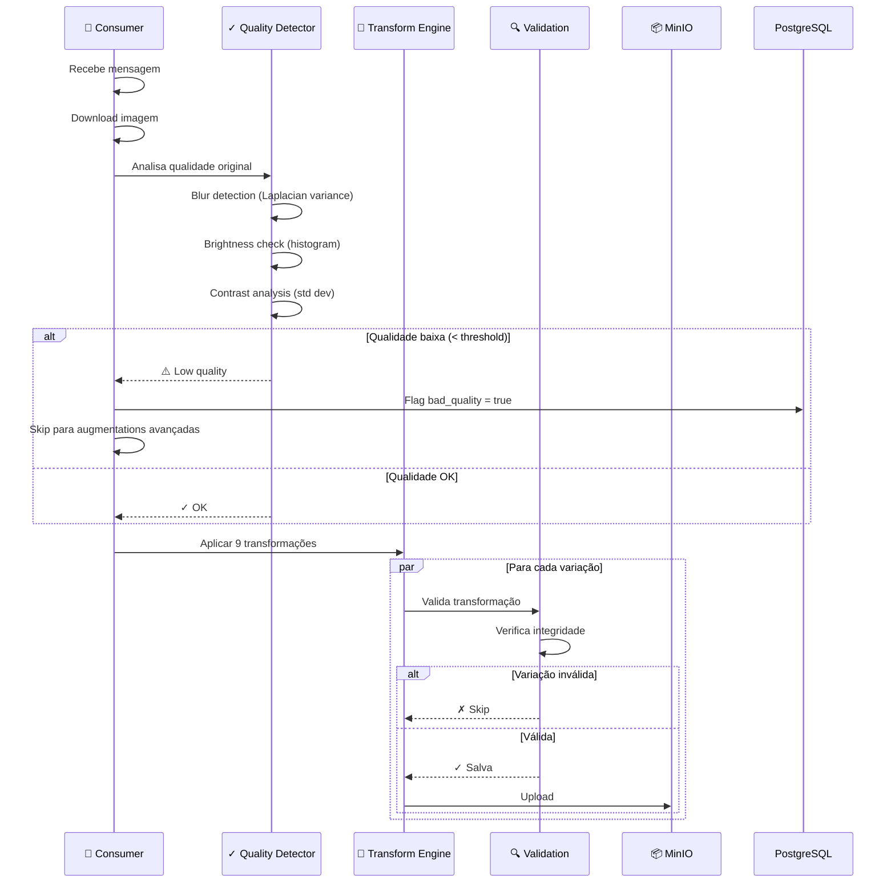

---

## ⚡ Fluxo 3: Batch Processing com Multi-Threading

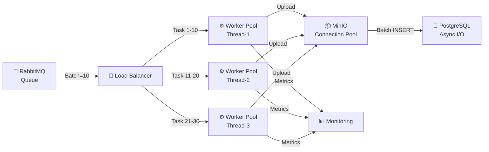

---

## 🔁 Fluxo 4: Retry com Exponential Backoff

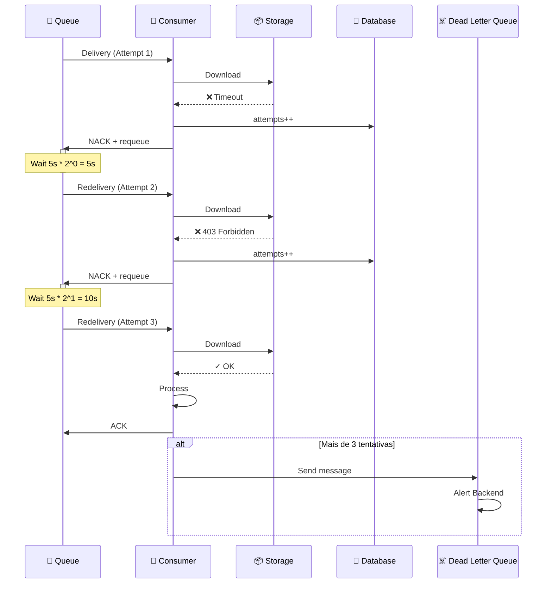

---

## 🎯 Fluxo 5: Augmentations Adaptativas Baseadas em Categoria

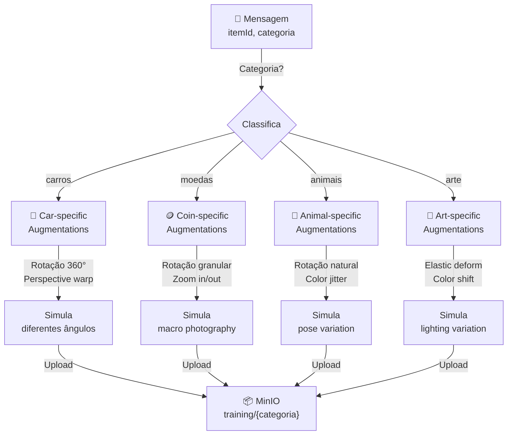

---

## 💾 Fluxo 6: Persistência com Transações PostgreSQL

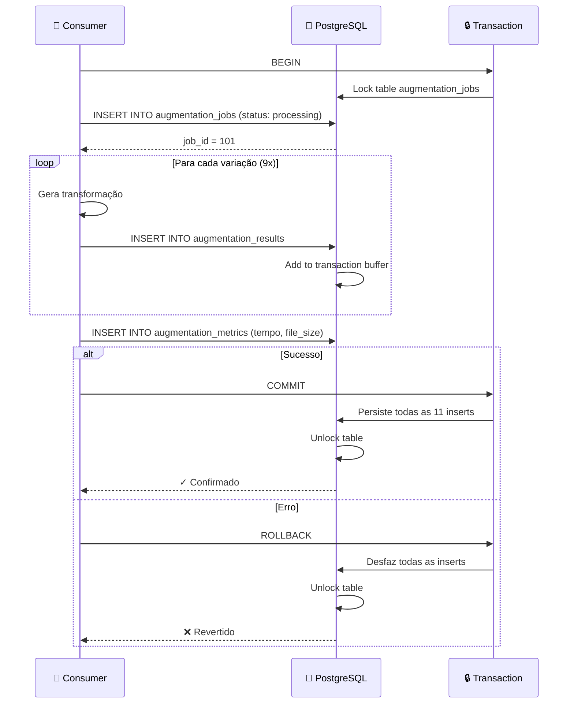

---

## 📊 Fluxo 7: Monitoramento e Métricas

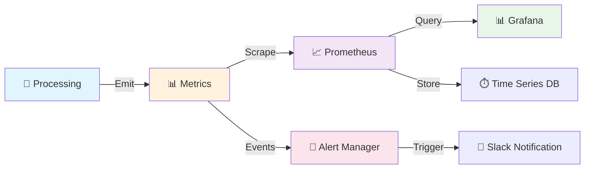

**Métricas coletadas:**
- Tempo de processamento por item
- Taxa de sucesso/falha
- Tamanho de arquivo processado
- Latência de RabbitMQ/MinIO/PostgreSQL
- Memória utilizada por worker

---

## 🔐 Fluxo 8: Validação de Integridade de Arquivo

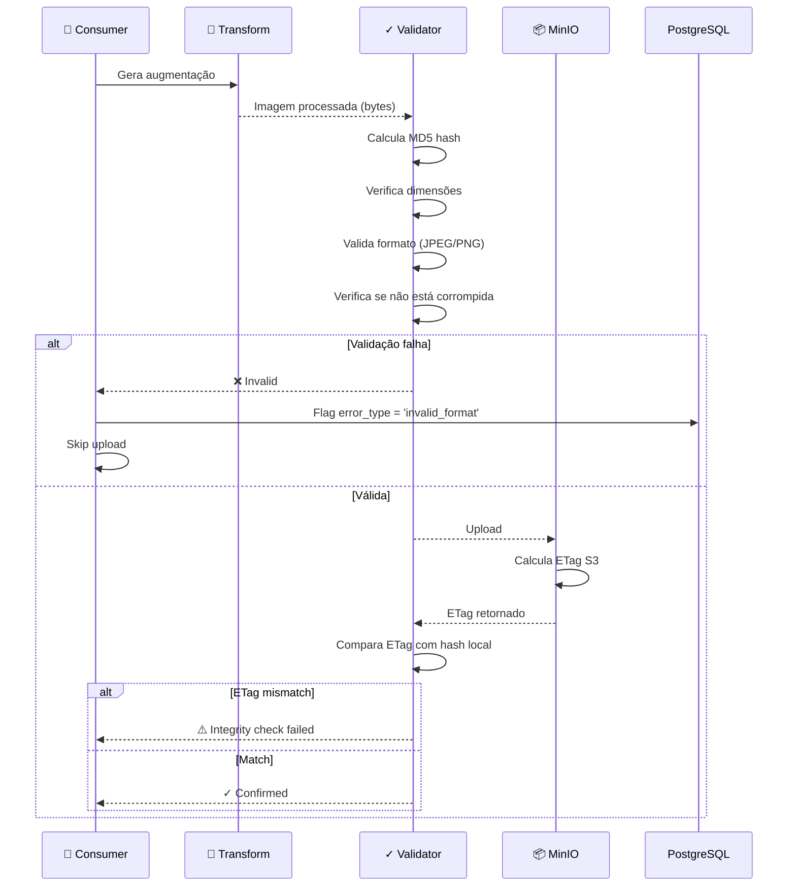

---

## 🚀 Fluxo 9: Escalabilidade com Consumidores Múltiplos

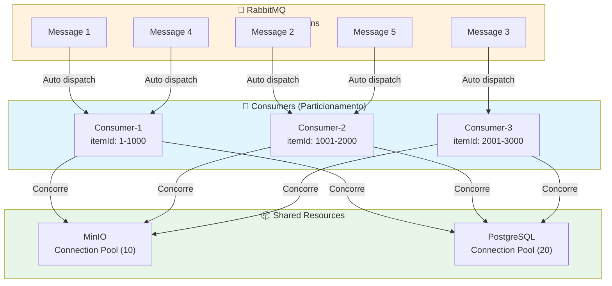

---

## 📈 Benchmark: Tempo de Processamento

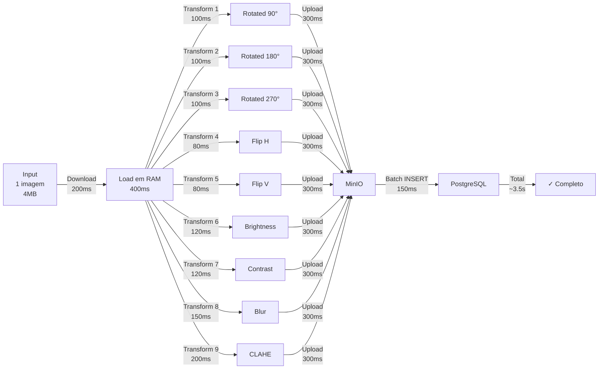

**Breakdown:**
- Download: 200ms
- Transform paralelo: ~200ms (9 tasks em paralelo)
- Upload paralelo: ~300ms (9 uploads em paralelo com connection pooling)
- Database: 150ms
- **Total: ~2.8-3.5 segundos por item**

---

## 🔍 Fluxo 10: Debugging e Observabilidade

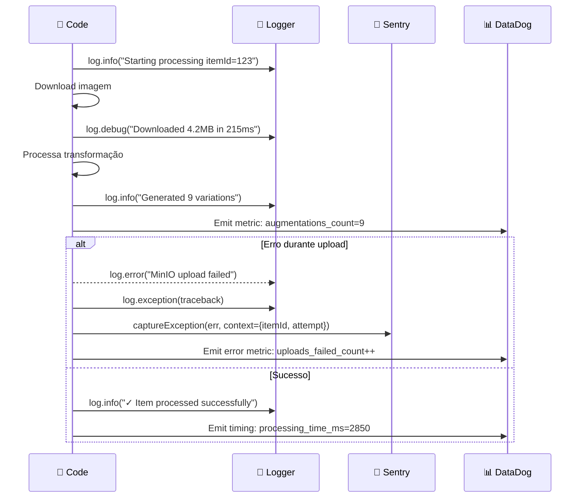

---

## 🎯 Conclusão

O **OColecionadorAugmentations** oferece:

✅ **Processamento Paralelo** – 9 transformações simultâneas  
✅ **Retry Automático** – Com exponential backoff  
✅ **Validação Rigorosa** – Integridade de arquivo  
✅ **Observabilidade** – Métricas, logs, alertas  
✅ **Escalabilidade** – Múltiplos consumers  
✅ **Resiliência** – Tratamento de erros robusto  

Tempo médio: **2.8-3.5 segundos por item**  
Throughput: **~1000-2000 itens/hora**