# OColecionadorAugmentations 🎨

## 📋 Visão Geral

O **OColecionadorAugmentations** é um serviço Python que consome mensagens de uma fila **RabbitMQ**, baixa imagens do **MinIO**, aplica **transformações (augmentations)** usando bibliotecas de Computer Vision, e salva as variações processadas.

### Responsabilidades Principais

- 📨 **Consumo de Fila** – Escuta mensagens do RabbitMQ
- 📥 **Download de Imagens** – Recupera originais do MinIO
- 🎨 **Transformações** – Rotação, flip, brilho, contraste, crop, etc.
- 📤 **Upload de Variações** – Salva processadas no MinIO
- 💾 **Persistência de Metadados** – Registra operações no PostgreSQL
- 🔄 **Retry Logic** – Reprocessa falhas com backoff exponencial
- 📊 **Logging e Monitoramento** – Rastreia execução e erros

---

## 🏗️ Arquitetura

### Estrutura de Pastas

```
OColecionadorAugmentations/
├── main.py                    # Ponto de entrada principal
├── requirements.txt           # Dependências Python
├── Dockerfile                 # Imagem Docker
├── init_db.sql               # Script de inicialização PostgreSQL
└── [módulos Python esperados]
    ├── config.py             # Configurações
    ├── rabbitmq_consumer.py  # Consumer RabbitMQ
    ├── minio_handler.py      # Handler MinIO
    ├── augmentations.py      # Funções de augmentation
    ├── database.py           # Conexão PostgreSQL
    └── logger.py             # Logging centralizado
```

---

## 📦 Dependências Principais

```txt
Python 3.11+
├── pika              # RabbitMQ Client
├── minio             # MinIO/S3 Client
├── opencv-python    # Processamento de imagens
├── pillow            # Manipulação de imagens
├── numpy             # Computação numérica
├── psycopg2-binary   # PostgreSQL Client
├── python-dotenv     # Variáveis de ambiente
└── albumentations    # Augmentations avançadas (opcional)
```

---

## 🔌 Fluxo Principal

```mermaid
graph LR
    A["📨 RabbitMQ"] -->|Mensagem| B["🎨 Augmentations Service"]
    B -->|Download| C["📦 MinIO<br/>bucket: original"]
    B -->|Processa| D["🔄 Transformações"]
    D -->|Upload| E["📦 MinIO<br/>bucket: processed"]
    D -->|Salva metadados| F["💾 PostgreSQL"]
    B -->|Erro| G["🔁 Retry Queue"]
```



---

## 🎨 Tipos de Augmentations

### 1. **Rotação**
```python
# Rotações: 90°, 180°, 270°
rotated_90 = cv2.rotate(image, cv2.ROTATE_90_CLOCKWISE)
rotated_180 = cv2.rotate(image, cv2.ROTATE_180)
rotated_270 = cv2.rotate(image, cv2.ROTATE_90_COUNTERCLOCKWISE)
```

---

### 2. **Flip (Espelhamento)**
```python
# Horizontal e vertical
flipped_h = cv2.flip(image, 1)   # Eixo Y
flipped_v = cv2.flip(image, 0)   # Eixo X
flipped_both = cv2.flip(image, -1)  # Ambos
```

---

### 3. **Brilho e Contraste**
```python
# Ajuste de intensidade
alpha = 1.2  # Contraste
beta = 30    # Brilho
adjusted = cv2.convertScaleAbs(image, alpha=alpha, beta=beta)
```

---

### 4. **Crop Central**
```python
# Extrai região central (80% da imagem)
h, w = image.shape[:2]
crop_size = int(0.8 * min(h, w))
y = (h - crop_size) // 2
x = (w - crop_size) // 2
cropped = image[y:y+crop_size, x:x+crop_size]
```

---

### 5. **Blur Gaussiano**
```python
# Desfoque para robustez
blurred = cv2.GaussianBlur(image, (5, 5), 0)
```

---

### 6. **Mudança de Cores**
```python
# De RGB para HSV, ajusta, converte de volta
hsv = cv2.cvtColor(image, cv2.COLOR_RGB2HSV)
hsv[:, :, 0] = (hsv[:, :, 0] + 30) % 180  # Muda tom
colored = cv2.cvtColor(hsv, cv2.COLOR_HSV2RGB)
```

---

### 7. **CLAHE (Contrast Limited Adaptive Histogram Equalization)**
```python
# Melhora contraste local
clahe = cv2.createCLAHE(clipLimit=2.0, tileGridSize=(8, 8))
enhanced = clahe.apply(cv2.cvtColor(image, cv2.COLOR_RGB2GRAY))
```

---

## 📨 Formato de Mensagem RabbitMQ

### Input (Consumo)

```json
{
  "itemId": 12345,
  "fotoCaminho": "item/12345/original.jpg",
  "categoria": "carros",
  "uploadedAt": "2025-11-15T10:30:00Z"
}
```

### Output (Publicação após sucesso)

```json
{
  "itemId": 12345,
  "categoria": "carros",
  "totalAugmentacoes": 10,
  "processadas": [
    {
      "variacao": "rotated_90",
      "caminho": "training/carros/12345_rotated_90.jpg",
      "timestamp": "2025-11-15T10:35:00Z"
    },
    {
      "variacao": "flipped_h",
      "caminho": "training/carros/12345_flipped_h.jpg",
      "timestamp": "2025-11-15T10:35:01Z"
    }
  ],
  "status": "success"
}
```

---

## 🗄️ Estrutura de Dados PostgreSQL

### Tabela: augmentation_jobs

```sql
CREATE TABLE augmentation_jobs (
    id SERIAL PRIMARY KEY,
    item_id INT NOT NULL,
    original_path VARCHAR(255) NOT NULL,
    categoria VARCHAR(50),
    status VARCHAR(20) DEFAULT 'pending', -- pending, processing, success, failed
    total_augmentations INT DEFAULT 0,
    processed_count INT DEFAULT 0,
    error_message TEXT,
    attempts INT DEFAULT 0,
    max_attempts INT DEFAULT 3,
    created_at TIMESTAMP DEFAULT CURRENT_TIMESTAMP,
    updated_at TIMESTAMP DEFAULT CURRENT_TIMESTAMP,
    completed_at TIMESTAMP
);
```

### Tabela: augmentation_results

```sql
CREATE TABLE augmentation_results (
    id SERIAL PRIMARY KEY,
    job_id INT REFERENCES augmentation_jobs(id),
    variation_type VARCHAR(50), -- rotated_90, flipped_h, etc.
    output_path VARCHAR(255) NOT NULL,
    file_size INT,
    dimensions VARCHAR(20), -- 224x224
    created_at TIMESTAMP DEFAULT CURRENT_TIMESTAMP
);
```

---

## 🔧 Configuração

### Variáveis de Ambiente (.env)

```bash
# RabbitMQ
RABBITMQ_HOST=rabbitmq
RABBITMQ_PORT=5672
RABBITMQ_USER=OColecionadorUser
RABBITMQ_PASSWORD=OColecionador@2025
RABBITMQ_QUEUE=ImageAugmentations

# MinIO
MINIO_HOST=minio
MINIO_PORT=9000
MINIO_ACCESS_KEY=OColecionadorUser
MINIO_SECRET_KEY=OColecionador@2025
MINIO_BUCKET_ORIGINAL=ocolecionadorbucket-original
MINIO_BUCKET_PROCESSED=ocolecionadorbucket-processed
MINIO_REGION=us-east-1

# PostgreSQL
DB_HOST=postgres
DB_PORT=5432
DB_NAME=augmentations_db
DB_USER=OColecionadorUser
DB_PASSWORD=OColecionador@2025

# Logging
LOG_LEVEL=INFO
LOG_FILE=/logs/augmentations.log

# Augmentations Config
AUGMENTATION_TYPES=rotated_90,rotated_180,rotated_270,flipped_h,flipped_v,brightness_up,brightness_down,blur,clahe
AUGMENTATION_COUNT=9
```

---

## 🚀 Estrutura de Código (main.py)

```python
# main.py - Ponto de entrada

import pika
import json
import logging
from datetime import datetime
from minio import Minio
import psycopg2

# Configuração
RABBITMQ_URL = f"amqp://{RABBITMQ_USER}:{RABBITMQ_PASSWORD}@{RABBITMQ_HOST}:{RABBITMQ_PORT}/"
QUEUE_NAME = "ImageAugmentations"

# Conexões
minio_client = Minio(...)
db_connection = psycopg2.connect(...)

def process_message(ch, method, properties, body):
    """Callback para processar mensagem do RabbitMQ"""
    try:
        message = json.loads(body)
        item_id = message['itemId']
        foto_caminho = message['fotoCaminho']
        categoria = message['categoria']
        
        # Download imagem original
        image = minio_client.fget_object(
            bucket_name='ocolecionadorbucket-original',
            object_name=foto_caminho
        )
        
        # Aplicar augmentations
        augmentations = apply_augmentations(image)
        
        # Upload variações
        for aug_name, aug_image in augmentations.items():
            output_path = f"training/{categoria}/{item_id}_{aug_name}.jpg"
            minio_client.fput_object(
                bucket_name='ocolecionadorbucket-processed',
                object_name=output_path,
                file_path=aug_image
            )
            
            # Salvar metadados
            save_augmentation_result(item_id, aug_name, output_path)
        
        # Confirmar processamento
        ch.basic_ack(delivery_tag=method.delivery_tag)
        logging.info(f"Item {item_id} processado com sucesso")
        
    except Exception as e:
        logging.error(f"Erro ao processar item: {str(e)}")
        # Requeue para retry
        ch.basic_nack(delivery_tag=method.delivery_tag, requeue=True)

def apply_augmentations(image):
    """Aplica todas as transformações à imagem"""
    augmentations = {}
    augmentations['rotated_90'] = cv2.rotate(image, cv2.ROTATE_90_CLOCKWISE)
    augmentations['rotated_180'] = cv2.rotate(image, cv2.ROTATE_180)
    # ... mais transformações
    return augmentations

def main():
    """Função principal - inicia consumer"""
    connection = pika.BlockingConnection(pika.URLParameters(RABBITMQ_URL))
    channel = connection.channel()
    
    channel.queue_declare(queue=QUEUE_NAME, durable=True)
    channel.basic_consume(
        queue=QUEUE_NAME,
        on_message_callback=process_message,
        auto_ack=False
    )
    
    logging.info("[*] Aguardando mensagens...")
    channel.start_consuming()

if __name__ == '__main__':
    main()
```

---

## 🐳 Docker

### Dockerfile

```dockerfile
FROM python:3.11-slim

WORKDIR /app

# Dependências do sistema
RUN apt-get update && apt-get install -y \
    libsm6 libxext6 libxrender-dev \
    postgresql-client \
    && rm -rf /var/lib/apt/lists/*

# Copiar requirements
COPY requirements.txt .
RUN pip install --no-cache-dir -r requirements.txt

# Copiar código
COPY . .

# Health check
HEALTHCHECK --interval=30s --timeout=10s --start-period=5s --retries=3 \
    CMD python -c "import pika; pika.BlockingConnection(pika.ConnectionParameters('rabbitmq'))"

# Executar
CMD ["python", "main.py"]
```

### requirements.txt

```txt
pika==1.3.1
minio==7.1.15
opencv-python==4.8.1.78
pillow==10.1.0
numpy==1.24.3
psycopg2-binary==2.9.9
python-dotenv==1.0.0
albumentations==1.3.1
Pillow==10.1.0
requests==2.31.0
```

---

## 🔄 Retry Logic

```mermaid
graph TD
    A["📨 Mensagem RabbitMQ"] -->|Primeiro processamento| B["🔄 Tenta processar"]
    B -->|❌ Erro| C["Attempts++"]
    C -->|attempts < 3| D["Aguarda 5s * 2^attempts"]
    D -->|Requeue| B
    C -->|attempts >= 3| E["📤 Move para Dead Letter Queue"]
    E -->|Monitoramento| F["🚨 Alert para Backend"]
    B -->|✅ Sucesso| G["✓ ACK"]
    G -->|Publica resultado| H["📤 Fila ModelTraining"]
```



---

## 📊 Exemplo de Fluxo Completo

```mermaid
sequenceDiagram
    participant Backend as 🔌 Backend
    participant RabbitMQ as 📨 RabbitMQ
    participant Augmentations as 🎨 Augmentations
    participant MinIO as 📦 MinIO
    participant PostgreSQL as 💾 PostgreSQL

    Backend->>RabbitMQ: PublishMessage { itemId: 1, fotoCaminho: 'item/1/original.jpg' }
    
    RabbitMQ->>Augmentations: Delivery (consumer ativo)
    Augmentations->>PostgreSQL: INSERT augmentation_jobs (status: processing)
    
    Augmentations->>MinIO: DownloadFile (bucket: original)
    MinIO-->>Augmentations: Imagem bytes
    
    Augmentations->>Augmentations: Aplicar 9 transformações
    
    loop Para cada transformação
        Augmentations->>MinIO: UploadFile (bucket: processed)
        Augmentations->>PostgreSQL: INSERT augmentation_results
    end
    
    Augmentations->>PostgreSQL: UPDATE augmentation_jobs (status: success)
    Augmentations->>RabbitMQ: PublishMessage (fila: ModelTraining)
    Augmentations->>RabbitMQ: NACK e ACK
```



---

## 🎯 Performance

- **Tempo por item:** ~2-5 segundos (9 augmentations)
- **Memória por processo:** ~500MB - 1GB
- **Taxa de processamento:** ~1000-2000 imagens/hora (1 container)
- **Escalabilidade:** Múltiplos containers consumindo mesma fila

---

## 🔗 Integração com Backend

### 1. Backend publica mensagem
```python
# Backend .NET
await rabbitService.PublishMessageAsync("ImageAugmentations", {
    itemId = 1,
    fotoCaminho = "item/1/original.jpg",
    categoria = "carros"
});
```

### 2. Augmentations processa
```python
# Augmentations Python
def process_message(message):
    # Download, augment, upload
    pass
```

### 3. Publica para Training (opcional)
```python
channel.basic_publish(
    exchange='',
    routing_key='ModelTraining',
    body=json.dumps({
        'batchId': batch_id,
        'totalImages': len(augmentations)
    })
)
```

---

## 📝 Conclusão

O **OColecionadorAugmentations** é um serviço robusto e escalável que:

✅ Consome mensagens de forma assíncrona  
✅ Aplica transformações profissionais  
✅ Trata erros e retries com elegância  
✅ Integra com infraestrutura moderna  
✅ Persiste metadados para auditoria  
✅ Prepara dados para treinamento de IA