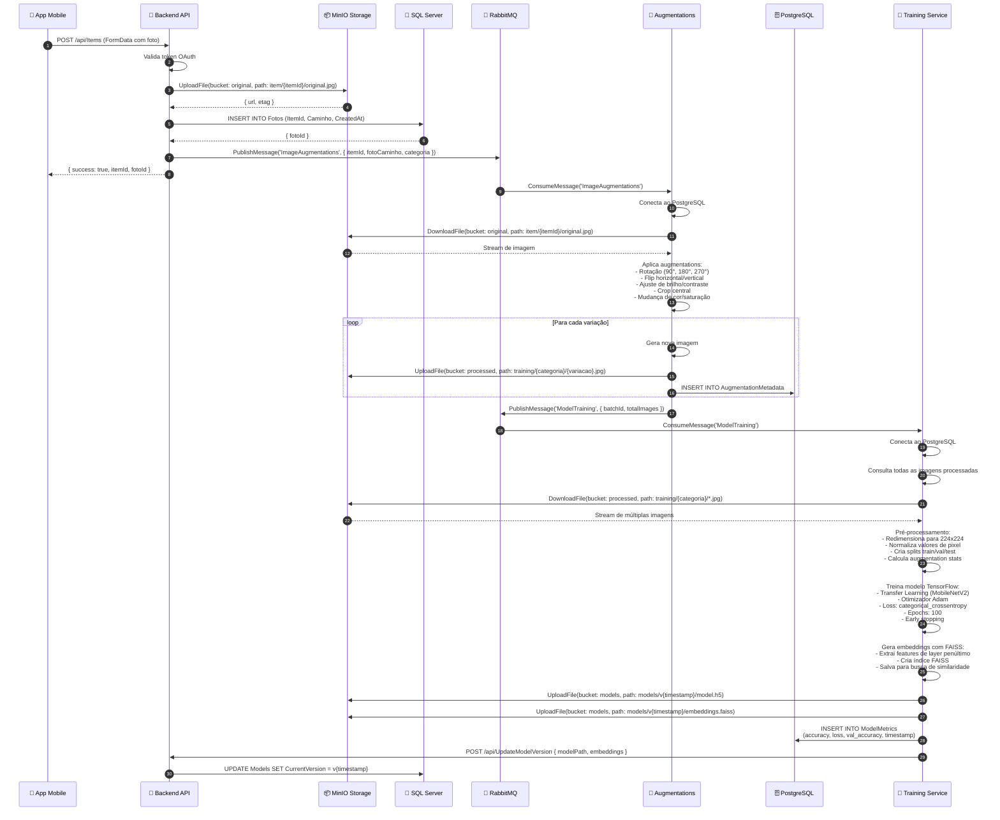
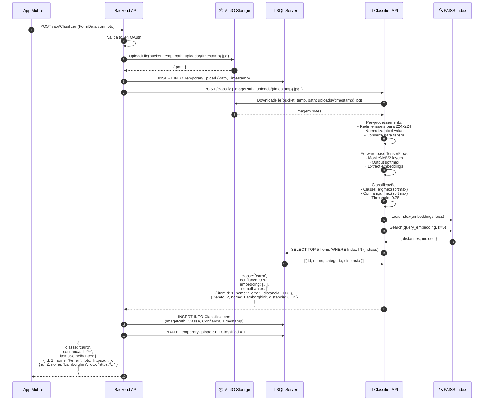
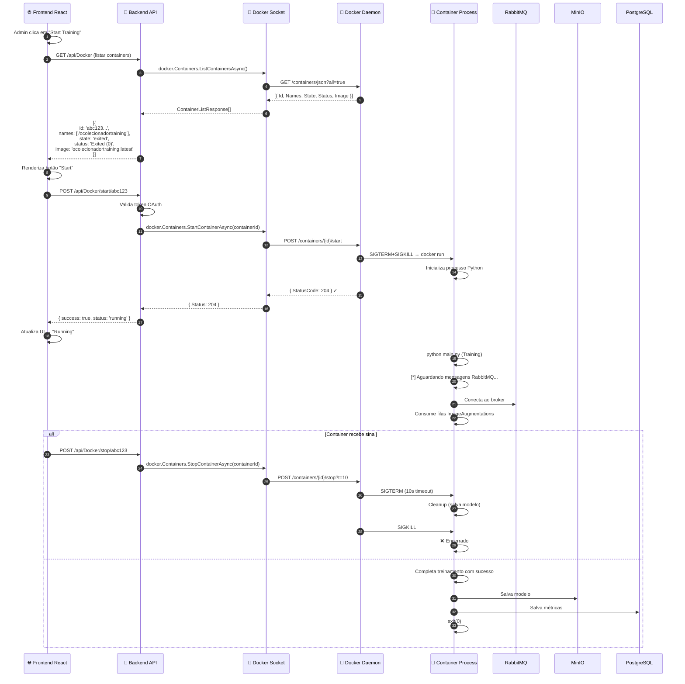
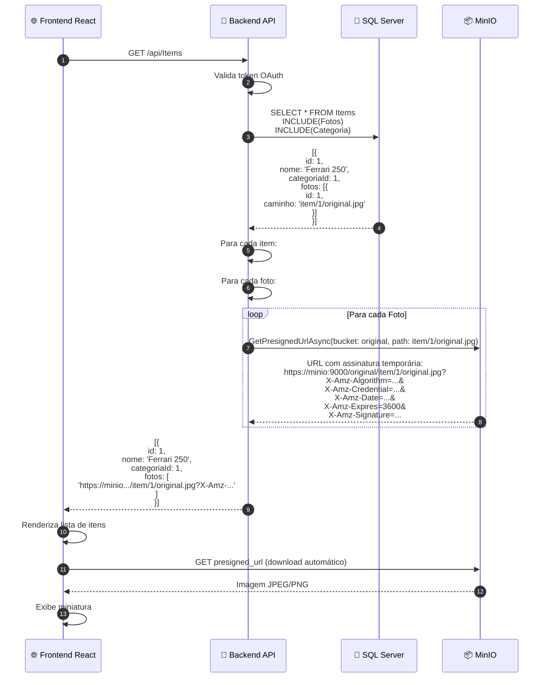
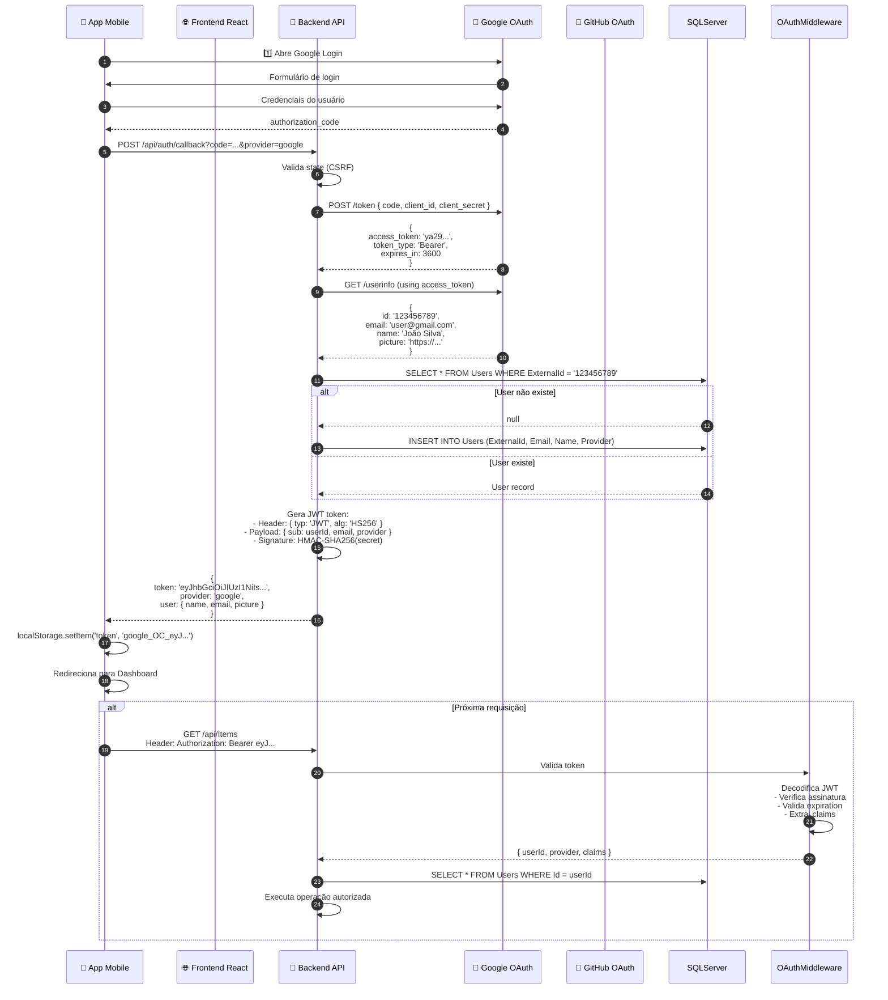
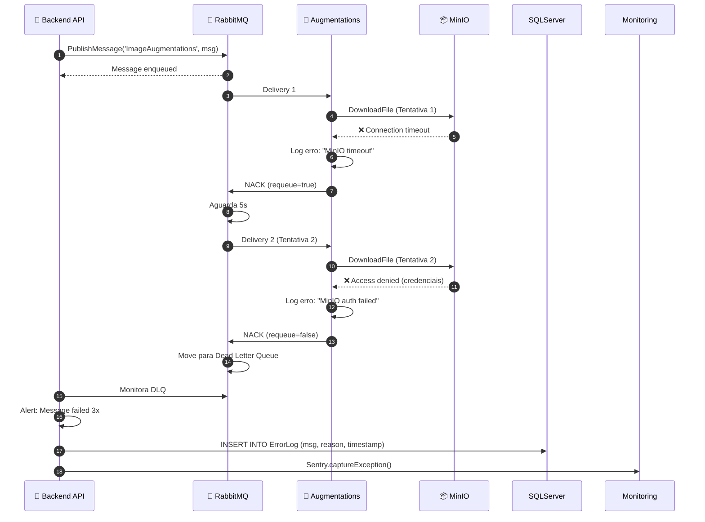
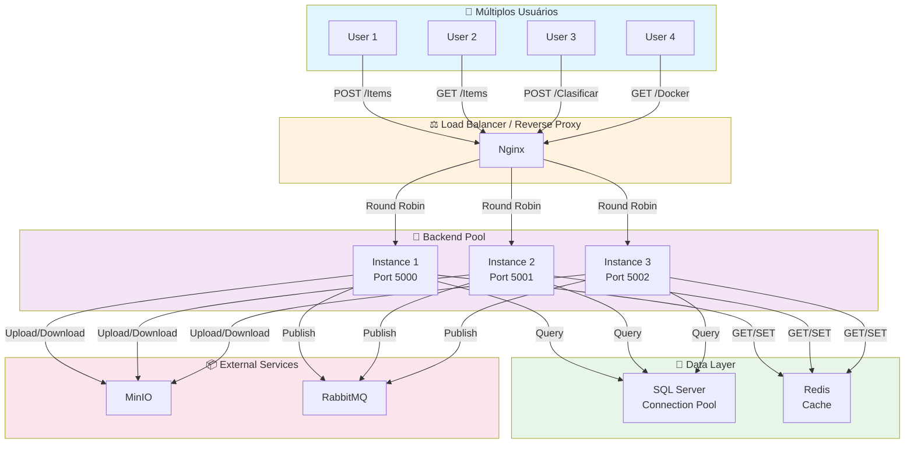

# OColecionadorBackEnd - Fluxos Avançados

Este documento detalha os fluxos mais complexos envolvendo múltiplos serviços, bancos de dados e fila de mensagens.

---

## 🔄 Fluxo 1: Pipeline Completo Upload → Augmentations → Training

---

## 🎯 Fluxo 2: Classificação com Busca de Similaridade

---

## 🐳 Fluxo 3: Orquestração de Containers Docker

---

## 📊 Fluxo 4: Get Items com Presigned URLs do MinIO

---

## 🔐 Fluxo 5: Autenticação OAuth2 com Token Validation

---

## ⚠️ Tratamento de Erros e Retry Logic

---

## 📈 Diagram de Carga: Múltiplas Requisições Simultâneas

---

## 🎯 Conclusão

Os fluxos acima ilustram a complexidade da orquestração entre:

✅ **Frontend/Mobile** – Interfaces do usuário  
✅ **Backend .NET** – Lógica central  
✅ **SQL Server + PostgreSQL** – Persistência  
✅ **MinIO** – Storage distribuído  
✅ **RabbitMQ** – Fila assíncrona  
✅ **Serviços de IA** – Classificação e treinamento  
✅ **Docker API** – Orquestração de containers  

O sistema foi projetado com **resiliência, escalabilidade e observabilidade** em mente.