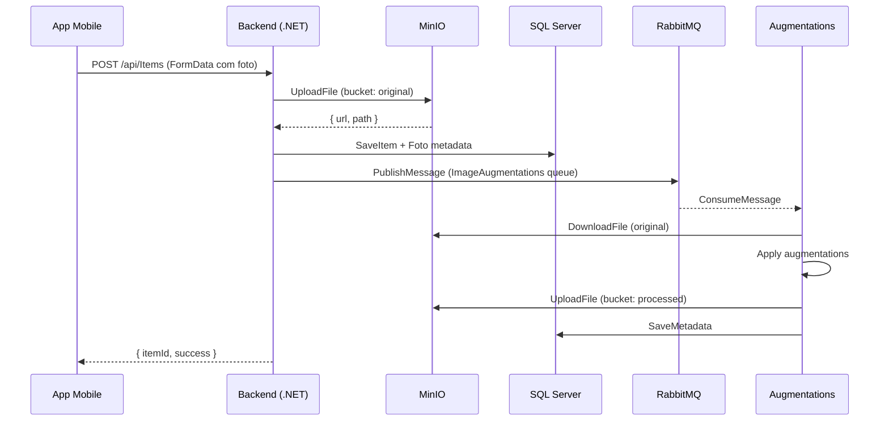
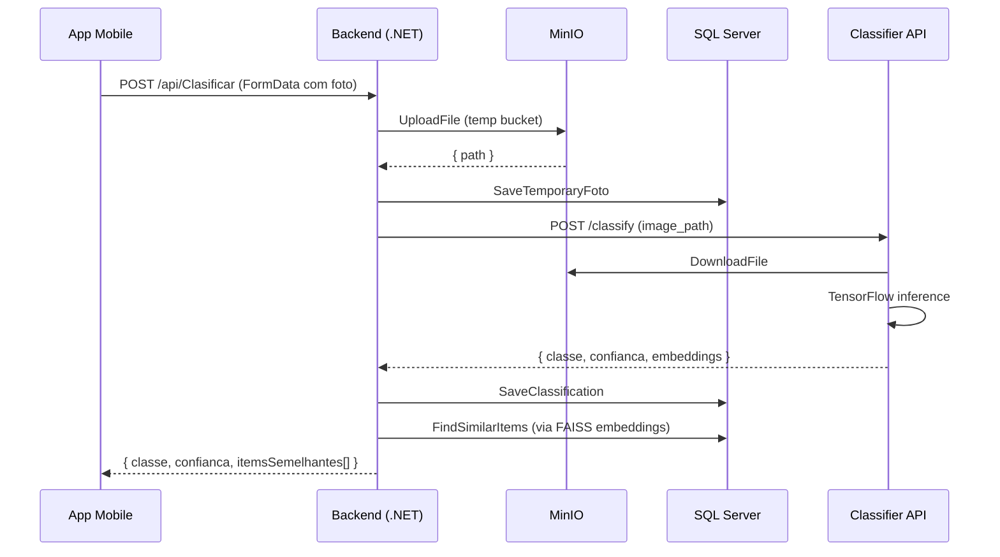
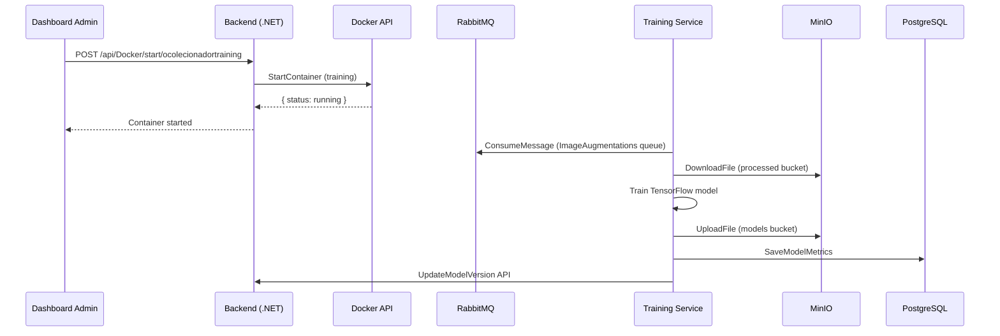
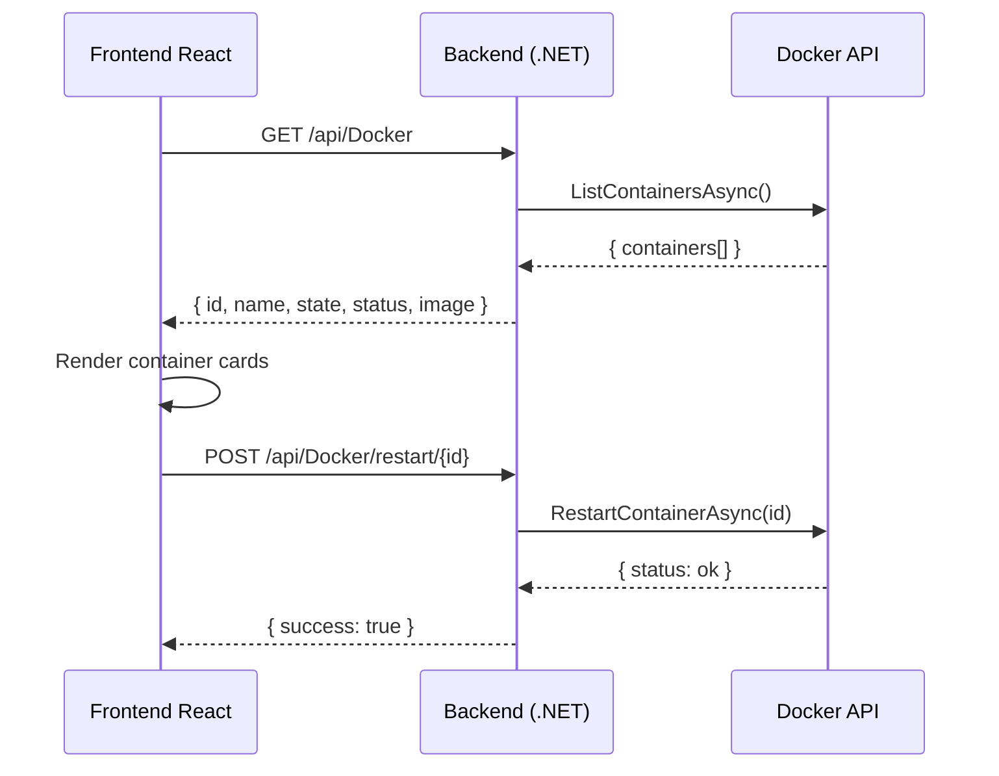
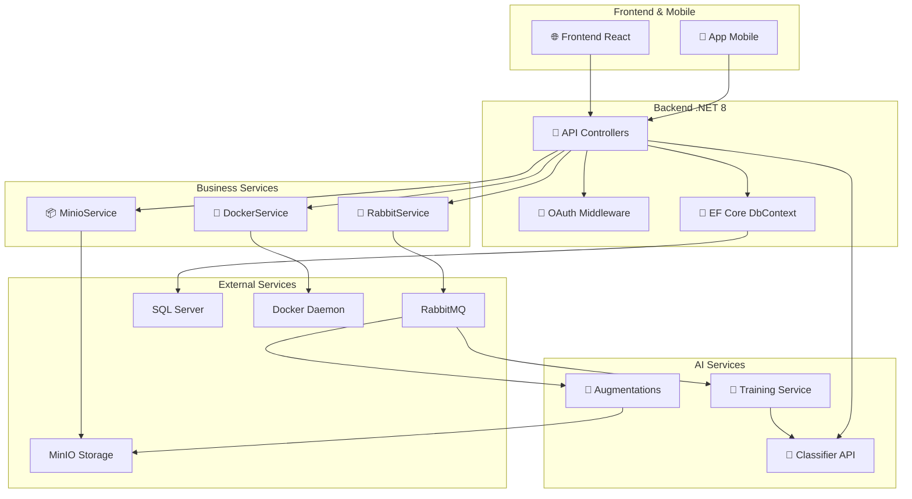

# OColecionadorBackEnd

## 📋 Visão Geral

O **OColecionadorBackEnd** é a API REST central do projeto OColecionador, desenvolvida em **C# com .NET 8** e **ASP.NET Core**. Ele funciona como orquestrador entre o aplicativo mobile, serviços de IA (classificação, treinamento, augmentations) e infraestrutura de armazenamento.

### Responsabilidades Principais

- 🔐 **Autenticação e Autorização** – OAuth2 com Google e GitHub
- 📸 **Gerenciamento de Imagens** – Upload, armazenamento no MinIO e metadados no SQL Server
- 🏷️ **Gerenciamento de Categorias** – CRUD de categorias de colecionáveis
- 📦 **Gerenciamento de Itens** – CRUD de itens com relacionamento a fotos
- 🤖 **Integração com IA** – Comunicação com serviços de classificação, treinamento e augmentations
- 🐳 **Controle de Containers Docker** – Start/stop/restart de serviços via API
- 📨 **Fila de Processamento** – Integração com RabbitMQ para tarefas assíncronas

---

## 🏗️ Arquitetura

### Estrutura de Pastas

```
OColecionadorBackEnd/
├── Controllers/                    # Endpoints REST
│   ├── AuthController.cs          # Autenticação OAuth2
│   ├── CategoriasController.cs    # CRUD de categorias
│   ├── ItemsController.cs         # CRUD de itens com fotos
│   ├── FotosController.cs         # Gerenciamento de fotos
│   ├── ClasificarController.cs    # Classificação de imagens
│   └── DockerController.cs        # Controle de containers
├── Data/
│   └── OColecionadorBackEndContext.cs  # DbContext do Entity Framework
├── Model/
│   ├── Categoria.cs              # Entidade de categoria
│   ├── Item.cs                   # Entidade de item
│   ├── Foto.cs                   # Entidade de foto
│   ├── FotoMessage.cs            # DTO para fila
│   └── ...
├── Service/
│   ├── MinioService.cs           # Integração com MinIO (S3)
│   ├── RabbitService.cs          # Integração com RabbitMQ
│   ├── DockerService.cs          # Integração com Docker API
│   └── ...
├── Middlewares/
│   └── OAuthMiddleware.cs        # Middleware de autenticação
├── Migrations/                    # Migrações do Entity Framework
└── Program.cs                     # Configuração da aplicação
```

---

## 🔌 Serviços Principais

### 1. **MinioService**

Gerencia upload, download e presigned URLs de imagens no MinIO (storage S3-compatível).

**Dependências:**
- MinIO Client
- IConfiguration (appsettings.json)

**Métodos principais:**
```csharp
- GetPresignedUrlAsync(string path) // Retorna URL temporária
- UploadFileAsync(string bucket, string objectName, Stream data)
- DeleteFileAsync(string bucket, string objectName)
```

---

### 2. **RabbitService**

Enfileira mensagens para processamento assíncrono em outros serviços (Augmentations, Training).

**Dependências:**
- RabbitMQ.Client
- IConfiguration

**Métodos principais:**
```csharp
- PublishMessageAsync(string queue, object message) // Publica na fila
- ConsumeMessagesAsync(string queue, Action<string> callback)
```

---

### 3. **DockerService**

Controla containers Docker via Docker API (lista, inicia, para, reinicia).

**Dependências:**
- Docker.DotNet
- Environment variables (DOCKER_URI)

**Métodos principais:**
```csharp
- ListContainersAsync() // Lista todos os containers
- StartContainerAsync(string containerId)
- StopContainerAsync(string containerId)
- RestartContainerAsync(string containerId)
```

---

## 🗄️ Modelo de Dados

### Entidades Principais

```csharp
// Categoria
public class Categoria
{
    public int Id { get; set; }
    public string Descricao { get; set; }
    public ICollection<Item> Itens { get; set; }
}

// Item
public class Item
{
    public int Id { get; set; }
    public string Nome { get; set; }
    public int CategoriaId { get; set; }
    public Categoria Categoria { get; set; }
    public ICollection<Foto> Fotos { get; set; }
}

// Foto
public class Foto
{
    public int Id { get; set; }
    public int ItemId { get; set; }
    public string Caminho { get; set; } // Path no MinIO
    public Item Item { get; set; }
}
```

---

## 🔌 Endpoints REST

### Autenticação
- `POST /api/auth/login` – Inicia fluxo OAuth2
- `POST /api/auth/callback` – Callback do provedor OAuth

### Categorias
- `GET /api/Categorias` – Lista todas as categorias
- `POST /api/Categorias` – Cria nova categoria
- `PUT /api/Categorias/{id}` – Atualiza categoria
- `DELETE /api/Categorias/{id}` – Deleta categoria

### Itens
- `GET /api/Items` – Lista itens com fotos e URLs do MinIO
- `POST /api/Items` – Cria item com upload de fotos
- `PUT /api/Items/{id}` – Atualiza item
- `DELETE /api/Items/{id}` – Deleta item

### Fotos
- `POST /api/Fotos` – Upload de foto para item existente
- `DELETE /api/Fotos/{id}` – Deleta foto

### Classificação (com IA)
- `POST /api/Clasificar` – Classifica imagem via OColecionadorClassifier
- Retorna: `{ classe, confianca, itemsSemelhantes }`

### Docker
- `GET /api/Docker` – Lista containers
- `POST /api/Docker/start/{id}` – Inicia container
- `POST /api/Docker/stop/{id}` – Para container
- `POST /api/Docker/restart/{id}` – Reinicia container

---

## 🔐 Autenticação e Autorização

### Fluxo OAuth2

```
1. Frontend/Mobile abre login
   ↓
2. Redireciona para Google/GitHub
   ↓
3. Usuário autoriza
   ↓
4. Google/GitHub retorna code
   ↓
5. Backend troca code por token
   ↓
6. Token armazenado como cookie/localStorage
   ↓
7. Requisições subsequentes incluem token no header Authorization: Bearer {token}
```

### Middleware de Autenticação

O [`OAuthMiddleware.cs`](c:\Users\Patrick\Desktop\OColecionador\OColecionadorBackEnd\Middlewares\OAuthMiddleware.cs) valida tokens nas requisições.

---

## 🔄 Fluxos Complexos com Múltiplos Serviços

### Fluxo 1: Upload de Item com Foto



### Fluxo 2: Classificação de Imagem (com Inferência de IA)



### Fluxo 3: Treinamento do Modelo



### Fluxo 4: Dashboard Docker Management



---

## 🔗 Integração com Serviços Externos

### MinIO (Armazenamento)

```json
{
  "Minio": {
    "Endpoint": "minio:9000",
    "AccessKey": "OColecionadorUser",
    "SecretKey": "OColecionador@2025",
    "pathExtern": "https://louse-model-lioness.ngrok-free.app/"
  }
}
```

**Buckets:**
- `ocolecionadorbucket-original` – Imagens originais
- `ocolecionadorbucket-processed` – Imagens com augmentations
- `ocolecionadorbucket-models` – Modelos treinados

---

### RabbitMQ (Fila de Mensagens)

```json
{
  "Rabbit": {
    "HostName": "rabbitmq",
    "UserName": "OColecionadorUser",
    "Password": "OColecionador@2025"
  }
}
```

**Filas:**
- `ImageAugmentations` – Trigger para augmentations service
- `ModelTraining` – Trigger para training service

**Formato de mensagem:**
```json
{
  "Caminho": "bucket/imagem.jpg",
  "Categoria": "animais",
  "ItemId": 12345
}
```

---

### SQL Server (Banco de Dados)

**Tabelas principais:**
- `Categorias` – Categorias de colecionáveis
- `Items` – Itens da coleção
- `Fotos` – Fotos dos itens

**Connection String:**
```
Server=sqlserver;Database=OColecionadorDataBase;User Id=OColecionadorUser;Password=OColecionador@2025;
```

---

### Docker API

Conecta via socket Unix (Linux/Mac) ou named pipe (Windows):

```csharp
var dockerUri = Environment.GetEnvironmentVariable("DOCKER_URI") ?? "unix:///var/run/docker.sock";
```

---

## 📊 Diagrama de Componentes



---

## 🚀 Deployment

### Docker

```bash
docker build -t ocolecionador-backend:latest .
docker run -p 5000:8080 \
  -e DOCKER_URI="unix:///var/run/docker.sock" \
  ocolecionador-backend:latest
```

### Docker Compose

```bash
docker compose up ocolecionadorbackend
```

---

## 🧪 Desenvolvimento Local

```bash
# Restaurar dependências
dotnet restore

# Executar migrações
dotnet ef database update

# Executar em desenvolvimento
dotnet run --launch-profile https

# Build para release
dotnet publish -c Release -o ./publish
```

---

## 📦 Dependências

```xml
- Docker.DotNet (3.125.15)
- Microsoft.EntityFrameworkCore.SqlServer (8.0.11)
- Minio (6.0.5)
- RabbitMQ.Client (7.1.2)
- Swashbuckle.AspNetCore (6.6.2)
```

---

## 📝 Conclusão

O **OColecionadorBackEnd** é o coração da arquitetura, orquestrando comunicação entre frontend, serviços de IA e infraestrutura, garantindo um fluxo robusto de captura, armazenamento, processamento e classificação de imagens.