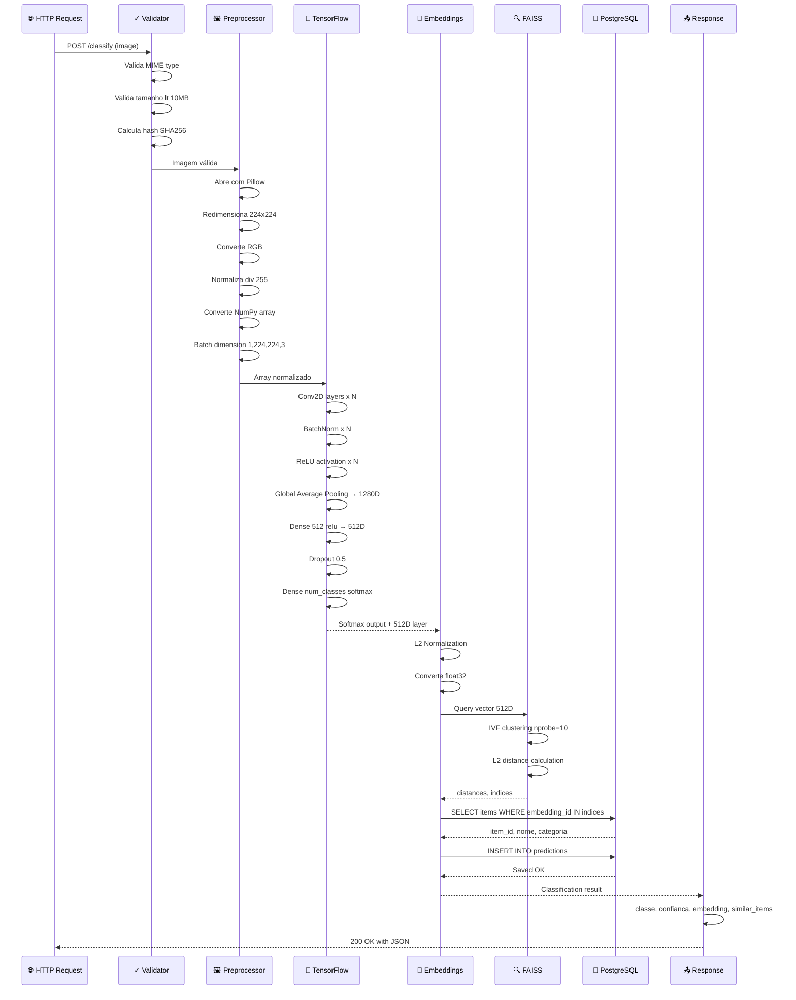
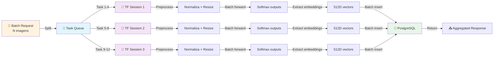
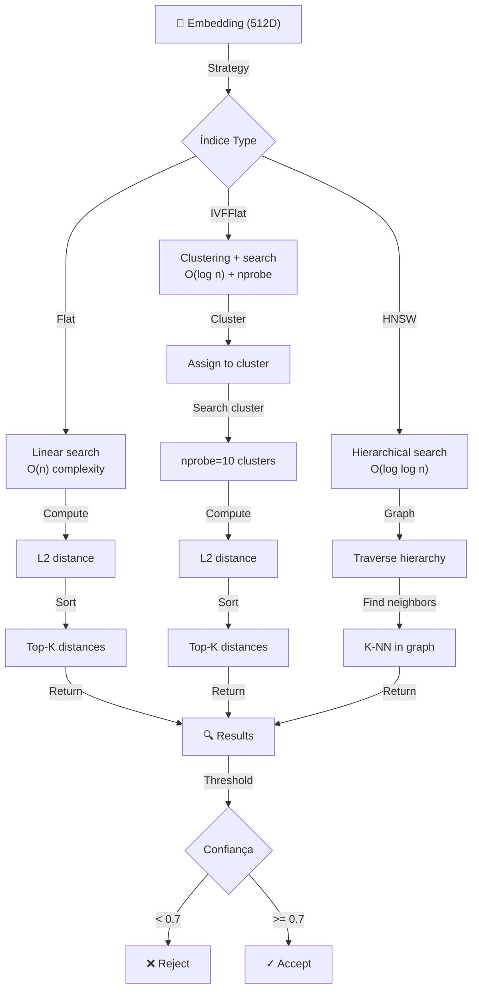
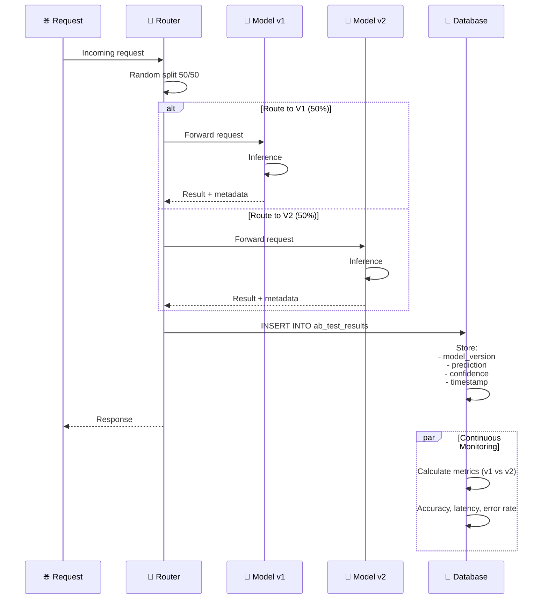
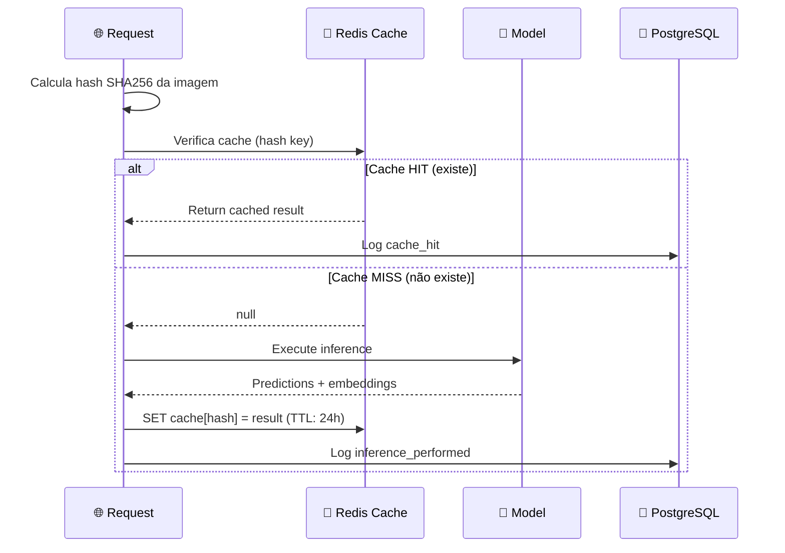
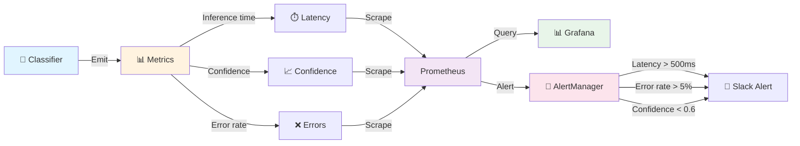
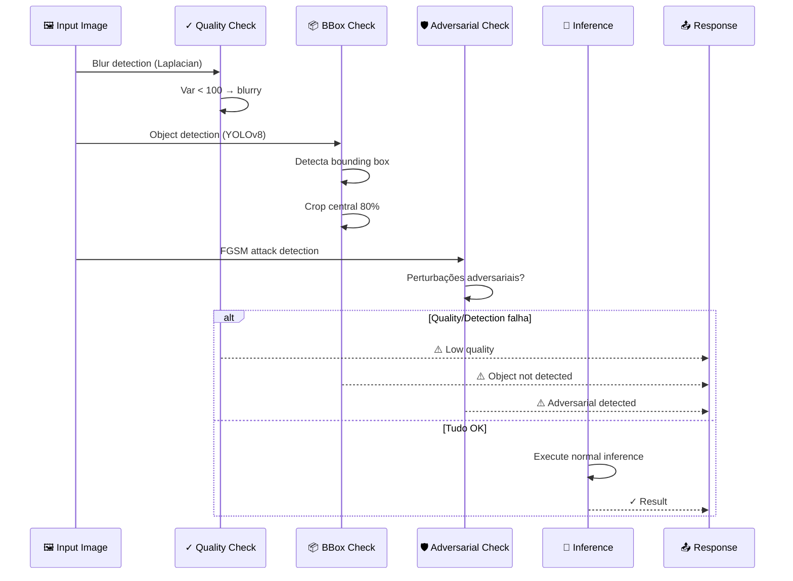
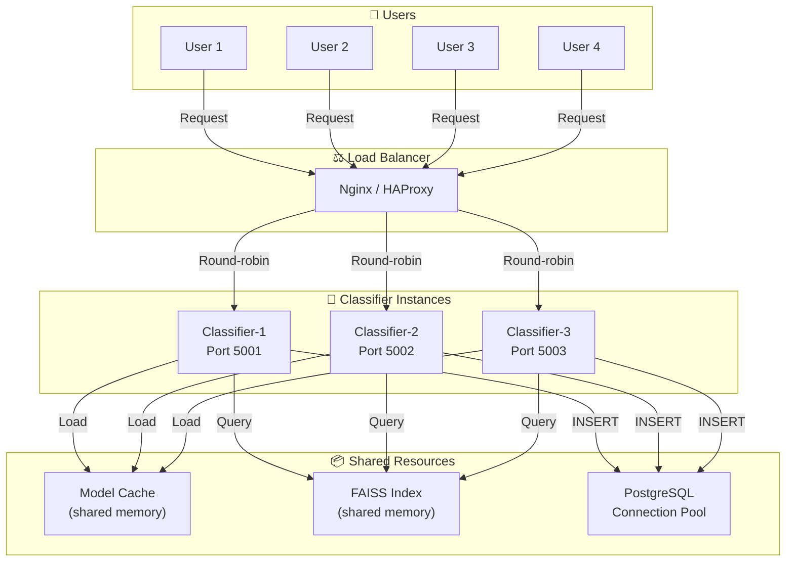
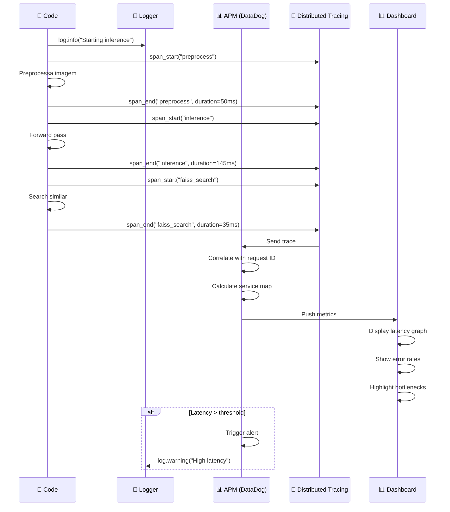

# OColecionadorClassifier - Fluxos Avançados

Documentação detalhada dos fluxos complexos de inferência e otimizações.

---

## 🔄 Fluxo 1: Pipeline Completo de Classificação com Embedding Extraction

---

## ⚡ Fluxo 2: Batch Inference com Processing Paralelo

---

## 🎯 Fluxo 3: FAISS Search com Diferentes Estratégias

---

## 🔄 Fluxo 4: Model Versioning e A/B Testing

---

## 💾 Fluxo 5: Caching e Cache Invalidation

---

## 📊 Fluxo 6: Monitoramento e Alertas em Tempo Real

---

## 🔐 Fluxo 7: Validação e Adversarial Detection

---

## 🚀 Fluxo 8: Escalabilidade com Horizontal Load Balancing

---

## 📈 Fluxo 9: Benchmark - Tempo de Processamento

```mermaid
graph LR
    A["Input<br/>1 image<br/>4MB"] 
    -->|Download<br/>50ms| B["Load em RAM"]
    -->|Validation<br/>10ms| C["Check MIME/Size"]
    -->|Preprocessing<br/>50ms| D["Resize 224x224<br/>Normalize"]
    -->|Inference<br/>100-150ms| E["Forward Pass<br/>TensorFlow"]
    -->|Embedding<br/>20ms| F["Extract 512D"]
    -->|FAISS Search<br/>30ms| G["Find k=5 similar"]
    -->|Database<br/>20ms| H["Query items"]
    -->|Response<br/>10ms| I["JSON encode"]
    -->|Total<br/>~290-340ms| J["✓ Complete"]
```

---

## 🔍 Fluxo 10: Debugging com Observabilidade Completa

---

## 🎯 Conclusão

O **OColecionadorClassifier** oferece:

✅ **Inferência Rápida** – 100-200ms (TensorFlow)  
✅ **Busca Escalável** – FAISS para milhares de itens  
✅ **Versioning** – A/B testing entre modelos  
✅ **Observabilidade** – Métricas, logs, tracing  
✅ **Validação Robusta** – Detecção de qualidade e adversarial  
✅ **Caching** – Redis para reduzir latência  
✅ **Escalabilidade** – Múltiplas instâncias com load balancer  

**Tempo médio: 290-340ms por requisição**  
**Throughput: ~5-10 requisições/seg por instância**