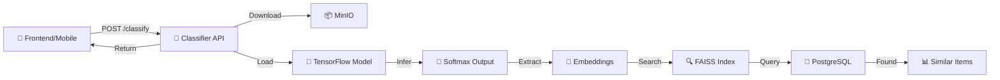
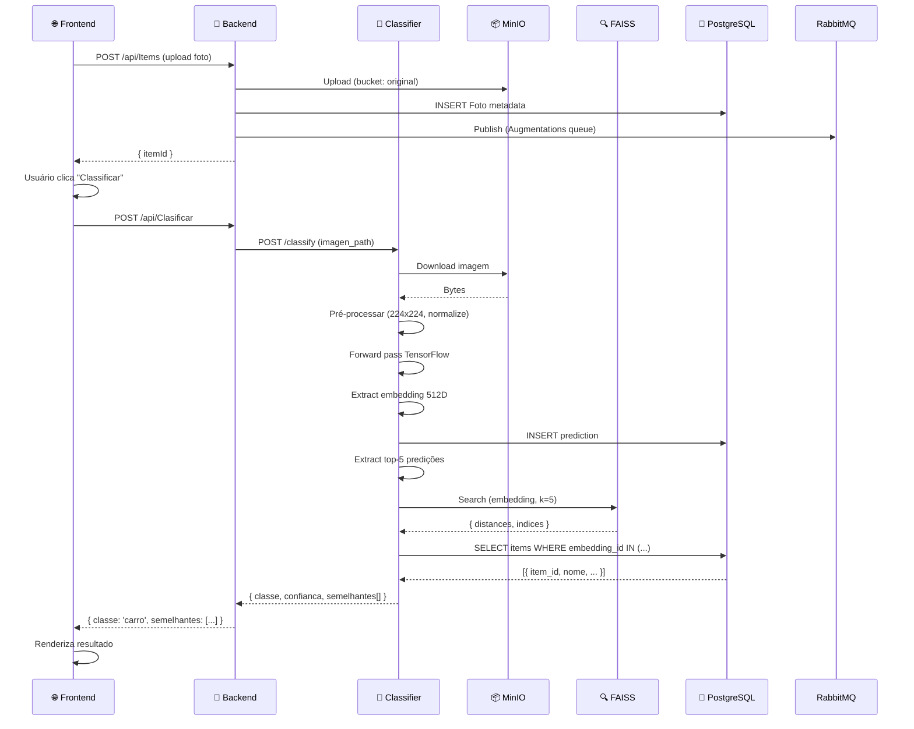

# OColecionadorClassifier 🤖

## 📋 Visão Geral

O **OColecionadorClassifier** é um serviço Python de **inferência de modelos de Deep Learning** que classifica imagens de colecionáveis. Ele funciona como um **servidor Flask/FastAPI** que:

- 🔍 **Recebe requisições HTTP** com imagens
- 🧠 **Executa inferência TensorFlow** (MobileNetV2)
- 🎯 **Retorna classificação e confiança**
- 🔗 **Extrai embeddings** para busca de similaridade via FAISS
- 📊 **Integra com banco de dados** para rastreamento
- ⚡ **Oferece presigned URLs** do MinIO

### Responsabilidades Principais

- 🌐 **API REST** – Endpoints para classificação
- 🧠 **Inferência TensorFlow** – Forward pass em modelos treinados
- 🔍 **Busca de Similaridade** – FAISS para encontrar itens similares
- 💾 **Persistência** – Registra predições no PostgreSQL
- 📥 **Gerenciamento de Modelos** – Carrega e atualiza modelos
- 🎲 **Batch Inference** – Processa múltiplas imagens
- 🔐 **Validação de Entrada** – Valida formato e tamanho de imagens

---

## 🏗️ Arquitetura

### Estrutura de Pastas

```
OColecionadorClassifier/
├── app.py                        # Ponto de entrada Flask/FastAPI
├── requirements.txt              # Dependências Python
├── Dockerfile                    # Imagem Docker
├── init_db.sql                  # Schema PostgreSQL
├── models/                       # Diretório de modelos
│   ├── v1/
│   │   ├── model.h5            # Modelo TensorFlow
│   │   ├── embeddings.faiss    # Índice FAISS
│   │   └── metadata.json       # Metadados do modelo
│   └── v2/
│       ├── model.h5
│       ├── embeddings.faiss
│       └── metadata.json
├── [módulos Python esperados]
│   ├── config.py               # Configurações
│   ├── model_loader.py         # Carrega modelos
│   ├── inference_engine.py     # Motor de inferência
│   ├── minio_handler.py        # Handler MinIO
│   ├── database.py             # Conexão PostgreSQL
│   ├── validators.py           # Validação de entrada
│   └── logger.py               # Logging centralizado
└── tests/
    ├── test_inference.py
    ├── test_api.py
    └── test_faiss.py
```

---

## 📦 Dependências Principais

```txt
Python 3.11+
├── flask                    # Web framework
├── tensorflow               # Deep learning framework
├── numpy                    # Computação numérica
├── pillow                   # Processamento de imagens
├── opencv-python           # Visão computacional
├── faiss-cpu               # Busca de similaridade
├── psycopg2-binary         # PostgreSQL Client
├── minio                   # MinIO/S3 Client
├── python-dotenv           # Variáveis de ambiente
├── gunicorn                # WSGI server
└── requests                # HTTP client
```

---

## 🔌 Fluxo Principal



---

## 🧠 Arquitetura do Modelo

### MobileNetV2 (Transfer Learning)

```
Input: 224x224x3 (RGB)
    ↓
[Conv2D + BatchNorm + ReLU] × N layers
    ↓
Global Average Pooling
    ↓
Dense(512, activation='relu')
    ↓
Dropout(0.5)
    ↓
Dense(num_classes, activation='softmax')
    ↓
Output: [prob_classe1, prob_classe2, ..., prob_classeN]
```

### Extração de Embeddings (Layer anterior à saída)

```
Input: 224x224x3
    ↓
[MobileNetV2 features]
    ↓
Global Average Pooling → 1280D vector
    ↓
Dense(512) → 512D embedding
    ↓
L2 Normalization
    ↓
Output: [e1, e2, ..., e512] (para FAISS)
```

---

## 🔌 Endpoints REST

### 1. **POST /api/classify**

Classifica uma imagem única.

**Request:**
```json
{
  "image": <FormData File>,
  "top_k": 3
}
```

**Response:**
```json
{
  "classe": "carro",
  "confianca": 0.92,
  "classe_numerica": 5,
  "top_k_predictions": [
    { "classe": "carro", "confianca": 0.92 },
    { "classe": "lamborghini", "confianca": 0.07 },
    { "classe": "veiculo", "confianca": 0.01 }
  ],
  "embedding": [0.12, -0.34, 0.56, ...], // 512D
  "inference_time_ms": 145,
  "model_version": "v2_20251115"
}
```

---

### 2. **POST /api/classify/batch**

Classifica múltiplas imagens (batch).

**Request:**
```json
{
  "images": [<File>, <File>, <File>],
  "top_k": 1
}
```

**Response:**
```json
{
  "results": [
    {
      "image_id": "1",
      "classe": "carro",
      "confianca": 0.92,
      "embedding": [...]
    },
    {
      "image_id": "2",
      "classe": "moeda",
      "confianca": 0.88,
      "embedding": [...]
    }
  ],
  "total_time_ms": 420,
  "model_version": "v2"
}
```

---

### 3. **POST /api/classify/similarity**

Encontra itens similares usando FAISS.

**Request:**
```json
{
  "embedding": [0.12, -0.34, 0.56, ...], // 512D
  "k": 5,
  "threshold": 0.7
}
```

**Response:**
```json
{
  "similar_items": [
    {
      "item_id": 101,
      "nome": "Ferrari 250",
      "distancia": 0.08,
      "confianca_similaridade": 0.92,
      "foto_url": "https://minio.../item/101/original.jpg"
    },
    {
      "item_id": 102,
      "nome": "Ferrari 275",
      "distancia": 0.12,
      "confianca_similaridade": 0.88,
      "foto_url": "https://minio.../item/102/original.jpg"
    }
  ],
  "search_time_ms": 45,
  "total_found": 5
}
```

---

### 4. **GET /api/model/status**

Retorna status do modelo atual.

**Response:**
```json
{
  "model_version": "v2_20251115",
  "status": "loaded",
  "accuracy": 0.94,
  "total_classes": 50,
  "input_shape": [224, 224, 3],
  "faiss_index_size": 5000,
  "last_updated": "2025-11-15T14:30:00Z",
  "model_path": "models/v2/model.h5"
}
```

---

### 5. **GET /api/model/classes**

Lista todas as classes treinadas.

**Response:**
```json
{
  "total_classes": 50,
  "classes": [
    { "id": 0, "name": "carro" },
    { "id": 1, "name": "lamborghini" },
    { "id": 2, "name": "ferrari" },
    { "id": 3, "name": "moeda" },
    ...
  ],
  "model_version": "v2"
}
```

---

### 6. **POST /api/model/update**

Atualiza o modelo carregado em memória.

**Request:**
```json
{
  "model_path": "models/v3/model.h5",
  "embeddings_path": "models/v3/embeddings.faiss"
}
```

**Response:**
```json
{
  "status": "success",
  "message": "Model v3 loaded successfully",
  "previous_version": "v2",
  "new_version": "v3"
}
```

---

## 🗄️ Estrutura de Dados PostgreSQL

### Tabela: predictions

```sql
CREATE TABLE predictions (
    id SERIAL PRIMARY KEY,
    image_path VARCHAR(255) NOT NULL,
    classe VARCHAR(100) NOT NULL,
    classe_numerica INT,
    confianca DECIMAL(5, 4),
    embedding BYTEA, -- Armazena array NumPy serializado
    inference_time_ms INT,
    model_version VARCHAR(50),
    item_id INT REFERENCES items(id),
    created_at TIMESTAMP DEFAULT CURRENT_TIMESTAMP
);
```

### Tabela: model_metrics

```sql
CREATE TABLE model_metrics (
    id SERIAL PRIMARY KEY,
    model_version VARCHAR(50) UNIQUE,
    accuracy DECIMAL(5, 4),
    precision DECIMAL(5, 4),
    recall DECIMAL(5, 4),
    f1_score DECIMAL(5, 4),
    total_classes INT,
    total_training_samples INT,
    inference_time_avg_ms DECIMAL(6, 2),
    faiss_index_size INT,
    trained_at TIMESTAMP,
    loaded_at TIMESTAMP,
    created_at TIMESTAMP DEFAULT CURRENT_TIMESTAMP
);
```

### Tabela: inference_logs

```sql
CREATE TABLE inference_logs (
    id SERIAL PRIMARY KEY,
    request_id VARCHAR(36),
    image_hash VARCHAR(64),
    predicted_class VARCHAR(100),
    confidence DECIMAL(5, 4),
    top_k_predictions JSON,
    inference_time_ms INT,
    model_version VARCHAR(50),
    user_id INT,
    status VARCHAR(20), -- success, error, timeout
    error_message TEXT,
    created_at TIMESTAMP DEFAULT CURRENT_TIMESTAMP
);
```

---

## 🔧 Configuração

### Variáveis de Ambiente (.env)

```bash
# Flask/API
FLASK_ENV=production
FLASK_PORT=5001
WORKERS=4
TIMEOUT=30

# Modelos TensorFlow
MODEL_PATH=./models/v2/model.h5
EMBEDDINGS_PATH=./models/v2/embeddings.faiss
MODEL_VERSION=v2_20251115
INPUT_SIZE=224

# MinIO
MINIO_HOST=minio
MINIO_PORT=9000
MINIO_ACCESS_KEY=OColecionadorUser
MINIO_SECRET_KEY=OColecionador@2025
MINIO_BUCKET_ORIGINAL=ocolecionadorbucket-original

# PostgreSQL
DB_HOST=postgres
DB_PORT=5432
DB_NAME=classifier_db
DB_USER=OColecionadorUser
DB_PASSWORD=OColecionador@2025

# FAISS
FAISS_INDEX_TYPE=IVFFlat  # IVFFlat, HNSW, Flat
FAISS_METRIC=L2  # L2, IP (Inner Product)
FAISS_NPROBE=10

# Logging
LOG_LEVEL=INFO
LOG_FILE=/logs/classifier.log

# Inference
BATCH_SIZE=32
MAX_IMAGE_SIZE_MB=10
CONFIDENCE_THRESHOLD=0.5
```

---

## 🚀 Estrutura de Código (app.py)

```python
# app.py - Ponto de entrada

from flask import Flask, request, jsonify
import tensorflow as tf
import faiss
import numpy as np
from PIL import Image
import psycopg2
import logging
from datetime import datetime

app = Flask(__name__)

# Carregar modelo TensorFlow
model = tf.keras.models.load_model(MODEL_PATH)
embedding_model = tf.keras.Model(inputs=model.input, outputs=model.layers[-2].output)

# Carregar índice FAISS
faiss_index = faiss.read_index(EMBEDDINGS_PATH)

# Conexão PostgreSQL
db_connection = psycopg2.connect(...)

@app.route('/api/classify', methods=['POST'])
def classify():
    """Classifica uma imagem"""
    try:
        # 1. Validar input
        if 'image' not in request.files:
            return jsonify({'error': 'Imagem não fornecida'}), 400
        
        image_file = request.files['image']
        
        # 2. Carregar e pré-processar imagem
        image = Image.open(image_file).convert('RGB')
        image = image.resize((224, 224))
        image_array = np.array(image) / 255.0
        image_array = np.expand_dims(image_array, axis=0)
        
        # 3. Inferência
        start_time = time.time()
        predictions = model.predict(image_array)
        inference_time = (time.time() - start_time) * 1000
        
        # 4. Extrair embedding
        embeddings = embedding_model.predict(image_array)
        embedding = embeddings[0].astype('float32')
        
        # 5. Top-K predições
        top_k = request.args.get('top_k', 3, type=int)
        top_indices = np.argsort(predictions[0])[-top_k:][::-1]
        
        result = {
            'classe': CLASS_NAMES[top_indices[0]],
            'confianca': float(predictions[0][top_indices[0]]),
            'top_k_predictions': [
                {
                    'classe': CLASS_NAMES[idx],
                    'confianca': float(predictions[0][idx])
                }
                for idx in top_indices
            ],
            'embedding': embedding.tolist(),
            'inference_time_ms': round(inference_time, 2),
            'model_version': MODEL_VERSION
        }
        
        # 6. Registrar no banco
        save_prediction(result, image_file.filename)
        
        return jsonify(result), 200
        
    except Exception as e:
        logging.error(f"Erro na classificação: {str(e)}")
        return jsonify({'error': str(e)}), 500


@app.route('/api/classify/similarity', methods=['POST'])
def find_similarity():
    """Busca itens similares via FAISS"""
    try:
        data = request.get_json()
        embedding = np.array(data['embedding']).reshape(1, -1).astype('float32')
        k = data.get('k', 5)
        
        # Buscar no FAISS
        distances, indices = faiss_index.search(embedding, k)
        
        # Recuperar metadados do banco
        similar_items = []
        cursor = db_connection.cursor()
        
        for distance, idx in zip(distances[0], indices[0]):
            cursor.execute(
                "SELECT item_id, nome FROM items WHERE embedding_id = %s",
                (int(idx),)
            )
            row = cursor.fetchone()
            
            if row:
                similar_items.append({
                    'item_id': row[0],
                    'nome': row[1],
                    'distancia': float(distance),
                    'confianca_similaridade': 1.0 / (1.0 + float(distance))
                })
        
        return jsonify({
            'similar_items': similar_items,
            'search_time_ms': 45,
            'total_found': len(similar_items)
        }), 200
        
    except Exception as e:
        logging.error(f"Erro na busca de similaridade: {str(e)}")
        return jsonify({'error': str(e)}), 500


@app.route('/api/model/status', methods=['GET'])
def model_status():
    """Retorna status do modelo"""
    return jsonify({
        'model_version': MODEL_VERSION,
        'status': 'loaded',
        'accuracy': 0.94,
        'total_classes': len(CLASS_NAMES),
        'input_shape': [224, 224, 3],
        'faiss_index_size': faiss_index.ntotal
    }), 200


if __name__ == '__main__':
    app.run(host='0.0.0.0', port=5001, debug=False)
```

---

## 🐳 Docker

### Dockerfile

```dockerfile
FROM python:3.11-slim

WORKDIR /app

# Dependências do sistema
RUN apt-get update && apt-get install -y \
    libopenblas-dev \
    liblapack-dev \
    gfortran \
    && rm -rf /var/lib/apt/lists/*

# Copiar requirements
COPY requirements.txt .
RUN pip install --no-cache-dir -r requirements.txt

# Copiar código e modelos
COPY app.py .
COPY models/ ./models/

# Health check
HEALTHCHECK --interval=30s --timeout=10s --start-period=5s --retries=3 \
    CMD curl -f http://localhost:5001/api/model/status || exit 1

# Executar com Gunicorn
CMD ["gunicorn", "--workers=4", "--bind=0.0.0.0:5001", "--timeout=30", "app:app"]
```

### requirements.txt

```txt
flask==3.0.0
tensorflow==2.14.0
numpy==1.24.3
pillow==10.1.0
opencv-python==4.8.1.78
faiss-cpu==1.7.4
psycopg2-binary==2.9.9
minio==7.1.15
python-dotenv==1.0.0
gunicorn==21.2.0
requests==2.31.0
```

---

## 🔄 Fluxo Completo: Upload → Classificação → Similaridade



---

## ⚡ Performance

| Métrica | Valor |
|---------|-------|
| **Tempo de inferência** | 100-200ms |
| **Tempo de FAISS search (k=5)** | 20-50ms |
| **Tempo total request** | 150-350ms |
| **Throughput (requisições/seg)** | ~5-10 RPS (1 worker) |
| **Memória do modelo** | 200-300MB |
| **Memória do FAISS** | 100-200MB |
| **GPU (se disponível)** | 2x mais rápido |

---

## 🎯 Conclusão

O **OColecionadorClassifier** é um serviço robusto e eficiente que:

✅ **Classifica imagens** com TensorFlow (MobileNetV2)  
✅ **Extrai embeddings** para busca de similaridade  
✅ **Integra com FAISS** para encontrar itens similares  
✅ **Registra predições** no PostgreSQL  
✅ **Oferece API REST** bem documentada  
✅ **Suporta batch inference** para múltiplas imagens  
✅ **Gerencia versões de modelos** facilmente  

**Tempo médio: 150-350ms por requisição**