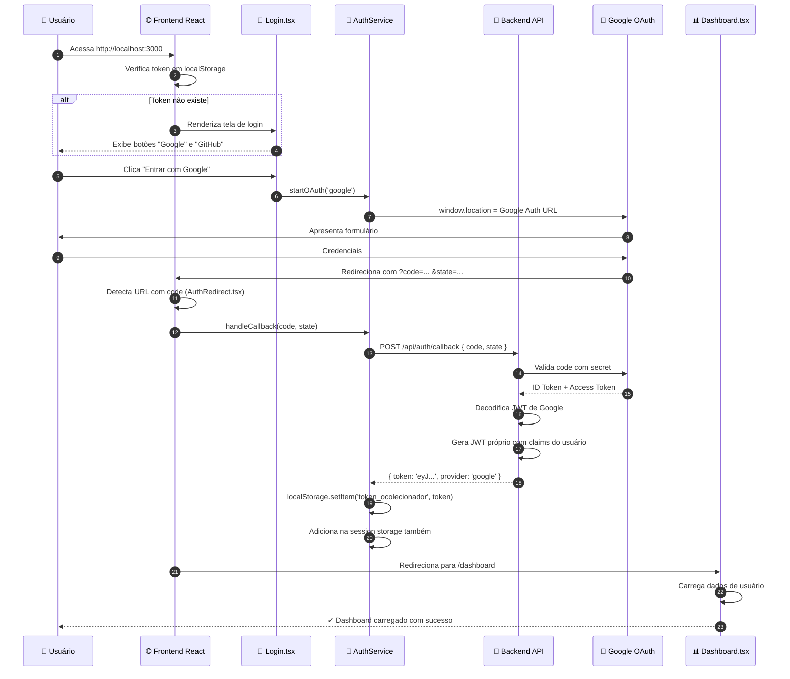
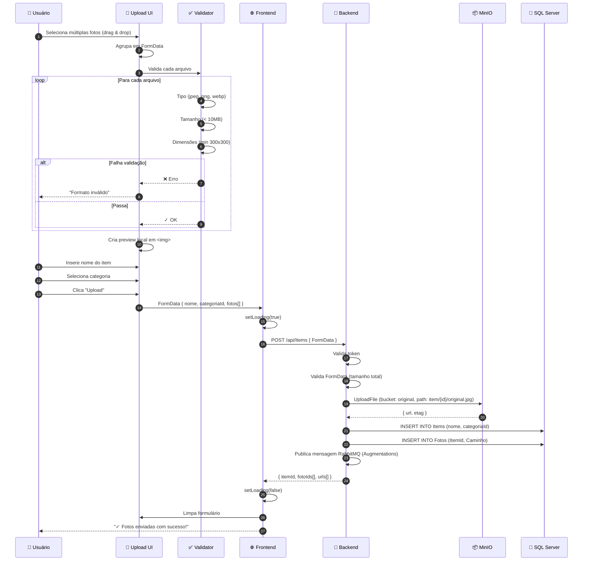
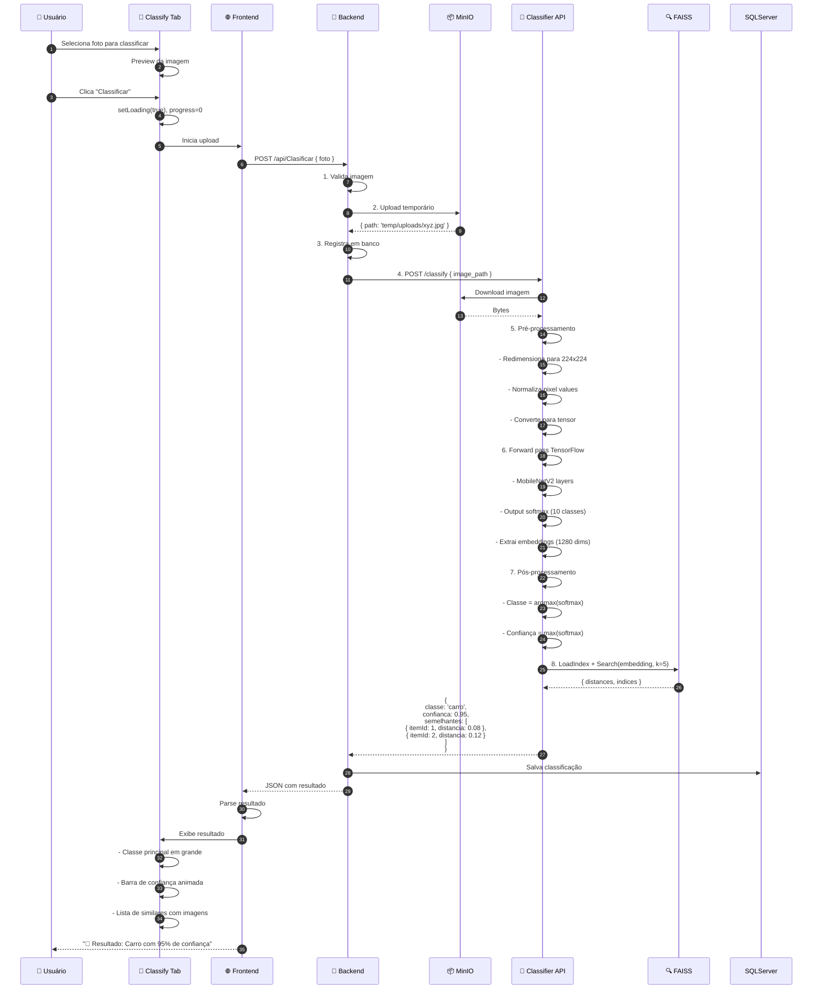
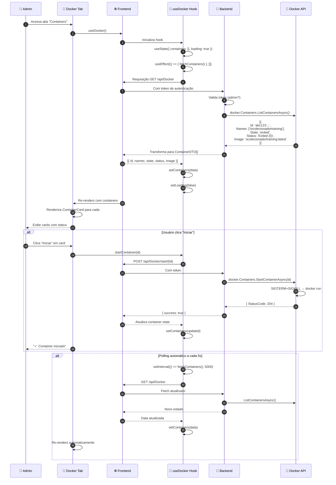
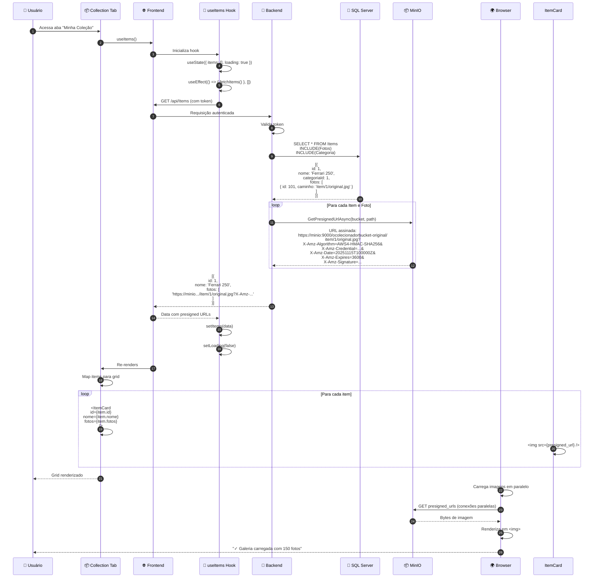

# OColecionadorFrontEnd - Fluxos Avançados

Documentação detalhada dos fluxos complexos e padrões avançados da aplicação React.

---

## 🔄 Fluxo 1: Autenticação OAuth2 Completa



---

## 📸 Fluxo 2: Upload Multi-Foto com Validação



---

## 🤖 Fluxo 3: Classificação com IA e Busca de Similaridade



---

## 🐳 Fluxo 4: Dashboard Docker com Polling e Real-time Updates



---

## 🎨 Fluxo 5: Renderização da Galeria com Imagens do MinIO



---

## 🔌 Interceptor de Requisições com Error Handling

```typescript
// Detalhes do arquivo services/API.ts

// Interceptor de Request
API.interceptors.request.use(
  (config) => {
    // 1. Adiciona token
    const token = localStorage.getItem('token_ocolecionador')
    if (token && !isTokenExpired(token)) {
      config.headers.Authorization = `Bearer ${token}`
    } else if (token && isTokenExpired(token)) {
      // Token expirado - logout
      clearToken()
      window.location.href = '/login'
    }
    
    // 2. Adiciona headers customizados
    config.headers['X-Requested-With'] = 'XMLHttpRequest'
    config.headers['Content-Type'] = 'application/json'
    
    // 3. Timeout por tipo de request
    if (config.url?.includes('/Clasificar')) {
      config.timeout = 30000 // 30s para classificação
    }
    
    return config
  },
  (error) => Promise.reject(error)
)

// Interceptor de Response
API.interceptors.response.use(
  (response) => {
    // 2xx: Sucesso
    return response
  },
  (error) => {
    // Trata diferentes status codes
    if (error.response?.status === 401) {
      // Unauthorized - logout
      clearToken()
      window.location.href = '/login'
    } else if (error.response?.status === 403) {
      // Forbidden - sem permissão
      console.error('Sem permissão para esta ação')
    } else if (error.response?.status === 404) {
      // Not found
      console.error('Recurso não encontrado')
    } else if (error.response?.status === 500) {
      // Server error
      console.error('Erro interno do servidor')
    } else if (error.code === 'ECONNABORTED') {
      // Timeout
      console.error('Requisição expirou')
    }
    return Promise.reject(error)
  }
)
```

---

## 🎯 Performance: Lazy Loading de Imagens

```typescript
// Componente com lazy loading implementado

interface ItemCardProps {
  item: Item
}

export function ItemCard({ item }: ItemCardProps) {
  const [loaded, setLoaded] = useState(false)
  const imgRef = useRef<HTMLImageElement>(null)

  useEffect(() => {
    // Intersection Observer para lazy loading
    const observer = new IntersectionObserver(
      (entries) => {
        entries.forEach((entry) => {
          if (entry.isIntersecting && imgRef.current) {
            imgRef.current.src = item.fotos[0]
            observer.unobserve(entry.target)
          }
        })
      },
      { rootMargin: '50px' }
    )

    if (imgRef.current) {
      observer.observe(imgRef.current)
    }

    return () => observer.disconnect()
  }, [item.fotos])

  return (
    <div className="item-card">
      <div className="image-container">
        {!loaded && <div className="skeleton" />}
         setLoaded(true)}
          className={loaded ? 'loaded' : ''}
        />
      </div>
      <h3>{item.nome}</h3>
    </div>
  )
}
```

---

## 📊 Conclusão

Os fluxos avançados do OColecionadorFrontEnd demonstram:

✅ **Segurança** – Token management, CORS, autenticação  
✅ **Performance** – Lazy loading, presigned URLs, polling  
✅ **UX** – Error handling, loading states, real-time updates  
✅ **Escalabilidade** – Hooks customizados, interceptadores, composição  
