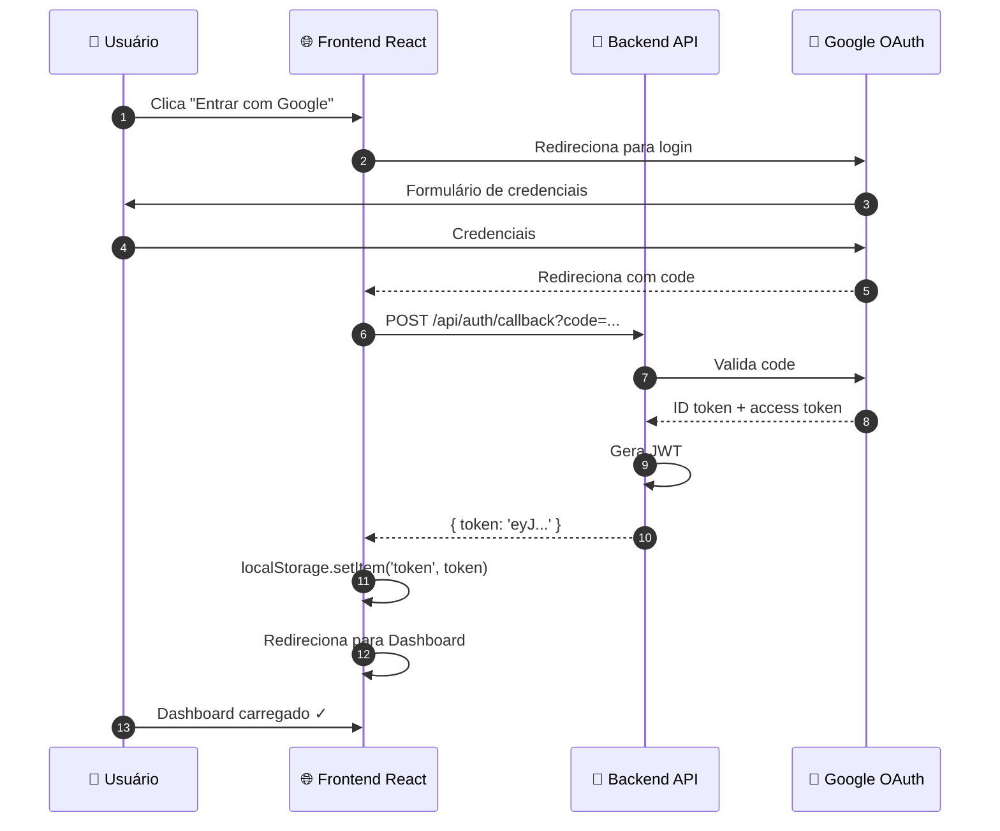
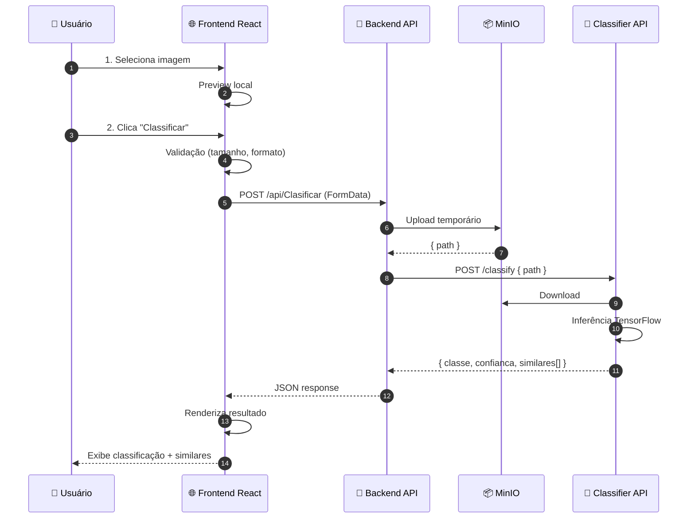
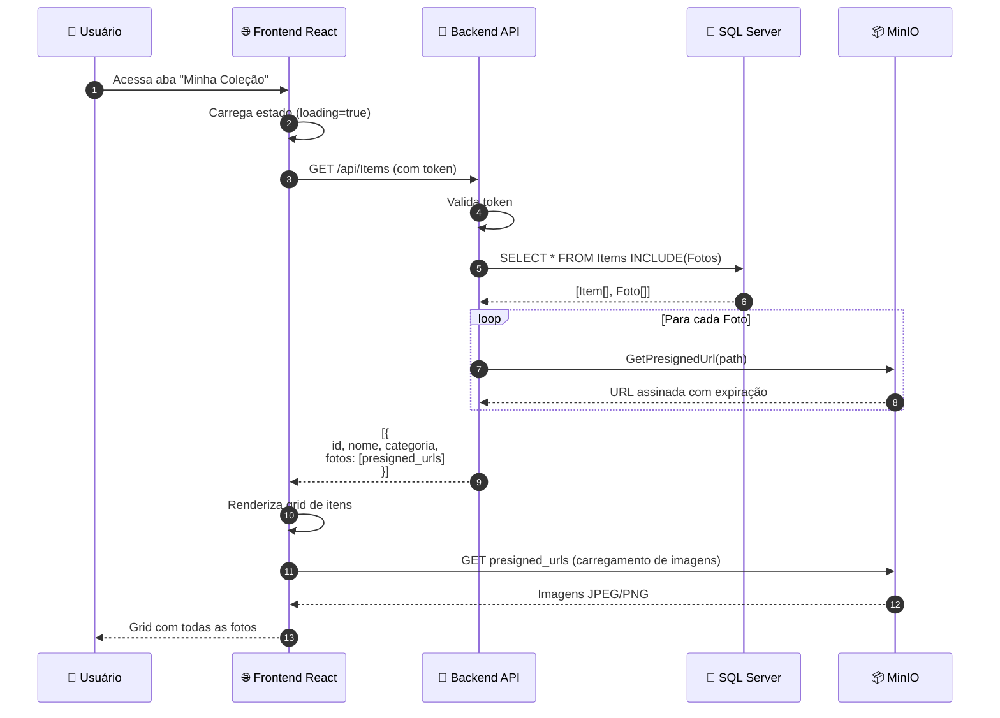
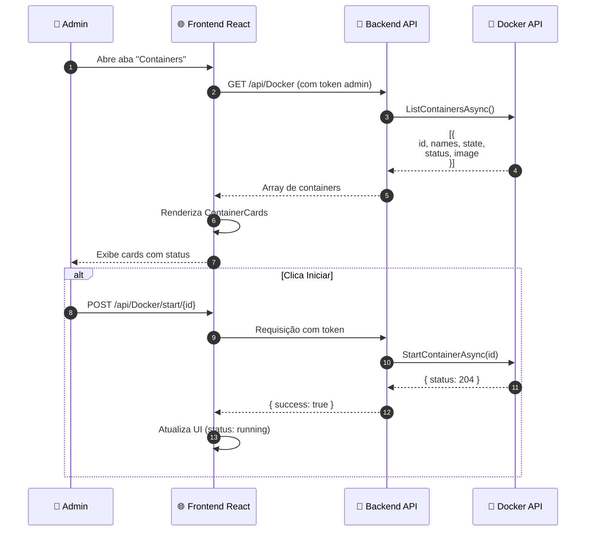
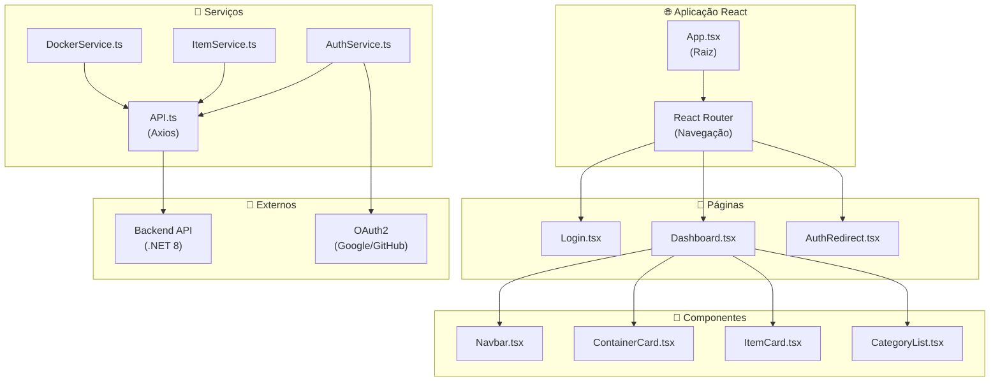

# OColecionadorFrontEnd 🌐

## 📋 Visão Geral

O **OColecionadorFrontEnd** é a **aplicação web (Dashboard)** do projeto OColecionador, desenvolvida em **React com TypeScript**. Ele fornece uma interface intuitiva para:

- 🔐 **Autenticação OAuth2** – Login com Google e GitHub
- 📱 **Visualização de Coleção** – Listagem de itens e categorias
- 📸 **Upload de Fotos** – Captura e envio de imagens
- 🤖 **Classificação em Tempo Real** – Reconhecimento de objetos via IA
- 🐳 **Dashboard de Containers** – Gerenciamento de serviços Docker
- 📊 **Painel de Controle** – Monitoramento do sistema

### Responsabilidades Principais

- 🎨 **UI/UX Responsiva** – Interface adaptável para desktop e tablets
- 🔄 **Integração API** – Comunicação com Backend .NET
- 🔐 **Gerenciamento de Sessão** – Armazenamento seguro de tokens
- 📡 **Real-time Updates** – Atualização de dados em tempo real
- 🎯 **Navegação Intuitiva** – Fluxo de uso simplificado
- ♿ **Acessibilidade** – Compatibilidade com leitores de tela

---

## 🏗️ Arquitetura

### Estrutura de Pastas

```
OColecionadorFrontEnd/
├── public/                         # Arquivos estáticos
│   ├── index.html                 # HTML principal
│   ├── manifest.json              # Configuração PWA
│   └── robots.txt                 # SEO
│
├── src/
│   ├── App.tsx                    # Componente raiz
│   ├── index.tsx                  # Ponto de entrada
│   │
│   ├── pages (screens)/
│   │   ├── Login.tsx              # Tela de autenticação
│   │   ├── Dashboard.tsx          # Dashboard principal
│   │   └── AuthRedirect.tsx       # Callback OAuth2
│   │
│   ├── components/
│   │   ├── ContainerCard.tsx      # Card de container Docker
│   │   ├── ItemCard.tsx           # Card de item da coleção
│   │   ├── CategoryList.tsx       # Lista de categorias
│   │   └── Navbar.tsx             # Navegação superior
│   │
│   ├── services/
│   │   ├── API.ts                 # Configuração Axios
│   │   ├── AuthService.ts         # Autenticação
│   │   ├── ItemService.ts         # Operações de itens
│   │   └── DockerService.ts       # Operações Docker
│   │
│   ├── models/
│   │   ├── Docker.ts              # Tipos de container
│   │   ├── Item.ts                # Tipos de item
│   │   └── Category.ts            # Tipos de categoria
│   │
│   ├── hooks/
│   │   ├── useAuth.ts             # Hook de autenticação
│   │   ├── useItems.ts            # Hook de itens
│   │   └── useDocker.ts           # Hook de Docker
│   │
│   ├── styles/
│   │   ├── Dashboard.css
│   │   ├── Login.css
│   │   └── global.css
│   │
│   ├── assets/
│   │   ├── logo.svg
│   │   ├── icons/
│   │   └── images/
│   │
│   └── utils/
│       ├── formatters.ts          # Funções de formatação
│       ├── validators.ts          # Validações
│       └── constants.ts           # Constantes da app
│
├── .gitignore
├── Dockerfile                      # Containerização
├── package.json                    # Dependências
├── tsconfig.json                   # Configuração TypeScript
└── README.md
```

---

## 🧩 Stack Tecnológico

| Tecnologia | Versão | Propósito |
|-----------|--------|----------|
| **React** | 19.2.0 | Framework UI |
| **TypeScript** | 4.9.5 | Type-safe development |
| **React Router** | 7.9.5 | Navegação entre páginas |
| **Axios** | 1.13.1 | Cliente HTTP |
| **Lucide React** | 0.552.0 | Icons library |
| **React Icons** | 5.5.0 | Icons adicionais |
| **CSS3** | - | Estilização |
| **Node.js** | 20 | Runtime |

---

## 🔌 Serviços Principais

### 1. **AuthService**

Gerencia autenticação OAuth2 e armazenamento de tokens.

```typescript
// services/AuthService.ts
export class AuthService {
  // Inicia login OAuth2
  startOAuth(provider: 'google' | 'github'): void
  
  // Processa callback de autenticação
  handleCallback(code: string, state: string): Promise<{ token: string }>
  
  // Salva token no localStorage
  setToken(token: string): void
  
  // Recupera token
  getToken(): string | null
  
  // Remove token (logout)
  clearToken(): void
  
  // Valida se usuário está autenticado
  isAuthenticated(): boolean
}
```

---

### 2. **APIService**

Configuração centralizada de requisições HTTP.

```typescript
// services/API.ts
import axios from 'axios'

const API = axios.create({
  baseURL: process.env.REACT_APP_API_URL || 'http://localhost:5000/api',
  timeout: 10000,
})

// Interceptor: Adiciona token em todas as requisições
API.interceptors.request.use((config) => {
  const token = localStorage.getItem('token')
  if (token) {
    config.headers.Authorization = `Bearer ${token}`
  }
  return config
})

// Interceptor: Trata erros de autenticação
API.interceptors.response.use(
  (response) => response,
  (error) => {
    if (error.response?.status === 401) {
      // Redireciona para login
      window.location.href = '/login'
    }
    return Promise.reject(error)
  }
)

export default API
```

---

### 3. **ItemService**

Operações CRUD de itens e fotos.

```typescript
// services/ItemService.ts
export class ItemService {
  // Lista todos os itens com fotos
  getItems(): Promise<Item[]>
  
  // Cria novo item com upload de fotos
  createItem(data: FormData): Promise<Item>
  
  // Atualiza item
  updateItem(id: number, data: FormData): Promise<Item>
  
  // Deleta item
  deleteItem(id: number): Promise<void>
  
  // Classifica imagem
  classifyImage(file: File): Promise<Classification>
}
```

---

### 4. **DockerService**

Gerenciamento de containers Docker.

```typescript
// services/DockerService.ts
export class DockerService {
  // Lista todos os containers
  listContainers(): Promise<Container[]>
  
  // Inicia container
  startContainer(id: string): Promise<void>
  
  // Para container
  stopContainer(id: string): Promise<void>
  
  // Reinicia container
  restartContainer(id: string): Promise<void>
  
  // Obtém logs do container
  getContainerLogs(id: string): Promise<string>
}
```

---

## 🎨 Componentes Principais

### 1. **Login.tsx**

Tela de autenticação com botões OAuth2.

```typescript
// pages/Login.tsx
export default function Login() {
  const handleGoogleLogin = () => {
    window.location.href = `${API_URL}/auth/google?redirect=${window.location.origin}`
  }

  const handleGithubLogin = () => {
    window.location.href = `${API_URL}/auth/github?redirect=${window.location.origin}`
  }

  return (
    <div className="login-container">
      <div className="login-box">
        
        <h1>O Colecionador</h1>
        <p>Organize sua coleção com estilo</p>
        
        <button onClick={handleGoogleLogin} className="btn-google">
          🔐 Entrar com Google
        </button>
        <button onClick={handleGithubLogin} className="btn-github">
          🔐 Entrar com GitHub
        </button>
      </div>
    </div>
  )
}
```

---

### 2. **Dashboard.tsx**

Painel principal com abas.

```typescript
// pages/Dashboard.tsx
export default function Dashboard() {
  const [activeTab, setActiveTab] = useState<'collection' | 'classify' | 'docker'>('collection')

  return (
    <div className="dashboard">
      <Navbar />
      
      <div className="dashboard-tabs">
        <button 
          className={`tab ${activeTab === 'collection' ? 'active' : ''}`}
          onClick={() => setActiveTab('collection')}
        >
          📦 Minha Coleção
        </button>
        <button 
          className={`tab ${activeTab === 'classify' ? 'active' : ''}`}
          onClick={() => setActiveTab('classify')}
        >
          🤖 Classificar
        </button>
        <button 
          className={`tab ${activeTab === 'docker' ? 'active' : ''}`}
          onClick={() => setActiveTab('docker')}
        >
          🐳 Containers
        </button>
      </div>

      <div className="dashboard-content">
        {activeTab === 'collection' && <CollectionTab />}
        {activeTab === 'classify' && <ClassifyTab />}
        {activeTab === 'docker' && <DockerTab />}
      </div>
    </div>
  )
}
```

---

### 3. **ContainerCard.tsx**

Card para exibir status de containers Docker.

```typescript
// components/ContainerCard.tsx
interface ContainerCardProps {
  container: Container
  onStart: () => Promise<void>
  onStop: () => Promise<void>
  onRestart: () => Promise<void>
}

export default function ContainerCard({ 
  container, 
  onStart, 
  onStop, 
  onRestart 
}: ContainerCardProps) {
  const [loading, setLoading] = useState(false)

  const handleAction = async (action: () => Promise<void>) => {
    setLoading(true)
    try {
      await action()
    } finally {
      setLoading(false)
    }
  }

  return (
    <div className="container-card">
      <div className="container-header">
        <h3>{container.names[0]}</h3>
        <span className={`status ${container.state}`}>
          {container.state === 'running' ? '🟢' : '🔴'} {container.state}
        </span>
      </div>

      <div className="container-info">
        <p><strong>Image:</strong> {container.image}</p>
        <p><strong>Status:</strong> {container.status}</p>
      </div>

      <div className="container-actions">
        {container.state !== 'running' && (
          <button onClick={() => handleAction(onStart)} disabled={loading}>
            ▶️ Iniciar
          </button>
        )}
        {container.state === 'running' && (
          <button onClick={() => handleAction(onStop)} disabled={loading}>
            ⏹️ Parar
          </button>
        )}
        <button onClick={() => handleAction(onRestart)} disabled={loading}>
          🔄 Reiniciar
        </button>
      </div>
    </div>
  )
}
```

---

## 📡 Fluxos Principais

### Fluxo 1: Login e Autenticação



---

### Fluxo 2: Upload e Classificação de Imagem



---

### Fluxo 3: Visualização e Gerenciamento da Coleção



---

### Fluxo 4: Dashboard Docker - Gerenciamento de Containers



---

## 🔒 Autenticação e Segurança

### Token Management

```typescript
// Armazenamento seguro
const setToken = (token: string) => {
  localStorage.setItem('token_ocolecionador', token)
}

const getToken = (): string | null => {
  return localStorage.getItem('token_ocolecionador')
}

const clearToken = () => {
  localStorage.removeItem('token_ocolecionador')
}

// Verificação de expiração
const isTokenExpired = (token: string): boolean => {
  const decoded = jwtDecode(token)
  return decoded.exp * 1000 < Date.now()
}
```

### Interceptor de Requisições

```typescript
API.interceptors.request.use((config) => {
  const token = getToken()
  
  if (token && isTokenExpired(token)) {
    clearToken()
    window.location.href = '/login'
    return Promise.reject('Token expirado')
  }
  
  if (token) {
    config.headers.Authorization = `Bearer ${token}`
  }
  
  return config
})
```

---

## 🎨 Temas e Estilização

### CSS Global

```css
/* src/styles/global.css */

:root {
  --primary-color: #6366f1;
  --secondary-color: #ec4899;
  --success-color: #10b981;
  --danger-color: #ef4444;
  --warning-color: #f59e0b;
  --bg-dark: #1f2937;
  --bg-light: #f9fafb;
  --text-dark: #111827;
  --text-light: #6b7280;
}

body {
  font-family: -apple-system, BlinkMacSystemFont, 'Segoe UI', Roboto;
  background-color: var(--bg-light);
  color: var(--text-dark);
}

.container {
  max-width: 1200px;
  margin: 0 auto;
  padding: 0 1rem;
}

.btn {
  padding: 0.75rem 1.5rem;
  border: none;
  border-radius: 0.5rem;
  font-weight: 600;
  cursor: pointer;
  transition: all 0.3s ease;
}

.btn-primary {
  background-color: var(--primary-color);
  color: white;
}

.btn-primary:hover {
  background-color: #4f46e5;
  transform: translateY(-2px);
}
```

---

## 🚀 Build e Deployment

### Scripts do package.json

```json
{
  "scripts": {
    "start": "react-scripts start",
    "build": "react-scripts build",
    "test": "react-scripts test",
    "eject": "react-scripts eject"
  }
}
```

### Build para Produção

```bash
npm run build
# Gera pasta build/ com arquivos otimizados
```

### Docker

```dockerfile
FROM node:20 AS build
WORKDIR /app
COPY . ./
RUN npm install
RUN npm run build

FROM node:20-alpine
WORKDIR /app
RUN npm install -g serve
COPY --from=build /app/build ./build
EXPOSE 3000
CMD ["serve", "-s", "build", "-l", "5002"]
```

---

## 📱 Responsividade

### Breakpoints

```css
/* Mobile First */
@media (max-width: 640px) {
  .dashboard-content {
    grid-template-columns: 1fr;
  }
}

/* Tablets */
@media (min-width: 768px) {
  .dashboard-content {
    grid-template-columns: repeat(2, 1fr);
  }
}

/* Desktop */
@media (min-width: 1024px) {
  .dashboard-content {
    grid-template-columns: repeat(3, 1fr);
  }
}
```

---

## 🧪 Testes

### Exemplo com React Testing Library

```typescript
// __tests__/Login.test.tsx
import { render, screen } from '@testing-library/react'
import Login from '../pages/Login'

describe('Login Component', () => {
  it('should render login buttons', () => {
    render(<Login />)
    expect(screen.getByText('Entrar com Google')).toBeInTheDocument()
    expect(screen.getByText('Entrar com GitHub')).toBeInTheDocument()
  })
})
```

---

## 📊 Diagrama de Componentes



---

## 🎯 Conclusão

O **OColecionadorFrontEnd** fornece uma interface intuitiva e responsiva para interagir com todo o ecossistema do OColecionador, desde autenticação até gerenciamento de containers Docker, com foco em experiência do usuário e segurança.