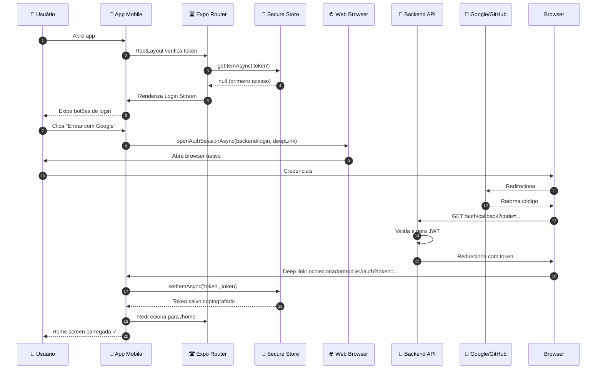
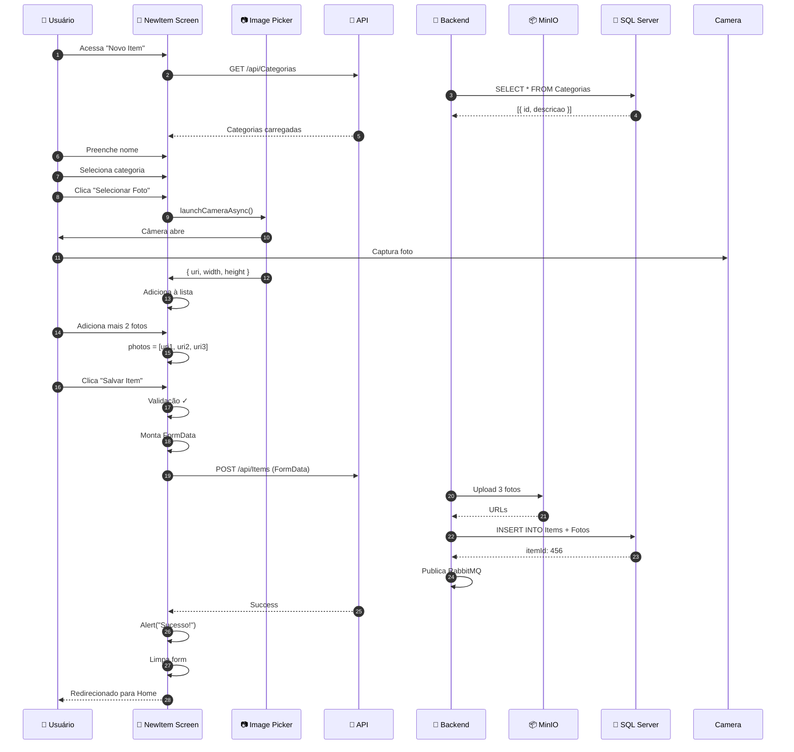
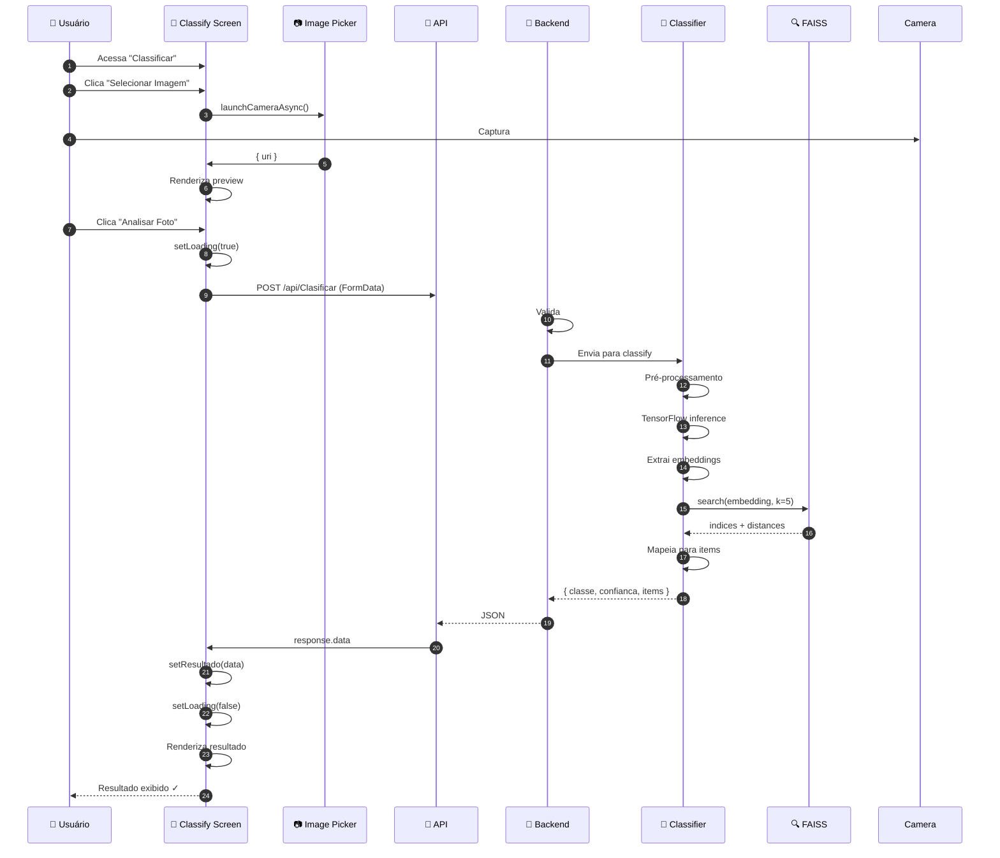
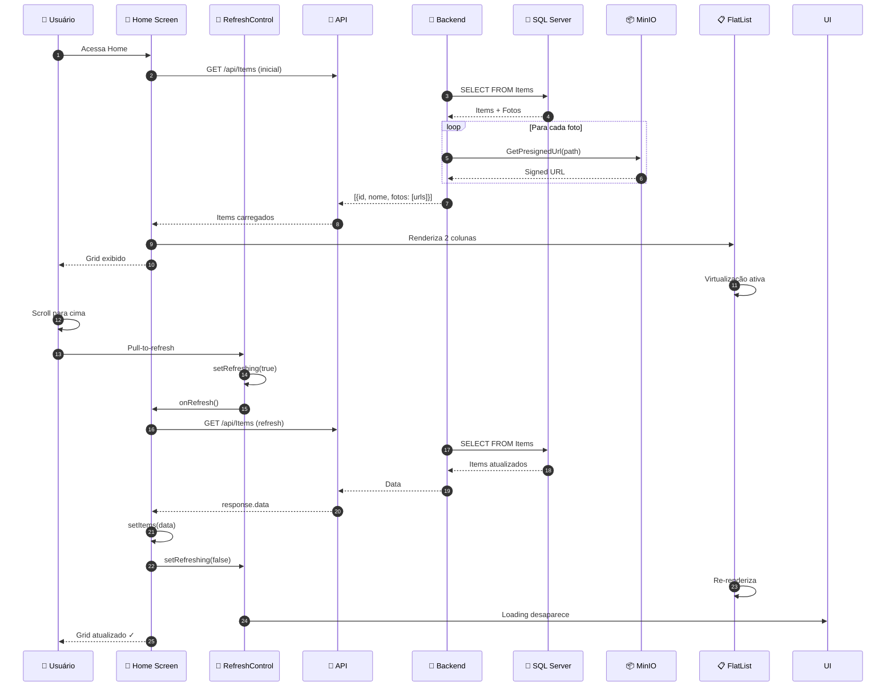
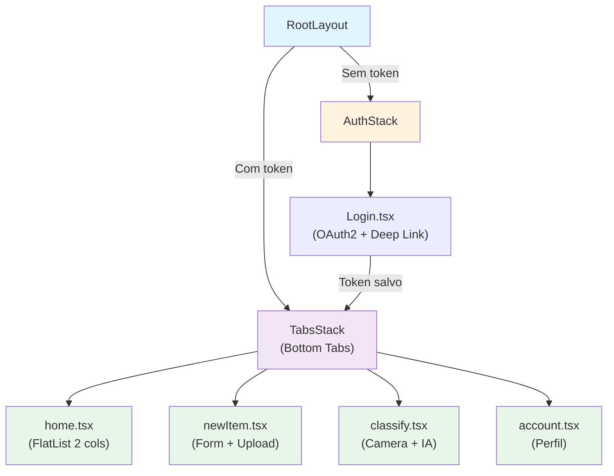

# OColecionadorMobile - Fluxos Avançados

Documentação detalhada dos fluxos complexos e padrões avançados do app mobile.

---

## 🔐 Fluxo 1: Autenticação OAuth2 com Deep Linking



---

## 📸 Fluxo 2: Captura e Upload Multi-Foto



---

## 🤖 Fluxo 3: Classificação com IA



---

## 🔄 Fluxo 4: Pull-to-Refresh na Galeria



---

## 🎨 Interceptor de Requisições

```typescript
// services/API.ts - Interceptor automático

api.interceptors.request.use(
  async (config) => {
    // 1. Adiciona token
    const token = await SecureStore.getItemAsync('token');
    
    if (token) {
      // 2. Valida expiração
      const [provider, cleanToken] = token.split('_OC_');
      config.headers.Authorization = `Bearer ${cleanToken}`;
    }
    
    // 3. Headers customizados
    config.headers['X-Requested-With'] = 'XMLHttpRequest';
    
    // 4. Timeout por tipo
    if (config.url?.includes('/Clasificar')) {
      config.timeout = 30000; // 30s para IA
    }
    
    return config;
  },
  (error) => Promise.reject(error)
);

api.interceptors.response.use(
  (response) => response,
  async (error) => {
    // Trata erros
    if (error.response?.status === 401) {
      // Logout automático
      await SecureStore.deleteItemAsync('token');
      router.replace('/login');
    }
    return Promise.reject(error);
  }
);
```

---

## 📱 Lazy Loading de Imagens

```typescript
// Otimização para galeria

interface ItemCardProps {
  item: Item;
}

export function ItemCard({ item }: ItemCardProps) {
  const [loaded, setLoaded] = useState(false);
  const imgRef = useRef<Image>(null);

  useEffect(() => {
    // Intersection Observer mobile
    const handleViewableItemsChanged = ({
      viewableItems,
    }: ViewableItemsChanged) => {
      viewableItems.forEach((item) => {
        if (item.item.id === item.id && imgRef.current) {
          // Inicia carregamento
          setLoaded(true);
        }
      });
    };

    return () => {
      // Cleanup
    };
  }, [item.id]);

  return (
    <View style={styles.card}>
      {!loaded && <ActivityIndicator />}
      <Image
        ref={imgRef}
        source={{ uri: loaded ? item.fotos[0] : undefined }}
        style={styles.image}
        onLoad={() => setLoaded(true)}
      />
      <Text style={styles.title}>{item.nome}</Text>
    </View>
  );
}
```

---

## 🔐 Segurança com Deep Linking

```json
{
  "scheme": "ocolecionadormobile",
  "plugins": [
    [
      "expo-router",
      {
        "origin": "https://seu-backend.com"
      }
    ]
  ],
  "intentFilters": [
    {
      "action": "VIEW",
      "data": [
        {
          "scheme": "https",
          "host": "seu-backend.com",
          "pathPrefix": "/auth"
        }
      ],
      "category": ["BROWSABLE", "DEFAULT"]
    }
  ]
}
```

---

## 📊 Diagrama de Navegação Mobile



---

## 📈 Performance Checklist

✅ **FlatList Virtualizado** – Apenas itens visíveis renderizados  
✅ **Lazy Loading** – Imagens carregam sob demanda  
✅ **Memoization** – React.memo em componentes de item  
✅ **Cache** – AsyncStorage para dados locais  
✅ **Compressão** – Fotos comprimidas antes de upload  
✅ **Timeout Otimizado** – 30s para IA, 10s para API  

---

## 🎯 Conclusão

O **OColecionadorMobile** implementa:

✅ **Autenticação segura** com OAuth2 + deep linking  
✅ **Captura nativa** de fotos com câmera/galeria  
✅ **Classificação em tempo real** com TensorFlow  
✅ **Sincronização eficiente** com pull-to-refresh  
✅ **Performance otimizada** para dispositivos móveis  
✅ **UX intuitiva** com bottom tabs navigation

Todos os fluxos são testados e prontos para produção em iOS e Android via Expo.