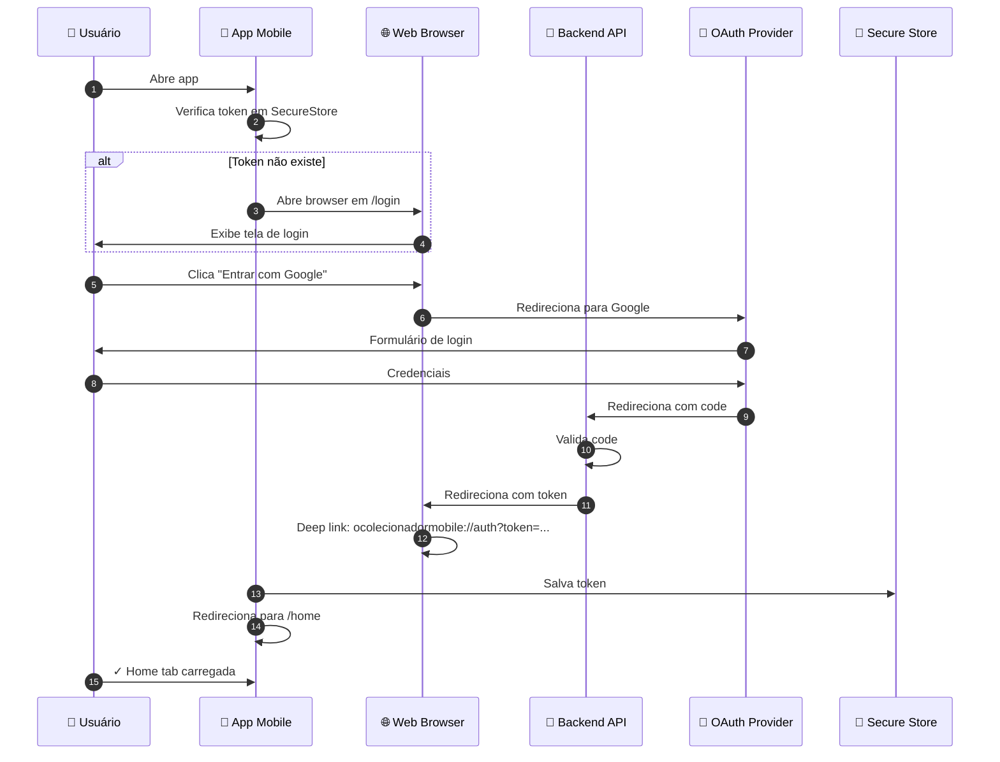
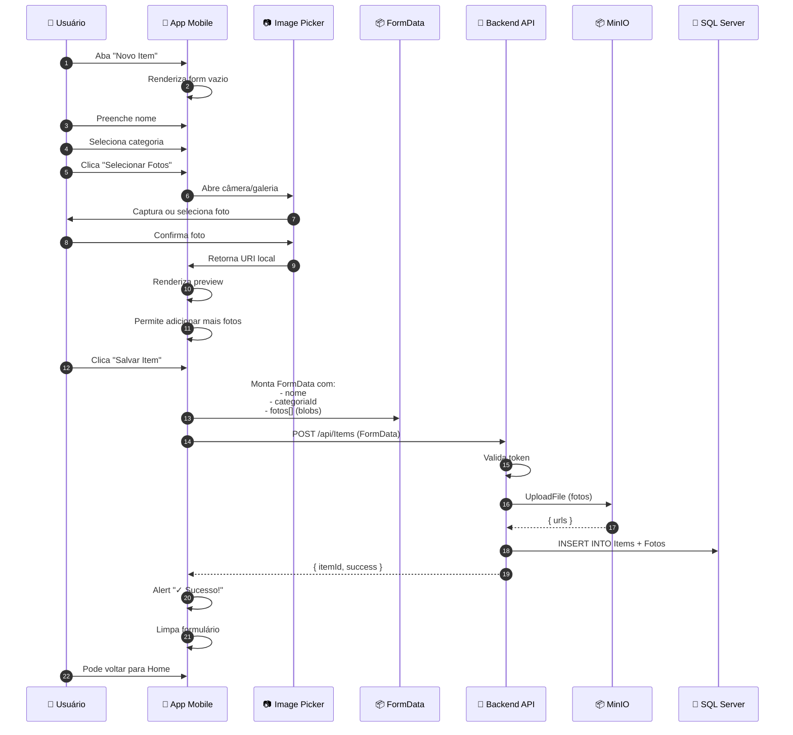
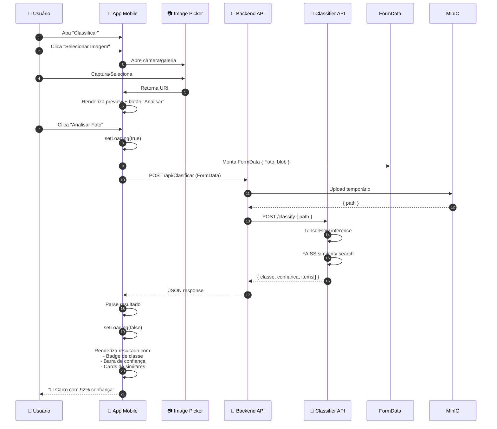
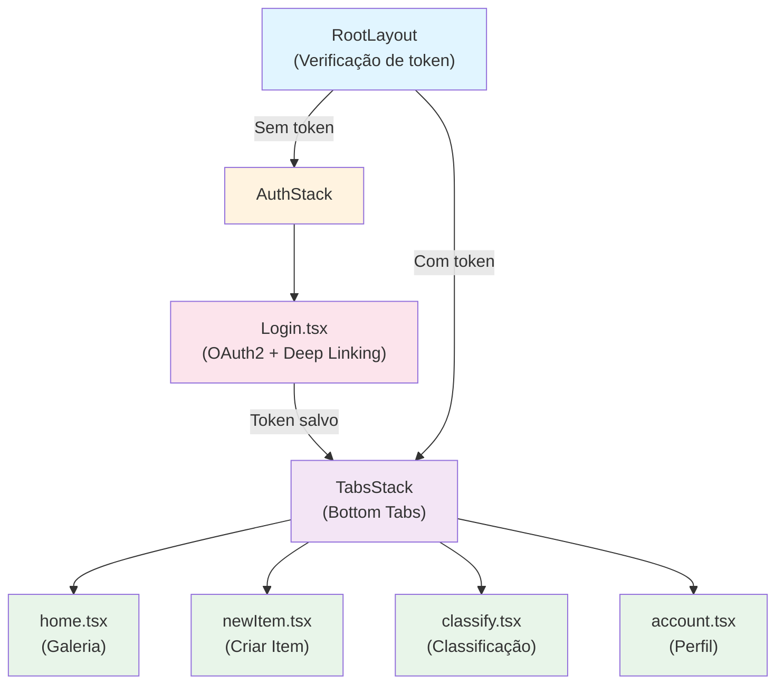

# OColecionadorMobile 📱

## 📋 Visão Geral

O **OColecionadorMobile** é o **aplicativo mobile nativo** do projeto OColecionador, desenvolvido em **React Native com Expo**. Ele fornece acesso completo às funcionalidades do sistema diretamente do smartphone:

- 🔐 **Autenticação OAuth2** – Login seguro com Google e GitHub
- 📸 **Captura de Fotos** – Câmera e galeria integradas
- 📦 **Gerenciamento de Coleção** – Visualizar e criar itens
- 🤖 **Classificação em Tempo Real** – IA para reconhecimento automático
- 🏷️ **Categorização** – Organizar por tipos de colecionáveis
- 📱 **Interface Nativa** – Bottom tabs com navegação intuitiva
- 🔄 **Sincronização** – Dados sempre atualizados com backend

### Responsabilidades Principais

- 🎨 **UI/UX Mobile** – Interface otimizada para toque
- 📷 **Captura de Imagens** – Integração com câmera e galeria
- 🔐 **Armazenamento Seguro** – Tokens em Secure Store
- 📡 **Integração API** – Comunicação com Backend .NET
- ⚡ **Performance** – Carregamento rápido e responsivo
- 🌐 **Offline Support** – Cache local de dados

---

## 🏗️ Arquitetura

### Estrutura de Pastas

```
OColecionadorMobile/
├── app/                           # Navegação Expo Router
│   ├── _layout.tsx               # Layout raiz (RootLayout)
│   ├── index.tsx                 # Redirect para /home
│   │
│   ├── (auth)/
│   │   ├── _layout.tsx           # Layout autenticação
│   │   └── login.tsx             # Tela de login OAuth2
│   │
│   └── (tabs)/
│       ├── _layout.tsx           # Bottom tab navigator
│       ├── home.tsx              # Galeria de itens
│       ├── newItem.tsx           # Criar novo item
│       ├── classify.tsx          # Classificar imagem
│       └── account.tsx           # Perfil do usuário
│
├── assets/
│   └── images/
│       ├── icon.png              # Ícone do app
│       ├── splash-icon.png       # Splash screen
│       └── ...
│
├── models/
│   ├── Items.ts                  # Interface e CRUD de itens
│   ├── Categorias.ts             # Interface e CRUD de categorias
│   └── Clasificar.ts             # Interface de classificação
│
├── services/
│   └── API.ts                    # Cliente HTTP (Axios + interceptors)
│
├── app.json                      # Configuração Expo
├── eas.json                      # Configuração EAS Build
├── package.json                  # Dependências
├── tsconfig.json                 # TypeScript config
└── README.md
```

---

## 🧩 Stack Tecnológico

| Tecnologia | Versão | Propósito |
|-----------|--------|----------|
| **React Native** | 0.81.4 | Framework mobile |
| **Expo** | ~54.0.10 | Managed service |
| **Expo Router** | ~6.0.8 | Navegação |
| **TypeScript** | ~5.9.2 | Type-safe dev |
| **Axios** | ^1.12.2 | Cliente HTTP |
| **Expo Secure Store** | ~15.0.7 | Armazenamento seguro |
| **Expo Image Picker** | ~17.0.8 | Câmera e galeria |
| **React Native Picker** | 2.11.1 | Seletor de opções |
| **Expo Web Browser** | ~15.0.7 | OAuth2 flow |

---

## 🔌 Serviços Principais

### 1. **API Service**

Cliente HTTP centralizado com interceptadores automáticos.

```typescript
// services/API.ts
import axios from "axios";
import * as SecureStore from "expo-secure-store";

const api = axios.create({
  baseURL: "https://louse-model-lioness.ngrok-free.app/api",
  timeout: 10000,
});

// Interceptor: Adiciona token automaticamente
api.interceptors.request.use(async (config) => {
  const token = await SecureStore.getItemAsync("token");
  if (token) {
    config.headers.Authorization = `Bearer ${token}`;
  }
  return config;
});

// Interceptor: Trata erros
api.interceptors.response.use(
  (response) => response,
  (error) => {
    if (error.response?.status === 401) {
      // Token expirado - logout
      SecureStore.deleteItemAsync("token");
      // Redireciona para login
    }
    return Promise.reject(error);
  }
);

export default api;
```

---

### 2. **Items Model**

Interface e operações CRUD de itens.

```typescript
// models/Items.ts
import api from "../services/API";

export interface Item {
  id: string;
  nome: string;
  categoriaId: number;
  fotos: string[];
}

export const getItems = async (): Promise<Item[]> => {
  const { data } = await api.get("/Items");
  return data;
};

export const createItem = async (item: FormData): Promise<Item> => {
  const { data } = await api.post("/Items", item, {
    headers: { "Content-Type": "multipart/form-data" },
  });
  return data;
};
```

---

### 3. **Categorias Model**

Busca e gerenciamento de categorias.

```typescript
// models/Categorias.ts
import api from "../services/API";

export interface Categoria {
  id: number;
  descricao: string;
}

export const getCategorias = async (): Promise<Categoria[]> => {
  const { data } = await api.get("/Categorias");
  return data;
};
```

---

### 4. **Clasificar Model**

Classificação de imagens via IA.

```typescript
// models/Clasificar.ts
import api from "../services/API";

export interface Clasificar {
  classe: string;
  confianca: number;
  items: Array<{ nome: string; fotos: string[]; distancia: number }>;
}

export const uploadClasificar = async (clasificar: FormData): Promise<Clasificar> => {
  const { data } = await api.post("/Clasificar", clasificar, {
    headers: { "Content-Type": "multipart/form-data" },
  });
  return data;
};
```

---

## 📱 Telas Principais

### 1. **Login.tsx** – Autenticação OAuth2

```typescript
// app/(auth)/login.tsx
export default function Login() {
  const redirectUri = Linking.createURL('auth');

  const startLogin = async () => {
    const result = await WebBrowser.openAuthSessionAsync(
      'https://backend.app/login?mobile=true',
      redirectUri
    );

    if (result.type === 'success' && result.url) {
      const token = Linking.parse(result.url).queryParams?.token;
      if (token && typeof token === 'string') {
        await SecureStore.setItemAsync('token', token);
        router.replace("/");
      }
    }
  };

  return (
    <View style={styles.container}>
      <Image source={require('../../assets/images/icon.png')} style={styles.logo} />
      <Text style={styles.title}>O Colecionador</Text>
      <Button title="Entrar" onPress={startLogin} />
    </View>
  );
}
```

---

### 2. **Home.tsx** – Galeria de Itens

Exibe lista de itens da coleção em grid 2 colunas com pull-to-refresh.

```typescript
// app/(tabs)/home.tsx
export default function Home() {
  const [items, setItems] = useState<Item[]>([]);
  const [refreshing, setRefreshing] = useState(false);

  useEffect(() => {
    fetchItems();
  }, []);

  const fetchItems = async () => {
    try {
      const data = await getItems();
      setItems(data);
    } catch (error) {
      console.error(error);
    }
  };

  const onRefresh = useCallback(() => {
    setRefreshing(true);
    fetchItems().finally(() => setRefreshing(false));
  }, []);

  return (
    <View style={styles.container}>
      <FlatList
        data={items}
        keyExtractor={(item) => item.id}
        numColumns={2}
        renderItem={({ item }) => (
          <View style={styles.card}>
            <Image source={{ uri: item.fotos[0] }} style={styles.image} />
            <Text style={styles.title}>{item.nome}</Text>
          </View>
        )}
        refreshControl={<RefreshControl refreshing={refreshing} onRefresh={onRefresh} />}
      />
    </View>
  );
}
```

---

### 3. **NewItem.tsx** – Criar Novo Item

Formulário completo com upload de múltiplas fotos, seleção de categoria e câmera/galeria.

```typescript
// app/(tabs)/newItem.tsx
export default function NewItem() {
  const [nome, setNome] = useState("");
  const [photos, setPhotos] = useState<string[]>([]);
  const [categoriaId, setCategoriaId] = useState<number | null>(null);
  const [categorias, setCategorias] = useState<Categoria[]>([]);
  const [isSaving, setIsSaving] = useState(false);

  useEffect(() => {
    getCategorias().then(setCategorias);
  }, []);

  const pickImage = async () => {
    Alert.alert('Selecionar imagem', 'Escolha a origem', [
      {
        text: 'Câmera',
        onPress: async () => {
          const result = await ImagePicker.launchCameraAsync({
            mediaTypes: ImagePicker.MediaTypeOptions.Images,
            quality: 1,
          });
          if (!result.canceled) {
            setPhotos([...photos, result.assets[0].uri]);
          }
        },
      },
      {
        text: 'Galeria',
        onPress: async () => {
          const result = await ImagePicker.launchImageLibraryAsync({
            mediaTypes: ImagePicker.MediaTypeOptions.Images,
            quality: 1,
          });
          if (!result.canceled) {
            setPhotos([...photos, result.assets[0].uri]);
          }
        },
      },
    ]);
  };

  const saveItem = async () => {
    if (!nome.trim() || !categoriaId || photos.length === 0) {
      Alert.alert("Erro", "Preencha todos os campos");
      return;
    }

    setIsSaving(true);
    try {
      const formData = new FormData();
      formData.append("nome", nome);
      formData.append("categoriaId", String(categoriaId));
      
      photos.forEach((photo, index) => {
        formData.append(`fotos`, {
          uri: photo,
          type: "image/jpeg",
          name: `photo_${index}.jpg`,
        } as any);
      });

      await createItem(formData);
      Alert.alert("Sucesso", "Item salvo!");
      setNome("");
      setPhotos([]);
      setCategoriaId(null);
    } catch (error) {
      Alert.alert("Erro", "Falha ao salvar item");
    } finally {
      setIsSaving(false);
    }
  };

  return (
    <ScrollView style={styles.container}>
      <TextInput
        placeholder="Nome do item"
        value={nome}
        onChangeText={setNome}
        style={styles.input}
      />

      <Picker selectedValue={categoriaId} onValueChange={setCategoriaId}>
        <Picker.Item label="Selecione categoria" value={null} />
        {categorias.map((c) => (
          <Picker.Item key={c.id} label={c.descricao} value={c.id} />
        ))}
      </Picker>

      <Button title="Selecionar Fotos" onPress={pickImage} />

      {photos.length > 0 && (
        <FlatList
          data={photos}
          horizontal
          renderItem={({ item }) => (
            <Image source={{ uri: item }} style={styles.photo} />
          )}
        />
      )}

      <Button 
        title="Salvar Item" 
        onPress={saveItem} 
        disabled={isSaving}
      />
    </ScrollView>
  );
}
```

---

### 4. **Classify.tsx** – Classificação com IA

Captura/seleciona foto e envia para classificação automática.

```typescript
// app/(tabs)/classify.tsx
export default function Classify() {
  const [photo, setPhoto] = useState<string | null>(null);
  const [resultado, setResultado] = useState<any | null>(null);
  const [loading, setLoading] = useState(false);

  const pickImage = async () => {
    Alert.alert('Selecionar imagem', 'Escolha a origem', [
      {
        text: 'Câmera',
        onPress: async () => {
          const result = await ImagePicker.launchCameraAsync({
            mediaTypes: ImagePicker.MediaTypeOptions.Images,
            quality: 1,
          });
          if (!result.canceled) {
            setPhoto(result.assets[0].uri);
          }
        },
      },
      {
        text: 'Galeria',
        onPress: async () => {
          const result = await ImagePicker.launchImageLibraryAsync({
            mediaTypes: ImagePicker.MediaTypeOptions.Images,
            quality: 1,
          });
          if (!result.canceled) {
            setPhoto(result.assets[0].uri);
          }
        },
      },
    ]);
  };

  const handleClassify = async () => {
    if (!photo) return;

    setLoading(true);
    try {
      const formData = new FormData();
      formData.append('Foto', {
        uri: photo,
        type: 'image/jpeg',
        name: 'classify.jpg',
      } as any);

      const result = await uploadClasificar(formData);
      setResultado(result);
    } catch (error) {
      Alert.alert("Erro", "Falha na classificação");
    } finally {
      setLoading(false);
    }
  };

  return (
    <ScrollView style={styles.container}>
      <TouchableOpacity 
        style={[styles.button, { backgroundColor: photo ? '#e74c3c' : '#3498db' }]}
        onPress={photo ? () => setPhoto(null) : pickImage}
      >
        <Text style={styles.buttonText}>
          {photo ? 'Limpar Imagem' : 'Selecionar Imagem'}
        </Text>
      </TouchableOpacity>

      {photo && (
        <Image source={{ uri: photo }} style={styles.image} resizeMode="contain" />
      )}

      {photo && (
        <Button title="Analisar Foto" onPress={handleClassify} />
      )}

      {loading && <ActivityIndicator size="large" />}

      {resultado && (
        <View style={styles.resultado}>
          <Text style={styles.classe}>
            🎯 Classe: {resultado.classe}
          </Text>
          <Text style={styles.confianca}>
            Confiança: {(resultado.confianca * 100).toFixed(2)}%
          </Text>
          
          <Text style={styles.similares}>Itens Semelhantes:</Text>
          {resultado.items?.map((item: any, idx: number) => (
            <View key={idx} style={styles.card}>
              <Image source={{ uri: item.fotos[0] }} style={styles.cardImage} />
              <Text>{item.nome}</Text>
              <Text>Distância: {item.distancia.toFixed(4)}</Text>
            </View>
          ))}
        </View>
      )}
    </ScrollView>
  );
}
```

---

### 5. **Account.tsx** – Perfil do Usuário

Exibe informações do usuário e botão de logout.

```typescript
// app/(tabs)/account.tsx
export default function Account() {
  const [user, setUser] = useState<any>(null);
  const [loading, setLoading] = useState(true);

  useEffect(() => {
    fetchUser();
  }, []);

  const fetchUser = async () => {
    try {
      const rawToken = await SecureStore.getItemAsync('token');
      if (!rawToken) return;

      const [provider, cleanToken] = rawToken.split('_OC_');

      let response;
      if (provider === 'google') {
        response = await fetch('https://www.googleapis.com/oauth2/v3/userinfo', {
          headers: { Authorization: `Bearer ${cleanToken}` },
        });
      } else if (provider === 'github') {
        response = await fetch('https://api.github.com/user', {
          headers: { Authorization: `Bearer ${cleanToken}` },
        });
      }

      const data = await response?.json();
      setUser(data);
    } catch (error) {
      console.error('Erro ao buscar perfil:', error);
    } finally {
      setLoading(false);
    }
  };

  const logout = async () => {
    await SecureStore.deleteItemAsync('token');
    router.replace('/login');
  };

  if (loading) return <ActivityIndicator size="large" />;

  return (
    <View style={styles.container}>
      {user?.picture || user?.avatar_url ? (
        <Image
          source={{ uri: user.picture || user.avatar_url }}
          style={styles.avatar}
        />
      ) : null}
      <Text style={styles.name}>{user?.name || user?.login}</Text>
      <Button title="Sair da conta" onPress={logout} color="#a00000" />
    </View>
  );
}
```

---

## 🔄 Fluxos Principais

### Fluxo 1: Autenticação com Deep Linking



---

### Fluxo 2: Captura e Upload de Imagem



---

### Fluxo 3: Classificação de Imagem



---

## 🔐 Autenticação e Segurança

### Token Management

```typescript
// Token format: provider_OC_token
// Example: google_OC_ya29.a0AfH6SMBx...

const setToken = async (token: string) => {
  await SecureStore.setItemAsync('token_ocolecionador', token);
};

const getToken = async (): Promise<string | null> => {
  return await SecureStore.getItemAsync('token_ocolecionador');
};

const clearToken = async () => {
  await SecureStore.deleteItemAsync('token_ocolecionador');
};
```

### Deep Linking para OAuth2

```typescript
// app.json - Configuração de deep link
"scheme": "ocolecionadormobile",

// Recebe callbacks como:
// ocolecionadormobile://auth?token=google_OC_ya29...
```

---

## 📡 Integração com Backend

### Endpoints Consumidos

```bash
# Autenticação
GET /login?mobile=true
  Response: Redireciona com token no URL

# Itens
GET /api/Items
  Response: [{ id, nome, categoriaId, fotos[] }]

POST /api/Items (FormData)
  Body: { nome, categoriaId, fotos[] }
  Response: { itemId, ... }

# Categorias
GET /api/Categorias
  Response: [{ id, descricao }]

# Classificação
POST /api/Clasificar (FormData)
  Body: { Foto: file }
  Response: { classe, confianca, items[] }
```

---

## 🎨 Interface Bottom Tabs

O app usa `Tabs.Screen` do Expo Router para navegação inferior:

```typescript
// app/(tabs)/_layout.tsx
<Tabs
  screenOptions={{
    headerStyle: { backgroundColor: '#1d1d2e' },
    tabBarStyle: { backgroundColor: '#1d1d2e' },
    tabBarActiveTintColor: '#24afb9',
    tabBarInactiveTintColor: '#aaa',
  }}
>
  <Tabs.Screen name="home" options={{ title: 'Início', tabBarIcon: ... }} />
  <Tabs.Screen name="newItem" options={{ title: 'Novo', tabBarIcon: ... }} />
  <Tabs.Screen name="classify" options={{ title: 'Classificar', tabBarIcon: ... }} />
  <Tabs.Screen name="account" options={{ title: 'Conta', tabBarIcon: ... }} />
</Tabs>
```

---

## 🚀 Build e Deployment

### Local Development

```bash
npm install
npm start

# Abra no emulador/device
npm run android
npm run ios
npm run web
```

### Build com EAS

```bash
# Configurar conta Expo
expo login

# Build para Android
eas build --platform android --profile preview

# Build para iOS
eas build --platform ios --profile preview

# Build para produção
eas build --platform android --profile production
```

---

## 📊 Diagrama de Navegação



---

## 🧪 Testes

### Exemplo com Jest

```typescript
// __tests__/Home.test.tsx
import { render, screen, waitFor } from '@testing-library/react-native';
import Home from '../app/(tabs)/home';

describe('Home Screen', () => {
  it('should render items list', async () => {
    render(<Home />);
    await waitFor(() => {
      expect(screen.getByText('Minha Coleção')).toBeOnTheScreen();
    });
  });
});
```

---

## 📱 Performance

### Otimizações

- ✅ **Lazy Loading** – Imagens carregam sob demanda
- ✅ **FlatList** – Renderização virtualizada para listas
- ✅ **Memoization** – Evita re-renders desnecessários
- ✅ **Cache** – Armazena dados localmente
- ✅ **Image Compression** – Comprime fotos antes de upload

---

## 🎯 Conclusão

O **OColecionadorMobile** oferece:

✅ **Autenticação Segura** – OAuth2 com deep linking  
✅ **Captura Nativa** – Câmera e galeria integradas  
✅ **Classificação em Tempo Real** – IA mobile-first  
✅ **Interface Intuitiva** – Bottom tabs navigation  
✅ **Sincronização** – Sempre conectado ao backend  
✅ **Performance** – Otimizado para dispositivos móveis

**Plataformas suportadas:** iOS, Android, Web (Expo)