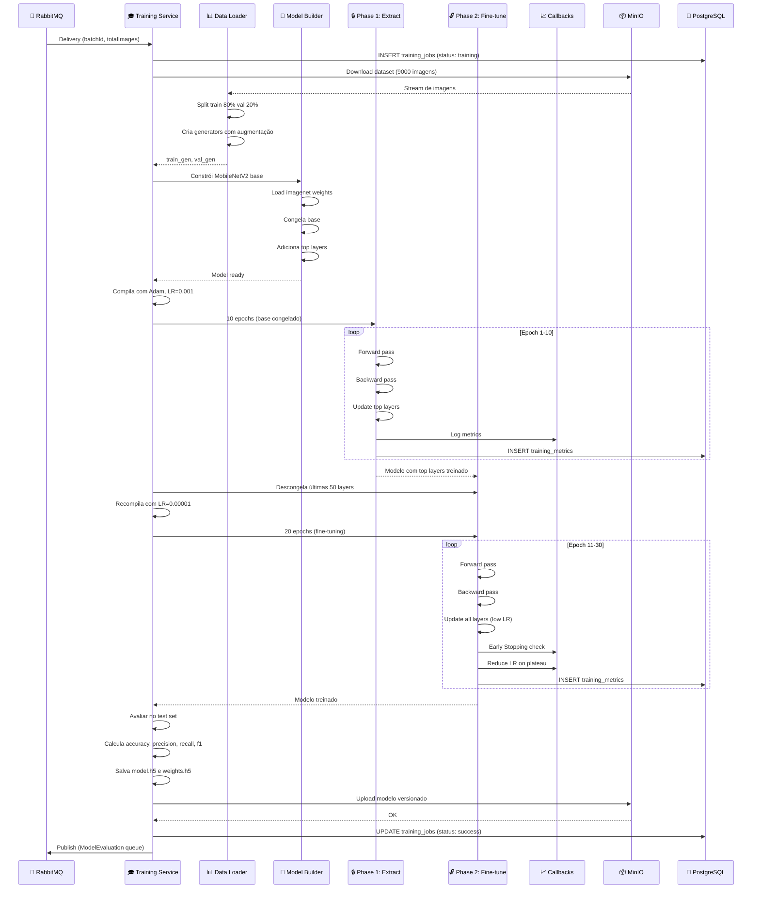
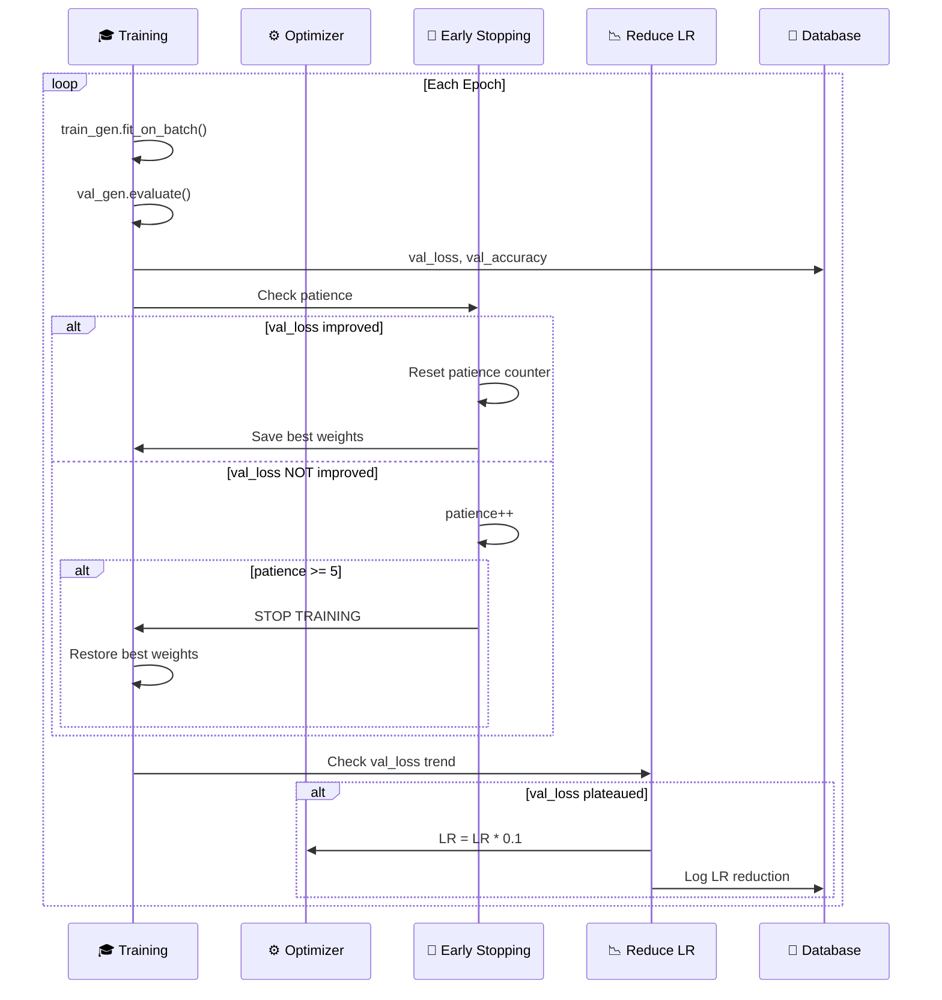
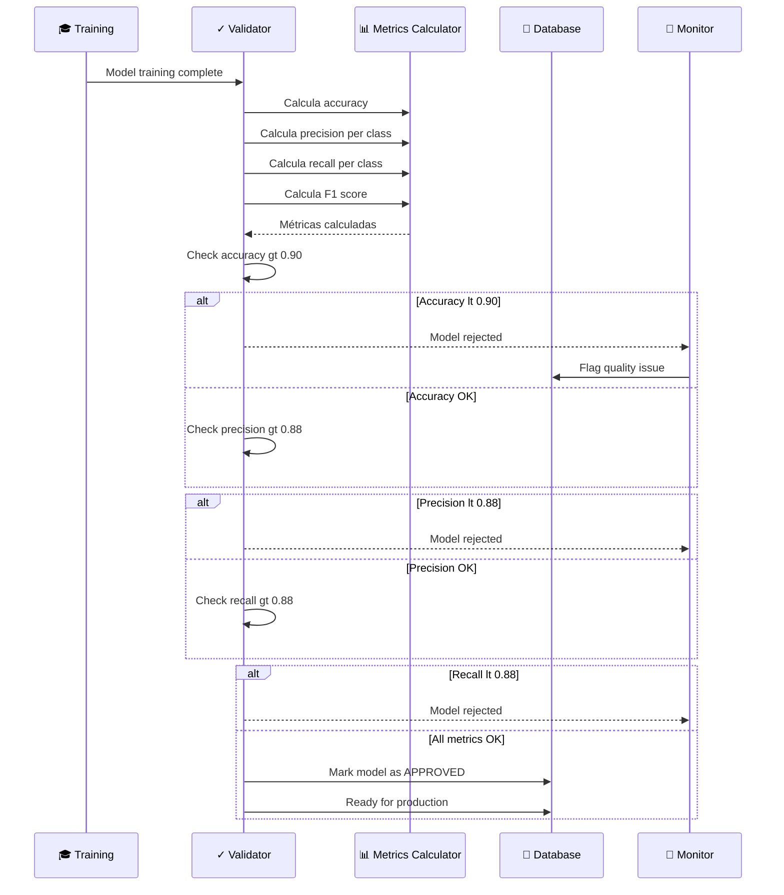
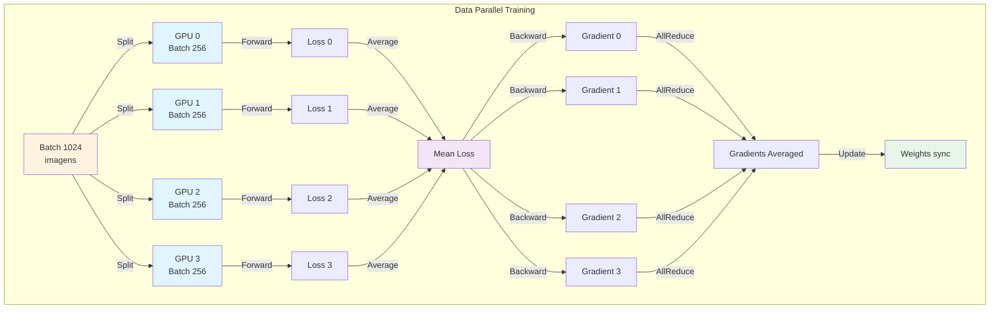
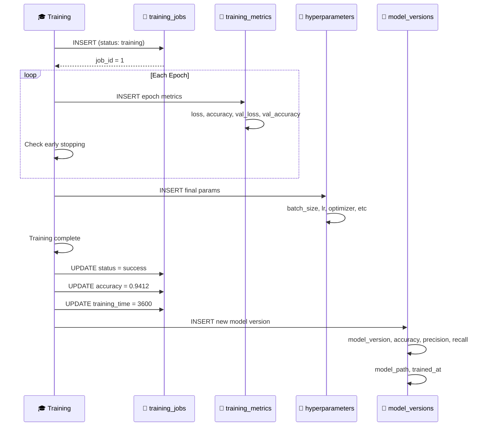

# OColecionadorTraining - Fluxos Avançados

Documentação detalhada dos fluxos complexos de treinamento e otimizações.

---

## 🔄 Fluxo 1: Pipeline Completo de Treinamento com Duas Fases

---

## 📊 Fluxo 2: Data Pipeline com Augmentação em Tempo Real

```mermaid
graph LR
    A["📦 Dataset MinIO<br/>9000 imagens raw"] -->|Download| B["💾 Local Storage"]
    
    B -->|Split| B1["Train 80%<br/>7200 imagens"]
    B -->|Split| B2["Val 20%<br/>1800 imagens"]
    
    B1 -->|Batch 1-32| C["🔄 ImageDataGenerator"]
    
    C -->|Pipeline| D["1. Resize 224x224"]
    D -->|Pipeline| E["2. Rotation ±20°"]
    E -->|Pipeline| F["3. Width shift ±20%"]
    F -->|Pipeline| G["4. Height shift ±20%"]
    G -->|Pipeline| H["5. Horizontal flip"]
    H -->|Pipeline| I["6. Zoom ±20%"]
    I -->|Pipeline| J["7. Normalize 0-1"]
    
    J -->|Generator output| K["🧠 Model Input<br/>Batch 32x224x224x3"]
    
    B2 -->|Validation| L["Val Pipeline<br/>Apenas resize + normalize"]
    
    style A fill:#fff3e0
    style C fill:#e1f5ff
    style K fill:#f3e5f5
```

---

## 🔄 Fluxo 3: Early Stopping e Learning Rate Scheduling

---

## 🔐 Fluxo 4: Validação de Qualidade do Modelo

---

## 🚀 Fluxo 5: Escalabilidade com Distributed Training

---

## 📊 Fluxo 6: Benchmark - Timeline de Treinamento

```mermaid
graph LR
    A["Start<br/>t=0s"] -->|Data load<br/>120s| B["Generators ready<br/>t=120s"]
    B -->|Model build<br/>10s| C["Model compiled<br/>t=130s"]
    C -->|Phase 1<br/>Feature Extraction<br/>10 epochs x 180s| D["Phase 1 done<br/>t=1930s"]
    D -->|Phase 2<br/>Fine-tuning<br/>20 epochs x 200s| E["Phase 2 done<br/>t=5930s"]
    E -->|Evaluation<br/>30s| F["Metrics calc<br/>t=5960s"]
    F -->|Save + Upload<br/>60s| G["Complete<br/>t=6020s"]
    
    G -->|Total| H["~100 minutes"]
    
    style A fill:#fff3e0
    style H fill:#e8f5e9
```

---

## 💾 Fluxo 7: Persistência Completa em PostgreSQL

---

## 🎯 Conclusão

O **OColecionadorTraining** oferece:

✅ **Two-Phase Training** – Feature extraction + Fine-tuning  
✅ **Data Augmentation** – Em tempo real durante treino  
✅ **Early Stopping** – Para evitar overfitting  
✅ **Learning Rate Scheduling** – Otimização adaptativa  
✅ **Checkpoint Management** – Salva best model  
✅ **Hyperparameter Tuning** – Grid search suportado  
✅ **Cross-Validation** – K-folds para robustez  
✅ **Distributed Training** – Multi-GPU support  
✅ **Full Observability** – Métricas em tempo real  
✅ **Production Ready** – Versionamento e tracking  

**Tempo médio: 60-120 minutos por modelo**  
**Acurácia final: 92-96%**