```mermaid
sequenceDiagram
    participant Training as 🎓 Training
    participant Validator as ✓ Validator
    participant Metrics as 📊 Metrics Calculator
    participant Database as 💾 Database
    participant Monitor as 🚨 Monitor

    Training->>Validator: Model training complete
    
    Validator->>Metrics: Calcula accuracy
    Validator->>Metrics: Calcula precision per class
    Validator->>Metrics: Calcula recall per class
    Validator->>Metrics: Calcula F1 score
    
    Metrics-->>Validator: Métricas calculadas
    
    Validator->>Validator: Check accuracy gt 0.90
    alt Accuracy lt 0.90
        Validator-->>Monitor: Model rejected
        Monitor->>Database: Flag quality issue
    else Accuracy OK
        Validator->>Validator: Check precision gt 0.88
    end
    
    alt Precision lt 0.88
        Validator-->>Monitor: Model rejected
    else Precision OK
        Validator->>Validator: Check recall gt 0.88
    end
    
    alt Recall lt 0.88
        Validator-->>Monitor: Model rejected
    else All metrics OK
        Validator->>Database: Mark model as APPROVED
        Validator->>Database: Ready for production
    end
```

# OColecionadorTraining - Fluxos Avançados

Documentação detalhada dos fluxos complexos de treinamento e otimizações.

---

## 🔄 Fluxo 1: Pipeline Completo de Treinamento com Duas Fases

```mermaid
sequenceDiagram
    participant RabbitMQ as 📨 RabbitMQ
    participant Training as 🎓 Training Service
    participant DataLoader as 📊 Data Loader
    participant ModelBuilder as 🧠 Model Builder
    participant Phase1 as 🔒 Phase 1: Extract
    participant Phase2 as 🔓 Phase 2: Fine-tune
    participant Callbacks as 📈 Callbacks
    participant MinIO as 📦 MinIO
    participant Database as 💾 PostgreSQL

    RabbitMQ->>Training: Delivery (batchId, totalImages)
    Training->>Database: INSERT training_jobs (status: training)
    
    Training->>MinIO: Download dataset (9000 imagens)
    MinIO-->>DataLoader: Stream de imagens
    
    DataLoader->>DataLoader: Split train 80% val 20%
    DataLoader->>DataLoader: Cria generators com augmentação
    DataLoader-->>Training: train_gen, val_gen
    
    Training->>ModelBuilder: Constrói MobileNetV2 base
    ModelBuilder->>ModelBuilder: Load imagenet weights
    ModelBuilder->>ModelBuilder: Congela base
    ModelBuilder->>ModelBuilder: Adiciona top layers
    ModelBuilder-->>Training: Model ready
    
    Training->>Training: Compila com Adam, LR=0.001
    Training->>Phase1: 10 epochs (base congelado)
    
    loop Epoch 1-10
        Phase1->>Phase1: Forward pass
        Phase1->>Phase1: Backward pass
        Phase1->>Phase1: Update top layers
        Phase1->>Callbacks: Log metrics
        Phase1->>Database: INSERT training_metrics
    end
    
    Phase1-->>Phase2: Modelo com top layers treinado
    
    Training->>Phase2: Descongela últimas 50 layers
    Training->>Training: Recompila com LR=0.00001
    Training->>Phase2: 20 epochs (fine-tuning)
    
    loop Epoch 11-30
        Phase2->>Phase2: Forward pass
        Phase2->>Phase2: Backward pass
        Phase2->>Phase2: Update all layers (low LR)
        Phase2->>Callbacks: Early Stopping check
        Phase2->>Callbacks: Reduce LR on plateau
        Phase2->>Database: INSERT training_metrics
    end
    
    Phase2-->>Training: Modelo treinado
    Training->>Training: Avaliar no test set
    Training->>Training: Calcula accuracy, precision, recall, f1
    
    Training->>Training: Salva model.h5 e weights.h5
    Training->>MinIO: Upload modelo versionado
    MinIO-->>Training: OK
    
    Training->>Database: UPDATE training_jobs (status: success)
    Training->>RabbitMQ: Publish (ModelEvaluation queue)
```



---

## 📊 Fluxo 2: Data Pipeline com Augmentação em Tempo Real

```mermaid
graph LR
    A["📦 Dataset MinIO<br/>9000 imagens raw"] -->|Download| B["💾 Local Storage"]
    
    B -->|Split| B1["Train 80%<br/>7200 imagens"]
    B -->|Split| B2["Val 20%<br/>1800 imagens"]
    
    B1 -->|Batch 1-32| C["🔄 ImageDataGenerator"]
    
    C -->|Pipeline| D["1. Resize 224x224"]
    D -->|Pipeline| E["2. Rotation ±20°"]
    E -->|Pipeline| F["3. Width shift ±20%"]
    F -->|Pipeline| G["4. Height shift ±20%"]
    G -->|Pipeline| H["5. Horizontal flip"]
    H -->|Pipeline| I["6. Zoom ±20%"]
    I -->|Pipeline| J["7. Normalize 0-1"]
    
    J -->|Generator output| K["🧠 Model Input<br/>Batch 32x224x224x3"]
    
    B2 -->|Validation| L["Val Pipeline<br/>Apenas resize + normalize"]
    
    style A fill:#fff3e0
    style C fill:#e1f5ff
    style K fill:#f3e5f5
```



---

## 🔄 Fluxo 3: Early Stopping e Learning Rate Scheduling

```mermaid
sequenceDiagram
    participant Training as 🎓 Training
    participant Optimizer as ⚙️ Optimizer
    participant EarlyStopping as 🛑 Early Stopping
    participant ReduceLR as 📉 Reduce LR
    participant Database as 💾 Database

    loop Each Epoch
        Training->>Training: train_gen.fit_on_batch()
        Training->>Training: val_gen.evaluate()
        
        Training->>Database: val_loss, val_accuracy
        
        Training->>EarlyStopping: Check patience
        alt val_loss improved
            EarlyStopping->>EarlyStopping: Reset patience counter
            EarlyStopping->>Training: Save best weights
        else val_loss NOT improved
            EarlyStopping->>EarlyStopping: patience++
            alt patience >= 5
                EarlyStopping->>Training: STOP TRAINING
                Training->>Training: Restore best weights
            end
        end
        
        Training->>ReduceLR: Check val_loss trend
        alt val_loss plateaued
            ReduceLR->>Optimizer: LR = LR * 0.1
            ReduceLR->>Database: Log LR reduction
        end
    end
```



---

## 🎯 Fluxo 4: Checkpoint Management e Model Versioning

```mermaid
graph TD
    A["🎓 Training Start"] -->|Create| B["Model v3_20251115"]
    
    loop Each Epoch
        B -->|Save if| C["val_accuracy improved"]
        C -->|Create| D["checkpoint_epoch_5.h5"]
        D -->|Store| E["models/v3/checkpoints/"]
    end
    
    E -->|Training complete| F["best_model.h5"]
    
    F -->|Create| G["model_v3_20251115.h5<br/>Final version"]
    F -->|Create| H["weights_v3_20251115.h5"]
    F -->|Create| I["training_log_v3.csv<br/>Metrics per epoch"]
    
    G -->|Upload| J["MinIO bucket: models"]
    H -->|Upload| J
    I -->|Upload| J
    
    J -->|Register| K["database<br/>model_versions table"]
    
    style A fill:#e1f5ff
    style B fill:#f3e5f5
    style G fill:#e8f5e9
```

---

## 📈 Fluxo 5: Hyperparameter Tuning com Grid Search

```mermaid
sequenceDiagram
    participant Manager as 🎯 Hyperparameter Manager
    participant GridSearch as 🔍 Grid Search
    participant Training as 🎓 Training
    participant Results as 📊 Results Tracker

    Manager->>GridSearch: Define parameter grid
    Note over GridSearch: batch_size: [16, 32, 64]<br/>learning_rate: [0.001, 0.0001]<br/>dropout: [0.3, 0.5, 0.7]
    
    GridSearch->>GridSearch: Generate combinations: 3x2x3=18
    
    loop For each combination
        GridSearch->>Training: Start training (combination_i)
        Training->>Training: 30 epochs
        Training->>Results: Log final accuracy
        Results->>Results: Store hyperparams + metrics
    end
    
    Results->>Results: Find best combination
    Results->>Results: best_params = argmax(accuracy)
    
    alt Best accuracy > 0.95
        Results->>Manager: Use best params for production
    else Accuracy < 0.95
        Results->>Manager: Flag for manual review
    end
```



---

## 🎪 Fluxo 6: Cross-Validation com K-Folds

```mermaid
graph LR
    A["📦 Dataset<br/>9000 imagens"] -->|Split| B["Fold 1"]
    A -->|Split| C["Fold 2"]
    A -->|Split| D["Fold 3"]
    A -->|Split| E["Fold 4"]
    A -->|Split| F["Fold 5"]
    
    B -->|Train 4 folds<br/>Val 1 fold| B1["Model 1<br/>Acc: 0.943"]
    C -->|Train 4 folds<br/>Val 1 fold| C1["Model 2<br/>Acc: 0.941"]
    D -->|Train 4 folds<br/>Val 1 fold| D1["Model 3<br/>Acc: 0.945"]
    E -->|Train 4 folds<br/>Val 1 fold| E1["Model 4<br/>Acc: 0.938"]
    F -->|Train 4 folds<br/>Val 1 fold| F1["Model 5<br/>Acc: 0.947"]
    
    B1 -->|Average| G["Mean Acc: 0.9428<br/>Std: 0.0034"]
    C1 -->|Average| G
    D1 -->|Average| G
    E1 -->|Average| G
    F1 -->|Average| G
    
    style A fill:#fff3e0
    style B1 fill:#e1f5ff
    style C1 fill:#e1f5ff
    style D1 fill:#e1f5ff
    style E1 fill:#e1f5ff
    style F1 fill:#e1f5ff
    style G fill:#e8f5e9
```



---

## 🔐 Fluxo 7: Validação de Qualidade do Modelo



---

## 🚀 Fluxo 8: Escalabilidade com Distributed Training


---

## 📊 Fluxo 9: Benchmark - Timeline de Treinamento


---

## 💾 Fluxo 10: Persistência Completa em PostgreSQL

```mermaid
sequenceDiagram
    participant Training as 🎓 Training
    participant Jobs as 💾 training_jobs
    participant Metrics as 💾 training_metrics
    participant Hyperparams as 💾 hyperparameters
    participant Models as 💾 model_versions

    Training->>Jobs: INSERT (status: training)
    Jobs-->>Training: job_id = 1
    
    loop Each Epoch
        Training->>Metrics: INSERT epoch metrics
        Metrics->>Metrics: loss, accuracy, val_loss, val_accuracy
        Training->>Training: Check early stopping
    end
    
    Training->>Hyperparams: INSERT final params
    Hyperparams->>Hyperparams: batch_size, lr, optimizer, etc
    
    Training->>Training: Training complete
    Training->>Jobs: UPDATE status = success
    Training->>Jobs: UPDATE accuracy = 0.9412
    Training->>Jobs: UPDATE training_time = 3600
    
    Training->>Models: INSERT new model version
    Models->>Models: model_version, accuracy, precision, recall
    Models->>Models: model_path, trained_at
```



---

## 🎯 Conclusão

O **OColecionadorTraining** oferece:

✅ **Two-Phase Training** – Feature extraction + Fine-tuning  
✅ **Data Augmentation** – Em tempo real durante treino  
✅ **Early Stopping** – Para evitar overfitting  
✅ **Learning Rate Scheduling** – Otimização adaptativa  
✅ **Checkpoint Management** – Salva best model  
✅ **Hyperparameter Tuning** – Grid search suportado  
✅ **Cross-Validation** – K-folds para robustez  
✅ **Distributed Training** – Multi-GPU support  
✅ **Full Observability** – Métricas em tempo real  
✅ **Production Ready** – Versionamento e tracking  

**Tempo médio: 60-120 minutos por modelo**  
**Acurácia final: 92-96%**