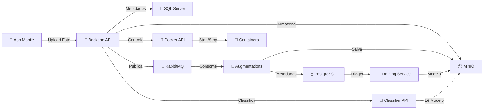

# OColecionadorBackEnd 🔌

## 📋 O que é?

O **OColecionadorBackEnd** é a **API REST central** do projeto OColecionador. Ele é responsável por:

- ✅ **Autenticação** – Login via OAuth2 (Google, GitHub)
- ✅ **Gerenciamento de Coleções** – CRUD de categorias, itens e fotos
- ✅ **Armazenamento** – Upload de imagens no MinIO (S3-compatível)
- ✅ **Processamento Assíncrono** – Integração com RabbitMQ
- ✅ **Classificação de IA** – Chamadas ao serviço de classificação
- ✅ **Controle de Containers** – Start/stop de serviços Docker
- ✅ **Banco de Dados** – Metadados no SQL Server

---

## 🏗️ Stack Tecnológico

| Tecnologia | Versão | Propósito |
|-----------|--------|----------|
| **.NET** | 8.0 | Framework principal |
| **ASP.NET Core** | 8.0 | Web API |
| **Entity Framework Core** | 8.0.11 | ORM para SQL Server |
| **SQL Server** | 2022 | Banco de dados |
| **MinIO** | Latest | Storage S3-compatível |
| **RabbitMQ** | 3 | Fila de mensagens |
| **Docker** | Latest | Orquestração de containers |
| **C#** | 12 | Linguagem principal |

---

## 🚀 Quick Start

### Pré-requisitos

- .NET 8 SDK instalado
- SQL Server em execução (ou via Docker)
- MinIO em execução
- RabbitMQ em execução

### Instalação Local

```bash
# 1. Clone o repositório
git clone https://github.com/PatrickCalorioCarvalho/OColecionador.git
cd OColecionador/OColecionadorBackEnd

# 2. Restaure as dependências
dotnet restore

# 3. Configure appsettings.json com suas credenciais
nano appsettings.Development.json

# 4. Execute as migrações do banco de dados
dotnet ef database update

# 5. Execute a aplicação
dotnet run
```

A API estará disponível em: `http://localhost:5000`

---

### Com Docker Compose (Recomendado)

```bash
cd OColecionador/
docker compose up ocolecionadorbackend
```

---

## 📡 Endpoints Principais

### 🔐 Autenticação

```bash
POST /api/auth/login
  Body: { provider: "google" | "github" }
  Response: { token: "eyJ..." }

POST /api/auth/callback
  Query: ?code=...&state=...
  Response: { token: "..." }
```

---

### 🏷️ Categorias

```bash
GET /api/Categorias
  Response: [
    { id: 1, descricao: "Carros" },
    { id: 2, descricao: "Moedas" }
  ]

POST /api/Categorias
  Body: { descricao: "Novinha" }
  Response: { id: 3, descricao: "Novinha" }

PUT /api/Categorias/1
  Body: { descricao: "Carros Clássicos" }

DELETE /api/Categorias/1
```

---

### 📦 Itens

```bash
GET /api/Items
  Response: [
    {
      id: 1,
      nome: "Ferrari 250",
      categoriaId: 1,
      fotos: ["https://minio.../1.jpg", "https://minio.../2.jpg"]
    }
  ]

POST /api/Items
  Body: FormData {
    "nome": "Ferrari 250",
    "categoriaId": 1,
    "fotos": [File, File]
  }
  Response: { id: 1, ... }

DELETE /api/Items/1
```

---

### 🤖 Classificação (com IA)

```bash
POST /api/Clasificar
  Body: FormData { "Foto": File }
  Response: {
    "classe": "carro",
    "confianca": 0.95,
    "semelhantes": [
      { "item": "Ferrari 250", "distancia": 0.12 },
      { "item": "Ferrari 275", "distancia": 0.18 }
    ]
  }
```

---

### 🐳 Docker

```bash
GET /api/Docker
  Response: [
    {
      id: "abc123...",
      names: ["/ocolecionadortraining"],
      state: "running",
      status: "Up 2 hours",
      image: "ocolecionadortraining:latest"
    }
  ]

POST /api/Docker/start/{containerId}
  Response: { status: "ok" }

POST /api/Docker/stop/{containerId}
  Response: { status: "ok" }

POST /api/Docker/restart/{containerId}
  Response: { status: "ok" }
```

---

## ⚙️ Configuração

### appsettings.json

```json
{
  "ConnectionStrings": {
    "OColecionadorBackEndContext": "Server=sqlserver;Database=OColecionadorDataBase;User Id=OColecionadorUser;Password=OColecionador@2025;"
  },
  "Minio": {
    "Endpoint": "minio:9000",
    "AccessKey": "OColecionadorUser",
    "SecretKey": "OColecionador@2025",
    "pathExtern": "https://seu-dominio.com/"
  },
  "Rabbit": {
    "HostName": "rabbitmq",
    "UserName": "OColecionadorUser",
    "Password": "OColecionador@2025"
  }
}
```

---

### Variáveis de Ambiente

```bash
# OAuth2
export GITHUB_CLIENT_ID="seu_client_id"
export GITHUB_CLIENT_SECRET="seu_secret"
export GOOGLE_CLIENT_ID="seu_client_id"
export GOOGLE_CLIENT_SECRET="seu_secret"

# Docker
export DOCKER_URI="unix:///var/run/docker.sock"
```

---

## 🔄 Fluxos Principais

### Fluxo 1: Captura e Upload de Foto

```
1. Usuário captura foto no app mobile
2. Backend recebe POST /api/Items
3. Arquivo é enviado ao MinIO
4. Metadados salvos no SQL Server
5. Mensagem publicada no RabbitMQ
6. Serviço Augmentations consome e cria variações
7. Variações armazenadas no MinIO
```

---

### Fluxo 2: Classificação de Imagem

```
1. Usuário envia foto ao endpoint /api/Clasificar
2. Backend armazena no MinIO
3. Backend chama Classifier API (TensorFlow)
4. Classifier retorna classe + embeddings
5. Backend busca itens similares no banco
6. Backend retorna resultado ao usuário
```

---

### Fluxo 3: Treinamento do Modelo

```
1. Admin clica para iniciar treino no dashboard
2. Backend chama Docker API para iniciar container
3. Training service consome filas do RabbitMQ
4. Baixa imagens processadas do MinIO
5. Treina modelo com TensorFlow
6. Salva modelo atualizado no MinIO
```

---

## 🗂️ Estrutura do Projeto

```
OColecionadorBackEnd/
├── Controllers/
│   ├── AuthController.cs          # OAuth2 login
│   ├── CategoriasController.cs    # CRUD categorias
│   ├── ItemsController.cs         # CRUD itens
│   ├── FotosController.cs         # Gerenciamento fotos
│   ├── ClasificarController.cs    # Classificação IA
│   └── DockerController.cs        # Controle Docker
│
├── Data/
│   └── OColecionadorBackEndContext.cs
│
├── Model/
│   ├── Categoria.cs
│   ├── Item.cs
│   ├── Foto.cs
│   └── FotoMessage.cs
│
├── Service/
│   ├── MinioService.cs            # Upload/download
│   ├── RabbitService.cs           # Fila de mensagens
│   └── DockerService.cs           # Controle Docker
│
├── Middlewares/
│   └── OAuthMiddleware.cs
│
├── Migrations/
│
├── Program.cs                      # Configuração app
│
├── appsettings.json
├── Dockerfile
└── README.md
```

---

## 🧪 Testes

### Executar Testes

```bash
dotnet test
```

### Exemplo de Teste

```csharp
[Fact]
public async Task GetItems_ReturnsOkResult()
{
    // Arrange
    var controller = new ItemsController(...);
    
    // Act
    var result = await controller.GetItem();
    
    // Assert
    Assert.NotNull(result);
}
```

---

## 📊 Diagrama de Fluxo Complexo



---

## 🐛 Troubleshooting

### Erro: Connection to SQL Server failed

```bash
# Verifique se SQL Server está rodando
docker ps | grep sqlserver

# Verifique a connection string
cat appsettings.json
```

---

### Erro: MinIO authentication failed

```bash
# Verifique credenciais
export MINIO_ROOT_USER="OColecionadorUser"
export MINIO_ROOT_PASSWORD="OColecionador@2025"
```

---

### Erro: RabbitMQ connection refused

```bash
# Verifique se RabbitMQ está rodando
docker logs rabbitmq
```

---

## 📚 Documentação Adicional

- [Entity Framework Core](https://docs.microsoft.com/en-us/ef/core/)
- [ASP.NET Core Web API](https://docs.microsoft.com/en-us/aspnet/core/web-api/)
- [MinIO SDK .NET](https://min.io/docs/dotnet/API.html)
- [RabbitMQ .NET Client](https://www.rabbitmq.com/tutorials/tutorial-one-dotnet.html)

---

## 👨‍💻 Contribuição

1. Fork o repositório
2. Crie uma branch (`git checkout -b feature/MinhaFuncionalidade`)
3. Commit suas mudanças (`git commit -m 'Adiciona funcionalidade'`)
4. Push para a branch (`git push origin feature/MinhaFuncionalidade`)
5. Abra um Pull Request

---

## 📄 Licença

Este projeto é open source. Veja [LICENSE](../../LICENSE) para detalhes.

---

## 👤 Autor

**Patrick Calorio Carvalho**  
📧 [Enviar email](mailto:patrick@example.com)  
🔗 [GitHub](https://github.com/PatrickCalorioCarvalho)  
🔗 [LinkedIn](https://linkedin.com/in/patrickcaloriocarvalho)

---

## 📞 Suporte

Para reportar bugs ou sugerir melhorias:
- 📝 [GitHub Issues](https://github.com/PatrickCalorioCarvalho/OColecionador/issues)
- 💬 [Discussões](https://github.com/PatrickCalorioCarvalho/OColecionador/discussions)