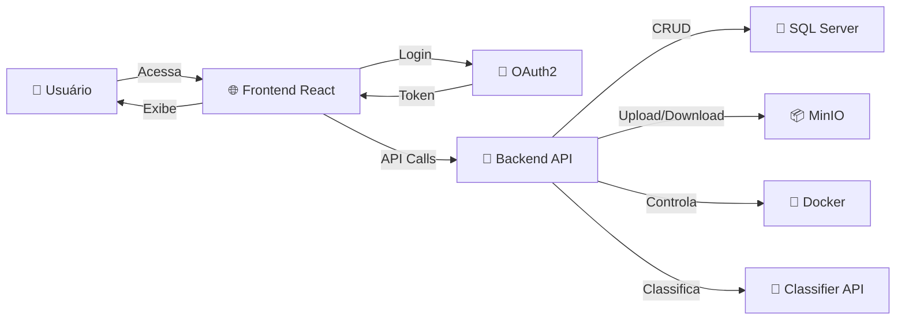

# OColecionadorFrontEnd 🌐

## 📋 O que é?

O **OColecionadorFrontEnd** é a **aplicação web (Dashboard)** do projeto OColecionador. Uma interface moderna e responsiva para:

- ✅ **Login OAuth2** – Autenticação segura com Google e GitHub
- ✅ **Galeria de Coleção** – Visualizar e organizar itens
- ✅ **Upload de Fotos** – Captura e envio de imagens
- ✅ **Classificação em Tempo Real** – IA integrada para reconhecimento
- ✅ **Dashboard Docker** – Gerenciar containers em execução
- ✅ **Interface Responsiva** – Funciona em desktop, tablet e mobile

---

## 🏗️ Stack Tecnológico

| Tecnologia | Versão | Propósito |
|-----------|--------|----------|
| **React** | 19.2.0 | Framework UI |
| **TypeScript** | 4.9.5 | Type-safe development |
| **React Router** | 7.9.5 | Navegação entre páginas |
| **Axios** | 1.13.1 | Cliente HTTP |
| **Lucide React** | 0.552.0 | Icons library |
| **CSS3** | - | Estilização |
| **Node.js** | 20 | Runtime |

---

## 🚀 Quick Start

### Pré-requisitos

- Node.js 20+ instalado
- npm ou yarn
- Backend API rodando em `http://localhost:5000`

### Instalação Local

```bash
# 1. Clone o repositório
git clone https://github.com/PatrickCalorioCarvalho/OColecionador.git
cd OColecionador/OColecionadorFrontEnd

# 2. Instale as dependências
npm install

# 3. Configure variáveis de ambiente
cat > .env << EOF
REACT_APP_API_URL=http://localhost:5000/api
REACT_APP_GITHUB_CLIENT_ID=seu_github_client_id
REACT_APP_GOOGLE_CLIENT_ID=seu_google_client_id
EOF

# 4. Inicie o servidor de desenvolvimento
npm start
```

A aplicação abrirá em: `http://localhost:3000`

---

### Com Docker Compose (Recomendado)

```bash
cd OColecionador/
docker compose up ocolecionadorfrontend
```

Acesse em: `http://localhost:3000`

---

## 🎨 Estrutura do Projeto

```
OColecionadorFrontEnd/
├── public/
│   ├── index.html                 # HTML principal
│   ├── manifest.json              # Configuração PWA
│   └── robots.txt
│
├── src/
│   ├── App.tsx                    # Componente raiz
│   ├── index.tsx                  # Ponto de entrada
│   │
│   ├── Login.tsx                  # Tela de autenticação
│   ├── Dashboard.tsx              # Painel principal
│   ├── AuthRedirect.tsx           # Callback OAuth2
│   │
│   ├── components/
│   │   └── ContainerCard.tsx      # Card de container Docker
│   │
│   ├── models/
│   │   └── Docker.ts              # Tipos TypeScript
│   │
│   ├── services/
│   │   └── API.ts                 # Cliente HTTP (Axios)
│   │
│   ├── assets/                    # Imagens e ícones
│   ├── styles/                    # Arquivos CSS
│   └── utils/                     # Funções auxiliares
│
├── .gitignore
├── Dockerfile
├── package.json
├── tsconfig.json
└── README.md
```

---

## 📡 Endpoints Principais

### Autenticação

```bash
# Inicia fluxo de login
GET /auth/google
GET /auth/github

# Callback de autenticação
POST /auth/callback?code=...&state=...
Response: { token: "eyJ..." }
```

---

### Itens

```bash
# Lista todos os itens com fotos
GET /api/Items
Response: [{
  id: 1,
  nome: "Ferrari 250",
  categoriaId: 1,
  fotos: ["https://minio.../1.jpg"]
}]

# Cria novo item com upload
POST /api/Items
Body: FormData { nome, categoriaId, fotos[] }

# Classifica imagem
POST /api/Clasificar
Body: FormData { Foto: File }
Response: {
  classe: "carro",
  confianca: 0.95,
  semelhantes: [...]
}
```

---

### Docker

```bash
# Lista containers
GET /api/Docker
Response: [{
  id: "abc123...",
  names: ["/ocolecionadortraining"],
  state: "running",
  status: "Up 2 hours"
}]

# Controlar containers
POST /api/Docker/start/{id}
POST /api/Docker/stop/{id}
POST /api/Docker/restart/{id}
```

---

## 🔐 Autenticação OAuth2

### Fluxo de Login

```
1. Usuário clica "Entrar com Google/GitHub"
   ↓
2. Redireciona para provedor OAuth
   ↓
3. Usuário autoriza acesso
   ↓
4. Provedor retorna authorization code
   ↓
5. Frontend envia code ao Backend
   ↓
6. Backend valida e retorna JWT token
   ↓
7. Token salvo em localStorage
   ↓
8. Requisições incluem: Authorization: Bearer {token}
```

---

## 🎯 Componentes Principais

### Login.tsx

Tela inicial com botões OAuth2:

```tsx
<div className="login-container">
  
  <h1>O Colecionador</h1>
  <button onClick={handleGoogleLogin}>🔐 Google</button>
  <button onClick={handleGithubLogin}>🔐 GitHub</button>
</div>
```

---

### Dashboard.tsx

Painel com 3 abas:

- 📦 **Minha Coleção** – Grid de itens com imagens
- 🤖 **Classificar** – Upload e classificação em tempo real
- 🐳 **Containers** – Cards de containers Docker

---

### ContainerCard.tsx

Exibe status e controles de um container:

```tsx
<div className="container-card">
  <h3>{container.names[0]}</h3>
  <span className="status">🟢 running</span>
  <div className="actions">
    <button>▶️ Iniciar</button>
    <button>⏹️ Parar</button>
    <button>🔄 Reiniciar</button>
  </div>
</div>
```

---

## ⚙️ Configuração

### Variáveis de Ambiente (.env)

```bash
# API Backend
REACT_APP_API_URL=http://localhost:5000/api

# OAuth2 Google
REACT_APP_GOOGLE_CLIENT_ID=seu_client_id.apps.googleusercontent.com

# OAuth2 GitHub
REACT_APP_GITHUB_CLIENT_ID=seu_github_app_id

# Ambiente
REACT_APP_ENV=development
```

---

## 🔄 Fluxos Principais

### 1️⃣ Upload e Classificação

```
Usuário seleciona foto
   ↓
Validação (tamanho, formato)
   ↓
Upload ao Backend
   ↓
Backend armazena no MinIO
   ↓
Classifier API executa inferência
   ↓
Resultado retorna ao Frontend
   ↓
Exibe classificação + itens similares
```

---

### 2️⃣ Visualização da Coleção

```
Dashboard carrega
   ↓
Requisição GET /api/Items
   ↓
Backend retorna lista com presigned URLs
   ↓
Frontend renderiza grid de cards
   ↓
Imagens carregam do MinIO
   ↓
Usuário pode filtrar por categoria
```

---

### 3️⃣ Gerenciamento de Containers

```
Clica aba "Containers"
   ↓
Requisição GET /api/Docker
   ↓
Backend lista containers via Docker API
   ↓
Frontend renderiza ContainerCards
   ↓
Clica "Iniciar/Parar/Reiniciar"
   ↓
Backend executa comando Docker
   ↓
Status atualiza em tempo real
```

---

## 🧪 Desenvolvimento Local

```bash
# Iniciar servidor de desenvolvimento
npm start

# Build para produção
npm run build

# Executar testes
npm test

# Analisar dependências
npm list
```

---

## 🐳 Docker

### Build da Imagem

```bash
docker build -t ocolecionador-frontend:latest .
```

### Executar Container

```bash
docker run -p 3000:3000 \
  -e REACT_APP_API_URL=http://backend:5000/api \
  ocolecionador-frontend:latest
```

---

## 📱 Responsividade

Funciona perfeitamente em:

- 📱 **Mobile** (320px+) – Menu colapsável, layout empilhado
- 📱 **Tablet** (768px+) – Grid 2 colunas
- 🖥️ **Desktop** (1024px+) – Grid 3+ colunas

---

## 🔒 Segurança

✅ **HTTPS Ready** – Funciona com HTTPS  
✅ **Token Storage** – Usa localStorage com expiração  
✅ **CORS Enabled** – Comunicação segura com Backend  
✅ **Input Validation** – Valida uploads de arquivo  
✅ **Error Handling** – Trata erros graciosamente  

---

## 📊 Diagrama de Fluxo



---

## 🐛 Troubleshooting

### Erro: "Failed to fetch from API"

```bash
# Verifique se backend está rodando
curl http://localhost:5000/api/Items

# Verifique CORS no Backend
# appsettings.json deve ter:
"Cors": {
  "AllowedOrigins": ["http://localhost:3000"]
}
```

---

### Erro: "OAuth token inválido"

```bash
# Verifique variáveis de ambiente
echo $REACT_APP_GOOGLE_CLIENT_ID
echo $REACT_APP_GITHUB_CLIENT_ID

# Regenere credenciais em:
# Google: https://console.cloud.google.com
# GitHub: https://github.com/settings/developers
```

---

### Erro: "TypeError: Cannot read property 'map' of undefined"

```bash
# Verifique tipos no arquivo models/Docker.ts
# Garanta que resposta da API corresponde aos types
```

---

## 📚 Documentação Adicional

- [React Documentation](https://react.dev)
- [TypeScript Handbook](https://www.typescriptlang.org/docs/)
- [React Router Guide](https://reactrouter.com)
- [Axios Documentation](https://axios-http.com/)
- [CSS Grid Guide](https://css-tricks.com/snippets/css/complete-guide-grid/)

---

## 👨‍💻 Contribuição

1. Fork o repositório
2. Crie uma branch (`git checkout -b feature/NovaFuncionalidade`)
3. Commit suas mudanças (`git commit -m 'Adiciona feature'`)
4. Push para a branch (`git push origin feature/NovaFuncionalidade`)
5. Abra um Pull Request

---

## 📄 Licença

Este projeto é open source. Veja [LICENSE](../../LICENSE) para detalhes.

---

## 👤 Autor

**Patrick Calorio Carvalho**  
📧 [Email](mailto:patrick@example.com)  
🔗 [GitHub](https://github.com/PatrickCalorioCarvalho)  
🔗 [LinkedIn](https://linkedin.com/in/patrickcaloriocarvalho)

---

## 📞 Suporte

Para reportar bugs ou sugerir melhorias:
- 📝 [GitHub Issues](https://github.com/PatrickCalorioCarvalho/OColecionador/issues)
- 💬 [Discussões](https://github.com/PatrickCalorioCarvalho/OColecionador/discussions)

---

## 🔗 Links Úteis

- 🌐 [Frontend](https://louse-model-lioness.ngrok-free.app)
- 🔌 [Backend API](http://localhost:5000)
- 📚 [Documentação Completa](../Documentation/docs)
- 🐳 [Docker Hub](https://hub.docker.com/u/patrickcaloriocarvalho)