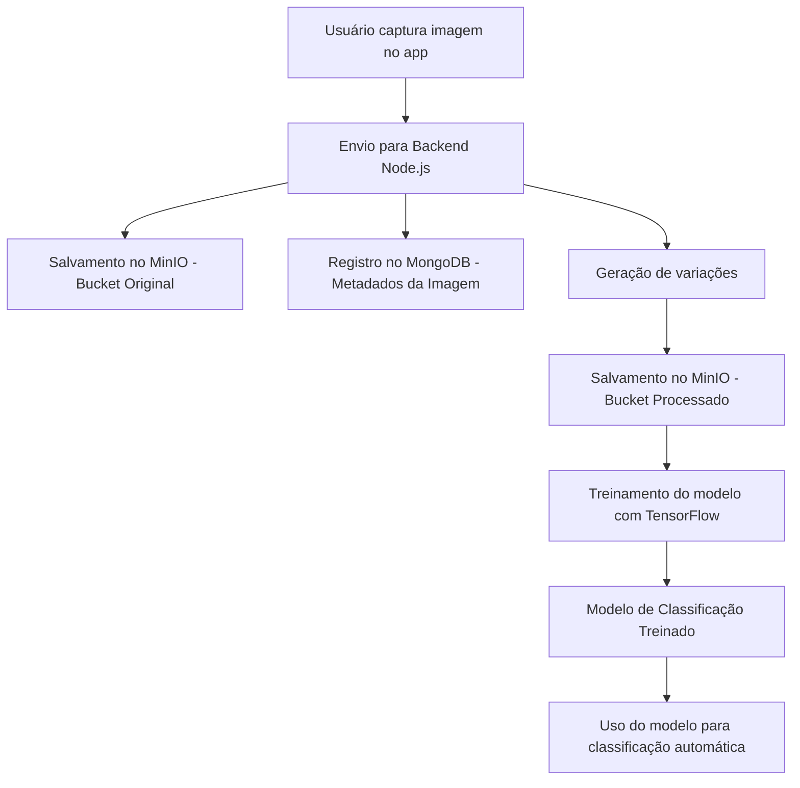

# OColecionador - Projeto de Classificação de Imagens com MinIO e TensorFlow

## Descrição
O **OColecionador** tem como objetivo capturar imagens pelo aplicativo mobile (React Native), enviá-las para um backend em Node.js, armazená-las em um bucket no MinIO e gerar automaticamente variações dessas imagens (rotação e mudança de coloração) para treinamento de um modelo de classificação com Python e TensorFlow. O modelo treinado pode ser utilizado posteriormente pelo backend ou por outro serviço para classificação automática de imagens.

Além de armazenar a imagem original no MinIO, o backend também salva no banco de dados MongoDB informações sobre a imagem, incluindo o usuário, o ID da imagem no bucket e outros metadados relevantes.

## Tecnologias Utilizadas
- **Frontend**: React Native
- **Backend**: Node.js
- **Armazenamento**: MinIO
- **Banco de Dados**: MongoDB
- **Processamento e Treinamento**: Python, TensorFlow

## Fluxo do Sistema
1. O usuário captura uma imagem pelo aplicativo React Native.
2. A imagem é enviada para o backend Node.js.
3. O backend salva a imagem original em um bucket no MinIO.
4. O backend registra no MongoDB informações sobre a imagem (usuário, ID no bucket e metadados).
5. O backend gera variações da imagem (rotação e coloração) e as armazena em outro bucket no MinIO.
6. Um processo de treinamento em Python e TensorFlow consome essas imagens para gerar um modelo de classificação.
7. O modelo treinado pode ser utilizado pelo backend ou outro serviço para classificação automática de novas imagens enviadas.

## Diagrama do Fluxo do Sistema

## Conclusão
O **OColecionador** fornece um pipeline completo para captura, armazenamento, processamento, treinamento e classificação de imagens. Com a automação da geração de variações das imagens, garantimos um conjunto de dados mais robusto para o treinamento do modelo de classificação.
